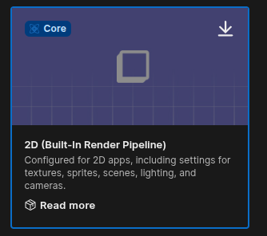
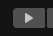
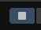
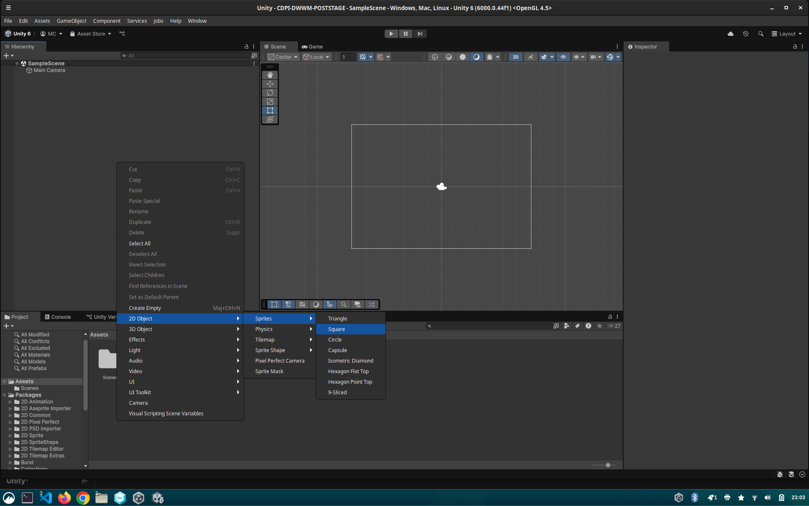
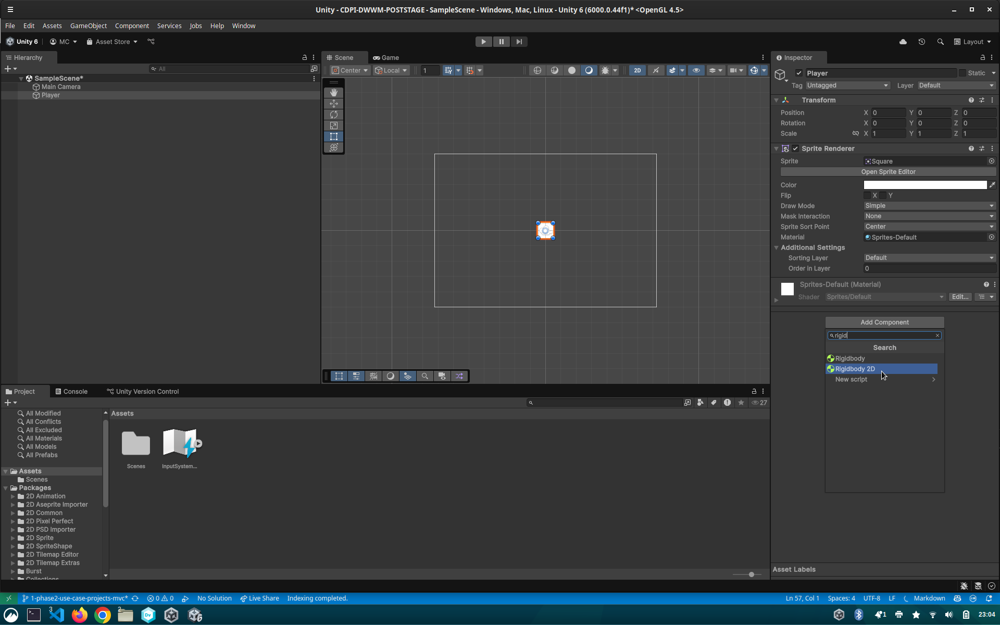

# Plan d'action

## 1. Installer Unity Hub

Unity Hub est un outil qui facilite la gestion de vos installations Unity et de vos projets.  
**Étapes :**
1. Rendez-vous sur le site officiel de [Unity Hub](https://unity.com/download).
2. Téléchargez la version adaptée à Linux.
3. Suivez les instructions d'installation propres à votre distribution.

## 2. Installer Unity 6 sous Linux

Une fois Unity Hub installé :
1. Ouvrez Unity Hub.
2. Accédez à l’onglet "Installs" et cliquez sur "Install editor".

3. Sélectionnez Unity 6.x.x (dernière version stable).
4. Ajoutez les modules nécessaires (par exemple, "Linux Build Support" si besoin).

5. Lancez l’installation.

## 3. Créer un projet Unity 2D

1. Dans Unity Hub>Projects, cliquez sur "New Project".
2. Choisissez le template "2D Built-in Render Pipeline".

*2D(Built-in Render Pipeline)*

> **Remarque :** Sous Linux, les autres templates de projet peuvent ne pas fonctionner nativement à cause de problèmes de compatibilité de drivers.

3. Donnez un nom à votre projet et choisissez un dossier de destination.
4. Cliquez sur "Create Project".

## 4. Bases de Unity

### Scene

La "Scene" est l’espace de travail où vous placez et organisez tous les éléments de votre jeu (personnages, décors, objets, etc.).

1. Cliquez sur le bouton Play pour lancer le Jeu (soyez patient pour la compilation)


2. Cliquez sur le bouton resume (le carré) pour arrete le jeu (NE LAISSEZ PAS LE JEU TOURNER EN FOND...votre PC va fondre)


### GameObject

Un "GameObject" est l’élément de base dans Unity. Il peut représenter n’importe quoi : personnage, décor, bouton, etc.

1. Créez un nouveau GameObject pour votre joueur : Clic droit (Hierarchy) > GameObject > Sprite > Square.



### Composants d’un GameObject

Les GameObjects n’ont pas de comportement par défaut. On leur ajoute des **composants** pour leur donner des fonctionnalités.

- **Rigidbody2D** : Permet à un objet d’être affecté par la physique (gravité, collisions, etc.).



- **BoxCollider2D** : Définit la zone de collision de l’objet (utile pour détecter les contacts avec d’autres objets).


- **Script (Hello World)** : Permet d’ajouter du code personnalisé à un objet.

1. Double cliquez sur le script pour l'ouvrir dans VSCode

Exemple de script simple en C# :

```csharp
using UnityEngine;

public class HelloWorld : MonoBehaviour
{
    void Start()
    {
        Debug.Log("Hello World !");
    }

    void Update()
    {
        // Cette fonction est appelée à chaque frame
    }
}
```

- `Start()` : Appelée une fois au début.
- `Update()` : Appelée à chaque image (frame), soit 60 fois par seconde pour un jeu à 60 fps.

## 5. Scripting en C#

Pour contrôler vos GameObjects (GO), vous allez écrire des scripts en C#. Voici quelques notions de base :

- `Debug.Log()` : Affiche un message dans la console (pratique pour vérifier ce qui se passe).

1. Déclarer une variable publique dans le script pour accéder à un composant du GameObject :
```csharp
using UnityEngine;

public class HelloWorld : MonoBehaviour
{
    // +
    public Rigidbody2D rb;
   
    void Start()
    {
        Debug.Log("Hello World !");
    }

    void Update()
    {
        // Cette fonction est appelée à chaque frame
    }
}
```
2. Ensuite, faites un glisser-déposer du composant Rigidbody2D dans le champ `rb` qui apparaît dans l’éditeur Unity.

### Appliquer une force à un objet et donc a son Rigidbody:

```csharp
rb.AddForce(new Vector2(x, y)); // Déplace le GO sur les axes x et y
```

```csharp
using UnityEngine;

public class HelloWorld : MonoBehaviour
{
    // +
    public Rigidbody2D rb;
   
    void Start()
    {
        Debug.Log("Hello World !");
    }

    void Update()
    {
        rb.AddForce(new Vector2(10, 0)); // Déplace le GO  sur la droite x+10
    }
}
```

### Récupérer les entrées clavier pour déplacer un objet :

```csharp
float moveX = Input.GetAxis("Horizontal");
float moveY = Input.GetAxis("Vertical");
```

- Détecter si la touche "Espace" est pressée :
```csharp
    if (Input.GetKeyDown(KeyCode.Space))
    {
        // Action à effectuer
    }
```

```csharp
using UnityEngine;

public class HelloWorld : MonoBehaviour
{
    // +
    public Rigidbody2D rb;
   
    void Start()
    {
        Debug.Log("Hello World !");
    }

    void Update()
    {
        rb.AddForce(new Vector2(10, 0)); // Déplace le GO  sur la droite x+10
        // Test
        if (Input.GetKeyDown(KeyCode.Space))
        {
            rb.AddForce(new Vector2(0, 1000)); // Déplace le GO  vers le haut
        }
    }
}
```

> Documentation des KeyCode : https://docs.unity3d.com/ScriptReference/KeyCode.html

### Appliquer une force instantanée (impulsion), pratique pour les sauts :

```csharp
rb.AddForce(new Vector2(0, 1000), ForceMode2D.Impulse);
```

> Pour un rendu régulier peut importe le nombre de FPS il est d'usage de mutliplier les valeurs x et y par Time.deltaTime (le temps écoulé depuis la dernière frame : un float entre 0 et 1 donc).

## Astuces

- Augmentez le facteur de gravité du Rigidbody2D pour rendre la retombée du personnage après un saut plus *jeu vidéo*.
- N'oubliez pas le BoxCollider sur les plateformes.
- Faites glisser-déposer la caméra sur le GO Player pour que la caméra suive le joueur.
- Glissez une image (png ou jpeg) dans l’éditeur pour créer un GameObject avec cette image (sprite).

## Pour aller plus loin

- `OnCollisionEnter2D` permet de réagir à la collision avec un autre GO (pratique pour gérer la vie, par exemple).
- Le GO UI permet de créer une interface utilisateur sur la scène.
- `LoadScene` permet de charger une autre scène du projet et ainsi enchaîner les niveaux (par exemple, en réagissant à la collision avec un GO drapeau).
- Glissez plusieurs images d’un coup pour créer un GameObject animé.

<!-- 
## 6. Annexe Animation avec les StateMachine  
-->
