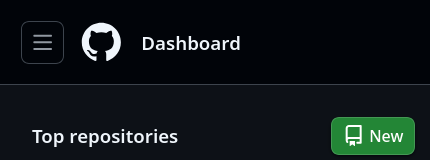
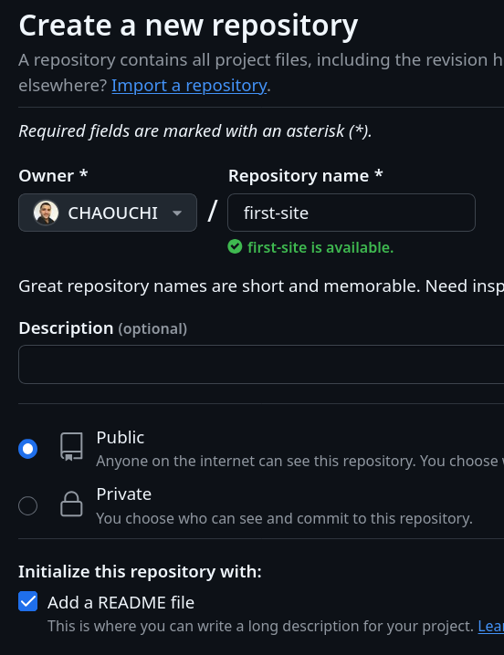
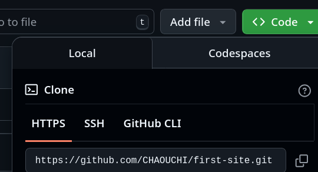
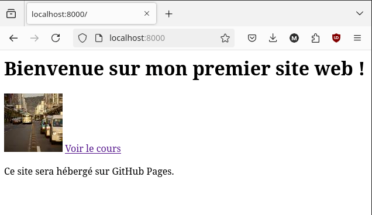
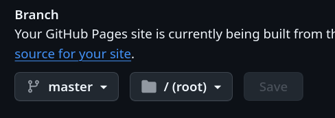

# GitHub Pages

## Sommaire
- [Introduction](#introduction)
- [Prérequis](#prérequis)
    - [Installer VSCode](#installer-vscode)
    - [Installer PHP](#installer-php)
    - [Créer un compte GitHub](#créer-un-compte-github)
    - [Installer Git](#installer-git)
    - [Connecter le terminal à GitHub](#connecter-le-terminal-à-github)
- [I. Mise en place de l'environnement de travail](#i-mise-en-place-de-lenvironnement-de-travail)
    - [Créer un dépôt GitHub](#créer-un-dépôt-github)
    - [Cloner le dépôt sur votre machine](#cloner-le-dépôt-sur-votre-machine)
    - [Ouvrir le projet dans VSCode](#ouvrir-le-projet-dans-vscode)
- [II. Coder votre premier site web !](#ii-coder-votre-premier-site-web-)
    - [La page d'accueil, le fichier `index.html`](#la-page-daccueil-le-fichier-indexhtml)
    - [Coder le contenu de la page d'accueil](#coder-le-contenu-de-la-page-daccueil)
    - [Tester le site en local](#tester-le-site-en-local)
- [III. Mettre en production votre site web sur GitHub Pages](#iii-mettre-en-production-votre-site-web-sur-github-pages)
    - [Pousser le code sur GitHub](#pousser-le-code-sur-github)
    - [Activer GitHub Pages](#activer-github-pages)
    - [Accéder à votre site en ligne](#accéder-à-votre-site-en-ligne)
- [Conclusion](#conclusion)
- [Exercice](#exercice)

## Introduction
GitHub est un service de stockage et de gestion de projet en ligne basé sur le logiciel libre Git. Il permet à un ou plusieurs développeurs de partager le code source d'un projet facilement via quelques commandes simples.

Grâce à git et aux serveurs de GitHub, vous allez pouvoir sauvegarder le code de votre premier site web dans un dossier en ligne appelé repository (ou dépôt en français).

GitHub Pages est un service qui permet d'héberger des sites web statiques directement à partir d'un dépôt GitHub. C'est un excellent moyen de partager vos projets, portfolios ou blogs sans avoir à payer un serveur web.

## Prérequis

### Installer VSCode
- Téléchargez et installez [Visual Studio Code](https://code.visualstudio.com/).

- Rendez-vous dans le dossier *Téléchargements* et installez vscode avec apt : 
```bash
cd Téléchargements
sudo apt install ./code_1.101.1-1750254731_amd64.deb
```

> Attention, le nom du fichier peut varier en fonction de la version de VSCode que vous avez téléchargée. Assurez-vous de taper le nom du fichier qui finit par `.deb`.

### Installer PHP
Tout à l'heure, vous allez tester votre site en local sur votre machine avant de l'envoyer vers un serveur réel. Pour cela, vous aurez besoin d'un serveur web local. Nous allons utiliser PHP qui possède une commande pour lancer un serveur web local.

1. Ouvrez un terminal et installez PHP (s'il vous pose une question, faites ENTRER pour dire *oui*):
```bash
sudo apt install php
```

### Créer un compte GitHub
Rendez-vous sur [GitHub](https://github.com) et créez un compte si vous n'en avez pas déjà un.

### Installer Git
1. Créer un compte GitHub
Créez-vous un compte sur https://www.github.com.

2. Installer Git et GitHub CLI
```bash
sudo apt install git
sudo apt install gh
```

3. Déclarer son identité à Git
Pour pouvoir pousser les modifications de code sur GitHub, le programme git doit pouvoir donner un nom à la source de l'envoi (vous).

Donnez donc votre identité à git avec les commandes suivantes :
```bash
git config --global user.name "Billie JOE"
git config --global user.email joe.billie@gmail.com
```

4. Configurer les merges
Exécutez la commande suivante pour autoriser git à fusionner (merge) les commits en cas de conflits (obligatoire pour plus tard, mieux vaut le faire tout de suite).
```bash
git config pull.rebase false
```

### Connecter le terminal à GitHub
```bash
gh auth login
```
Vous allez être guidé pour vous connecter à votre compte GitHub. Suivez les instructions à l'écran pour autoriser GitHub CLI à accéder à votre compte (vous devez normalement écrire un code fourni dans le terminal).

## I. Mise en place de l'environnement de travail
Avant de faire le site, nous allons mettre en place l'environnement de travail. Nous allons :
- créer un projet sur GitHub, 
- le cloner sur notre machine 
- et l'ouvrir dans Visual Studio Code.

### Créer un dépôt GitHub
Sur le site de GitHub, une fois connecté, cliquez sur le bouton "New" pour créer un nouveau dépôt (repository). Donnez-lui un nom : `first-site` et cochez la case "Add a README file" pour initialiser le dépôt avec un fichier README.
*Créer un répo*

*Configurer le répo*


### Cloner le dépôt sur votre machine
Il faut maintenant récupérer ce projet vierge sur votre machine.

Dans un terminal, exécutez la commande suivante pour copier le dossier du projet sur votre machine :
```bash
git clone https://github.com/<votre-username-github>/first-site.git
```

> Vous pouvez également copier le lien du dépôt depuis la page GitHub en cliquant sur le bouton "Code" et en copiant l'URL.
> 

### Ouvrir le projet dans VSCode
Vous devriez voir apparaître un dossier `first-site`.
```bash
ls # lister le dossier courant pour vérifier si le dossier `first-site` est bien là
```
1. Ouvrez le dossier `first-site` dans Visual Studio Code :
```bash
code first-site
```

## II. Coder votre premier site web !

### La page d'accueil, le fichier `index.html`
Vous avez ouvert le dossier first-site dans VSCode.

1. Créez un fichier nommé `index.html`. Ce fichier sera la page d'accueil de votre site web.

> **IL FAUT OBLIGATOIREMENT NOMMER CE FICHIER `index.html`** car c'est le nom par défaut que les serveurs web cherchent pour afficher la page d'accueil d'un site.
> SI VOUS L'APPELEZ AUTREMENT, VOUS NE POURREZ PAS VOIR VOTRE SITE WEB EN LANCANT LE SERVEUR WEB ET OBTIENDREZ UNE ERREUR 404 (page non trouvée).

### Coder le contenu de la page d'accueil
Dans le fichier `index.html`, ajoutez le code HTML suivant :
```html
<h1>Bienvenue sur mon premier site web !</h1>

<a href="https://github.com/CHAOUCHI/cdpi-dwwm">Voir le cours</a>
<p>Ce site sera hébergé sur GitHub Pages.</p>
```
> Vous pouvez copier-coller ce code dans le fichier `index.html`. Il contient un titre, une image aléatoire, un lien vers le cours et un paragraphe.

### Tester le site en local
Pour voir votre site web en local, vous devez lancer un serveur web. 

1. Utilisez php pour lancer ce serveur local.
```bash
php -S localhost:8000
```

2. Ouvrez votre navigateur et allez à l'adresse `http://localhost:8000`. Vous devriez voir votre page d'accueil avec le titre, l'image et le lien.



Notre site fonctionne en local sur notre machine ! Super, il est temps de le mettre en production, c'est-à-dire le mettre en ligne pour que tout le monde puisse le voir.

Ici, le serveur de production est GitHub Pages.

> Il faut différencier serveur de production et serveur de développement. Le serveur de développement est celui que vous utilisez pour tester votre site en local (ici avec PHP), tandis que le serveur de production est celui qui héberge votre site en ligne (ici GitHub Pages).

> Les serveurs de production sont bien plus sécurisés mais les serveurs de dev sont plus simples à mettre en place.

## III. Mettre en production votre site web sur GitHub Pages
### Pousser le code sur GitHub
Maintenant que votre site est prêt, il faut envoyer le code sur GitHub pour qu'il soit accessible en ligne.

Dans le terminal de VSCode (Terminal > New Terminal), exécutez les commandes suivantes :

1. git status pour vérifier les fichiers modifiés :
```bash
git status
```
> Vous devriez voir que le fichier `index.html` est modifié.

2. Préparer les changements pour l'envoi :
```bash
git add .
```

3. Créez un paquet de modifications (commit) avec un message :
```bash
git commit -m "Ajout de la page d'accueil"
```

4. Poussez les modifications sur GitHub :
```bash
git push
```
> Si c'est la première fois que vous poussez des modifications, il se peut que Git vous demande de préciser la branche distante. Vous pouvez le faire avec la commande suivante :
```bash
git push --set-upstream origin main
```

5. Rendez-vous sur la page de votre dépôt GitHub pour vérifier que le fichier `index.html` a bien été ajouté.

### Activer GitHub Pages
Pour que votre site soit accessible en ligne, vous devez activer GitHub Pages pour votre dépôt.

1. Allez dans les paramètres de votre dépôt GitHub (Settings).
2. Faites défiler la page jusqu'à la section "GitHub Pages".
3. Dans la section "Source", sélectionnez la branche `main` et le dossier `/` (root) comme source.
4. Cliquez sur "Save".

> Si vous avez du mal à trouver la page sur le site de GitHub, appelez-moi ou allez sur ce lien (remplacez le username par le vôtre) https://github.com/username/cdpi-dwwm/settings/pages



### Accéder à votre site en ligne
Après avoir activé GitHub Pages, votre site sera accessible à l'adresse suivante :
```
https://votre-username.github.io/first-site/
```
> Remplacez `votre-username` par votre nom d'utilisateur GitHub.

Je peux ainsi voir votre site et la terre entière au passage ! :)

## Conclusion
Vous avez :
- Mis en place un environnement de travail avec Git, GitHub et VSCode.
- Créé un site web simple avec HTML.
- Testé votre site en local avec PHP.
- Poussé votre site sur GitHub et mis en production sur GitHub Pages pour le rendre accessible sur Internet.

Félicitations ! GitHub Pages permet le fonctionnement de HTML, CSS et JavaScript ! Si vous allez dans le Readme du cours, vous verrez des ressources pour aller plus loin et faire des sites web plus complexes.

Nous aborderons tous les sujets au fur et à mesure de l'année, mais vous avez déjà tout ce qu'il faut pour faire du développement web front-end (JS, React, Vue ou même Angular) et vous n'avez rien à payer pour ça.

## Exercice
Mettez en production un site web qui parle d'un des sujets suivants :
- Vous-même.
- Le film `Entretien avec un vampire` de Neil Jordan (mettez des photos)
- Ce que vous voulez, mais faites un site qui parle d'un sujet précis pour pouvoir le montrer aux autres.
