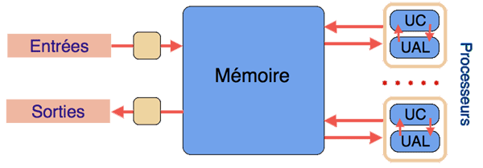

# Qu'est-ce qu'un ordinateur ?

Si l'on pose la question : "Qu'est-ce qu'un ordinateur ?" à un utilisateur un tant soit peu expérimenté, il répondrait probablement :

*Un ordinateur est une machine qui permet d'effectuer des traitements automatiques grâce à des programmes.*

Et il aurait raison.

La notion d'automatisation de tâches via un processus précis ne date pas d'hier, et c'est le mathématicien Alan Turing qui a mis en place le premier modèle théorique d'un ordinateur.

## La machine de Turing

  
*Alan Turing*

***Alan Turing est un homme très important, il le père de l'informatique.*** Il était mathématicien, et ses talents en cryptographie ont sauvé la vie de millions de personnes lors de la Seconde Guerre mondiale. Il a également défini les fondements de l'intelligence artificielle dont les concepts sont encore utilisé aujourd'hui dans nos IA moderne !

Sans Alan turing pas d'IA et pas de cyber-sécurité, pas d'informatique en faite (ou en tout cas ces technologies aurait mit plus de temps à voir le jours).

> Il trouvera tristement la mort à l'âge de 43 ans par suicide après avoir subi une castration chimique forcée à cause de son homosexualité, qui était alors interdite à l'époque.

> Il mourra dans l'anonymas de sa contribution à l'humanité et sera fait chevalier bien trop tard à titre postume.

**La machine de Turing** est un modèle théorique d'une machine qui permet l'automatisation du traitement de tâches via une suite d'instructions non ambiguës.

> "Imaginez une boîte noire, dans laquelle je fais passer un ruban de papier. Sur ce ruban sont écrites, ligne après ligne, des instructions que la boîte exécute dans l'ordre. De l'autre côté de la boîte, un résultat est fourni."

Voilà une machine de Turing.

Une machine qui prend des instructions en paramètre et renvoie un résultat. 

*Un ordinateur, en somme.*

L'enchaînement de ces instructions dans un ordre précis se nomme un **algorithme**.

Intéressons-nous maintenant à ce qui se trouve dans la boîte noire.

## Architecture de Von Neumann

Von Neumann est un ingénieur et mathématicien du milieu du XXe siècle qui, en se basant sur les travaux de Turing, définit avec ses équipes le plan du premier ordinateur numérique moderne. Jusqu'à aujourd'hui, ce plan est toujours respecté. On appelle ce plan : **l'architecture de Von Neumann d'un ordinateur.**

  
*John Von Neumann dans les années 1940*

Un ordinateur est un appareil électronique qui :

- **effectue des calculs via des données prises en ENTRÉE**. 

- Il fournit le **résultat via une SORTIE** 

- et **possède une MÉMOIRE** qui lui permet de stocker des données le temps du calcul. 

- Il **possède également au moins un PROCESSEUR** de calcul.

```
ENTREE + SORTIE + PROCESSEUR + MEMOIRE = ordinateur
```

Pour qu'un ordinateur soit considéré comme tel, il faut au minimum qu'il respecte l'architecture de Von Neumann.

  
*Schéma moderne (1960) de l'architecture de Von Neumann avec un ordinateur qui possède un ou plusieurs processeurs*

Le fonctionnement d'une machine de Von Neumann se fait comme suit :

1. Les instructions du programme sont chargées dans la **mémoire** dans leur ordre d'exécution via l'**entrée**(un disque dur par exemple).
2. L'**Unité de Contrôle** (UC) du processeur lit les instructions dans la mémoire et les envoie au fur et à mesure à l'**Unité Arithmétique et Logique** (UAL) du processeur, qui s'occupe du calcul.
3. L'UAL peut écrire ou lire des données dans la **mémoire** si besoin et également demander à l'UC l'instruction suivante.

Grossièrement, l'**algorithme** chargé peut être :

```
ALLOUE 2 octets dans la mémoire
RELIE une variable age à ce bloc mémoire
LIRE l'entrée -> age
SI age > 17
ALORS
ÉCRIS "majeur" dans la sortie
```

Et PHP on écrira àa comme ça :

```php
# la fonction fgets lit le clavier : Standard Input(entrée)
$age = fgets(STDIN); 
if($age > 17){
    echo "majeur";
}
```

Un ordinateur est donc au **minimum** composé de :

- Entrée
- Sortie
- Mémoire
- Unité de contrôle (UC)
- Unité Arithmétique et Logique (UAL)

> On l'appelle UAL car les opérateurs disponibles sont :
> - les opérateurs **arithmétiques** : +, -, *, /, %
> - et les opérateurs **logiques** : AND, OR, NOT

## En conclusion

- Pour fonctionner un programme doit être non-ambiguë. C'est à dire, que chaque ligne de son programme doit être parfaitement explicite.
- Un programme est une suite d'instruction executé les une après les autres par un ordinateur (une machine de turing).
- L'algorithme c'est le nom qu'on donne à cette liste d'instructions qui forme un programme. Tout les programmes que vous avez utilisé depuis toujours fonctionne ainsi.
- Un programme est une suite d'entrée et de sortie. C'est la chose la plus importante à retenir ! Dans 10 mois vous verrez que tout reviens à ce concept simple : une entrée (un paramètre) une sortie (une valeur de retour)