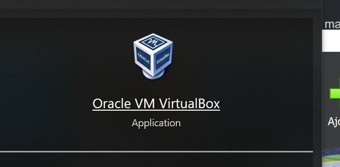
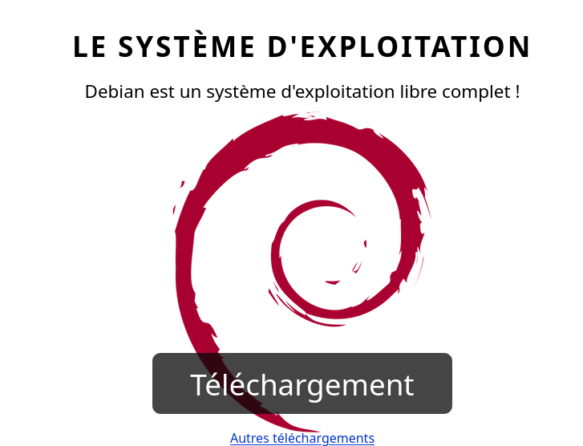

# Machine virtuel

*Ce cours décrit les détails d'installation d'une VM Linux*.

## *LISEZ BIEN TOUTES LES INSTRUCTIONS SINON VOUS RISQUEZ DE DEVOIR TOUT RECOMMENCER !* :D

Une machine virtuel est un programme qui simule le comportement d'un ordinateur (Entrée, Sortie,Processeur, Mémoire, Carte réseau(qui est une entrée d'ailleurs), ...).

Les machines virtuels permettent d'avoir plusieurs systèmes d'exploitation sur un même système d'exploitation hôte.

> Si vous avez déjà utilisé un émulateur de console de jeu vidéo : la logique est similaire même si une machine virtuel permet d'accéder à un système complet et pas seulement aux logiciels qui peuvent être exectués dessus.

Les programmes qui permettent la création de machine virtuel s'appelles des *Hyperviseurs*.

*VirtualBox* est un hyperviseur de type 2 c'est à dire un hypersieur installable sur un OS existant et qui va gérer les OS hébergés.




*Concrètement vous allez avoir une fenêtre sur votre ordinateur qui contient elle même un ordinateur virtuel*.

Pour créer une machine virtuelle il faut :

1. Installer VirtualBox. Dans un terminal tapez :
```bash
sudo apt install virtualbox
```

> Lancer VirtualBox en ligne de commande avec `virtualbox` ou en le cherchant dans le menu démarrer de votre OS (touche windows).

2. Télécharger une image disque ISO d'un système d'exploition(OS), il suffit le plus souvent d'aller sur le site de l'édtieur de l'OS pour le télécharger.
   - Par exemple pour Debian GNU/Linux, vous pouvez aller sur https://www.debian.org
   <!-- - Attention pour Windows il faut utiliser media creation tool, un logiciel de Microsoft qui permet de télécharger l'ISO de Windows 10 ou 11. -->
3. Ajouter une nouvelle machine dans virtualbox (bouton bleue *Nouvelle*).

4. Préciser les spécifications matériel de la machine pour définir sa puissance(placer tout les curseurs au maximum **tout en restant dans le VERT**)

5. **COCHEZ ABSOLUMENT la case Skip Unattended Install !!** sinon vous ne pourrez pas choisir les mots de passe utilisateur et administrateur de la machine virtuelle.
*cochez bien cette case pour avoir accès à l'installation complète*

6. Pendant le processus de création de la VM **un fichier ISO** vous est demandez, **fournissez lui** pour qu'il lance l'installation de l'OS au démarrage de la VM.
7. Démarrer la machine et suivre les instructions d'installation de l'OS. (EST CE QUE VOUS AVEZ BIEN COCHER LA CASE `SKIP UNATTENDED INSTALL` ?)

## Télécharger Virtual Box

https://www.virtualbox.org/

Sous linux
```bash
sudo apt install virtualbox
```

## Télécharger une ISO 
Un fichier ISO est un fichier qui contient les données d'un CD d'installation.

- *ISO de Debian GNU/Linux* (recommandé) : https://www.debian.org
*Cliquez sur le gros bouton Téléchargement de la page d'accueil*


- *ou ISO de Ubuntu* (GNU/Linux) : https://cdimage.ubuntu.com/ubuntucinnamon/releases/24.04.2/release/


## LISEZ-MOI ! Annexe : A propos de l'installation de Debian GNU/Linux

> Si je ne parle pas d'une étape ici considérez que vous pouvez laissez la valeur par défaut et faire *suivant*.

L'installation de Debian GNU/Linux est assez simple cependant il faut faire attention à quelques points :
1. **Partitionnement** : Choisissez l'option "Guidé - utiliser tout le disque" pour simplifier le partitionnement.
2. **Definir le mot de passe administrateur** : Assurez-vous que le mot de passe administrateur root soit `root` pour simplifier la gestion de la VM. Ce n'est pas une bonne pratique de sécurité mais vous n'avez vraiement pas envie de recommencer l'installation si vous oubliez le mot de passe de votre VM.
3. **Définir le nom d'utilisateur** : Vous pouvez définir le nom d'utilisateur à `user` pour simplifier la connexion à la VM.
4. **Définir le mot de passe utilisateur** : Vous pouvez définir le mot de passe utilisateur à `user` pour simplifier la connexion à la VM.
5. **Utiliser GRUB** : Assurez-vous que le chargeur de démarrage GRUB est installé sur le disque dur virtuel pour pouvoir démarrer la VM.
6. **DECOCHER GNOME et cocher LXDE** : GNOME est un environnement de bureau lourd (similaire à MacOS) qui peut ralentir la VM, préférez LXDE qui est plus léger et adapté aux machines virtuelles.

> Si vous voulez un bonne equilibre entre performance et esthétique, vous pouvez choisir *Cinnamon*.