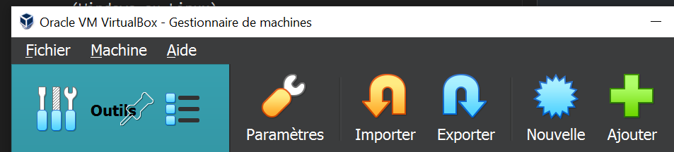

# Activité - Créer un envrionnement de développement Linux

Linux est le meilleur envrionnement de développement grâce à sa fiabilité (une fois les commandes connues tout se fait toujours de la même manière) et permet au développeur de programmer dans un envrionnement similiaire à la production : la plupart des serveurs moderne étant également sous Linux.

**Lancer VirtualBox et créer une nouvelle VM.**

Utilisez le bouton *Nouvelle* pour créer une VM et suivez les instructions d'installation.

N'oubliez pas de télécharger une image ISO de *Ubuntu* en avance car le téléchargement peut prendre un peu de temps !


## Cahier des charges

Lorsque vous allea lancez l'installation de la VM (au premier lancement), il faudra confihurer le nouveau système voici les quelques infos dont vous avez besoin :

1. Créer une VM Debian 
    - cocher la case *Skip Unattended Install*
    - nommé la VM `server`
    - username : `user`
    - mot de passe : `user`
    - mot de passe root : `root`
2. Une fois la VM installez, mettez la à jour
    - DANS LA VM : Ouvrez un terminal et tapez les commandes suivantes :
    ```bash
    su - # pour passer en mode administrateur 
    # Rentrez le mot de passe administrateur `root`
    ```
    - Puis mettez à jour la VM :
    ```bash
    apt update
    apt upgrade
    ```
3. Si tout c'est bien passé, vous devriez avoir une VM Debian fonctionnelle et à jour.

> Si vous rencontrez des problèmes verifiez que vous avez bien suivi les instructions et que vous avez bien coché la case *Skip Unattended Install* lors de la création de la VM. Si vous avez oublié de cocher cette case, vous devrez recommencer l'installation de la VM.

> Verifiez que le La virtualisation matérielle est activée dans le BIOS de votre ordinateur :
> - Redémarrez votre ordinateur et accédez au BIOS en appuyant sur `F10` pour les pc HP.
> - Recherchez l'option de virtualisation matérielle (souvent appelée "Intel VT-x" ou "AMD-V") et assurez-vous qu'elle soit bien activée.
> - Enregistrez les modifications et quittez le BIOS.
> - Redémarrez votre ordinateur et essayez de créer la VM à nouveau.