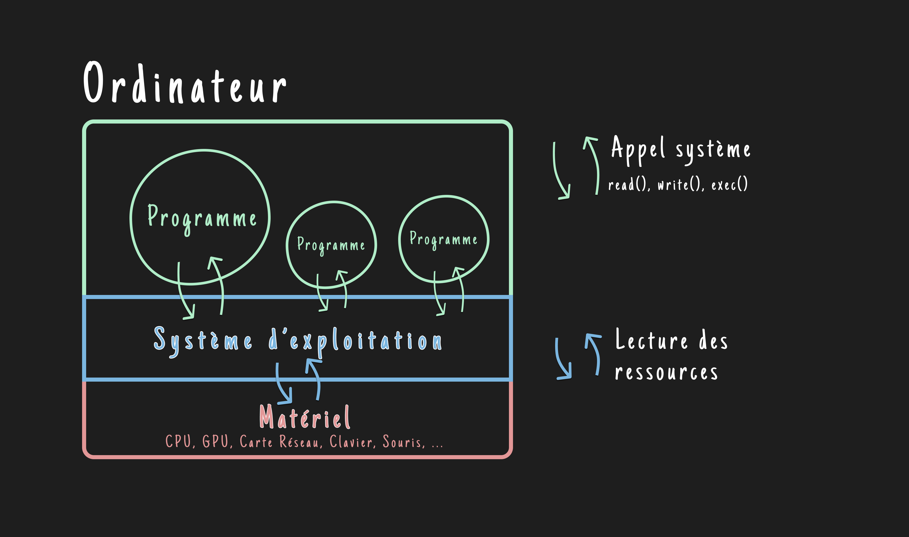

## Le système - Pilier de l'informatique
Von Neumann est un schéma matériel d'un ordinateur. À l'origine, les premiers programmeurs concevaient des programmes qui écrivaient directement dans les registres du matériel. Le développement de logiciels demandait donc des compétences pointues et prenait énormément de temps.

L'idée de concevoir un logiciel qui fournit, une bonne fois pour toutes, une interface avec les ressources matérielles germa, et les premiers systèmes d'exploitation (*Operating System* ou *OS*) furent conçus.

### Schéma en couches d'un ordinateur
De nombreux systèmes virent le jour jusqu'à l'apparition *d'un système pour les réunir tous* : ce système s'appelle ***UNIX***. Il naquit en même temps que le **langage C**, dans les années 1970, des mains des légendaires Ken Thompson (*UNIX*), Dennis Ritchie (*UNIX & C*) et Brian Kernighan (*UNIX & C*) dans les laboratoires de *Bell*.

Unix a été adopté en masse grâce à sa grande compatibilité avec la plupart des architectures d'ordinateurs de l'époque. Le langage C est né en même temps que Unix, leur relation symbiotique fait qu'un programmeur de l'époque pouvait apprendre le C et écrire des programmes compatibles avec la plupart des ordinateurs, et ce sans avoir à se soucier de leur architecture spécifique.

Son modèle de représentation des données et du matériel sous la forme de fichiers fut une révolution et, encore aujourd'hui, le système UNIX sert de norme aux systèmes comme macOS et GNU/Linux via leur adoption de la norme POSIX, Windows restant à part.

> Le noyau Linux sert aujourd'hui (2024) les 3,9 milliards d'utilisateurs de smartphones Android.

> La plupart des commandes fonctionnant sous Linux fonctionnent également sous macOS : *ls, mkdir, cd*.

On peut voir sur le schéma suivant une représentation du fonctionnement logiciel d'un ordinateur.

D'abord le matériel (voir Architecture Von Neumann) qui ne possède aucune partie logicielle, puis un logiciel nommé système d'exploitation.

Les fabricants de systèmes d'exploitation ont codé à l'avance de nombreuses fonctionnalités utilisables par le programmeur. On appelle ces fonctions des appels système, en voici un extrait :

| Appels système | descriptions|
|-|-|
| open()  | Ouvre ou crée un fichier |
| read()  | Lit un fichier           |
| write() | Écrit dans un fichier    |
| exec()  | Exécute un programme     |
| kill()  | Arrête un programme      |

La plupart des programmeurs d'aujourd'hui ne touchent jamais à ces fonctions et travaillent avec des langages de programmation dits "haut niveau", c'est-à-dire moins proches de la machine. Cependant, peu importe à quel "niveau" vous travaillerez, au bout du compte, ce sont forcément les appels système qui sont utilisés pour communiquer avec le matériel par l'intermédiaire du système d'exploitation.


*Schéma du fonctionnement logiciel d'un ordinateur*

Le système d'exploitation nous fournit des fonctions comme *read()* ou *write()* pour écrire dans des fichiers ou encore *exec()* pour exécuter un programme. Ces fonctions sont des appels système et on peut les utiliser librement dans des langages comme le langage C, par exemple.

Vous pouvez essayer de compiler ce programme, vous verrez qu'un fichier todo.txt sera créé et qu'il contiendra la chaîne de caractères *"Faire les courses"*.

```c
// Inclusion des bibliothèques d'appels système
#include <unistd.h>
#include <fcntl.h>
#include <string.h>

int main(){
    // Demander à l'OS d'ouvrir le fichier todo.txt dans le disque dur 
    int fichier = open("todo.txt",O_CREAT | O_WRONLY, 0777);
    char* tache = "Faire les courses";
    // Écrire le texte "Faire les courses" dans le fichier
    write(fichier,tache,17);
    return 0;
}
```

Voici le même exemple en Python, un langage de programmation de plus haut niveau qui simplifie l’utilisation des fonctionnalités offertes par le langage C en le surcouchant.

```python
# Ouvre (ou crée) le fichier todo.txt en écriture
fichier = open("todo.txt", "w")
tache = "Faire les courses"
# Écrit le texte dans le fichier
fichier.write(tache)
fichier.close()
```

**Et c'est ainsi qu'un programme a accès aux ressources d'un ordinateur.**

> Dans le programme précédent :
> - O_WRONLY signifie *Open write only* : ouvrir en écriture seule.
> - O_CREAT signifie *OPEN_CREATE* : créer le fichier s'il n'existe pas.
> - 0777 signifie que tout le monde a le droit de lire et d'écrire sur le fichier.
> - 17, c'est le nombre de lettres à écrire. "Faire les courses" fait 17 lettres en comptant les espaces.

