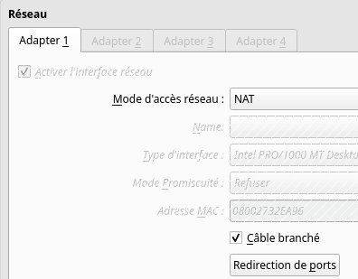
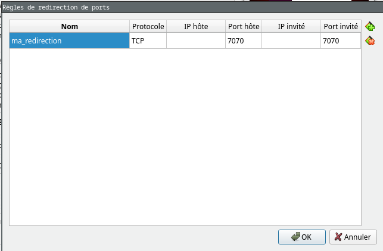

# Machine virtuelle en LAN

Le principe d'une machine virtuelle est de simuler et d'isoler un ordinateur sans avoir à brancher ou acheter un ordinateur physique.

La plupart des hébergeurs vous fournissent des machines virtuelles pour héberger vos applications. Ces machines sont complètement capables d'accéder à internet via la carte réseau de l'ordinateur hôte.

1. Dans la VM, ouvrez un terminal et tapez la commande suivante pour vérifier la connectivité internet :
```bash
ping google.com # Test de la connexion internet sur le serveur de leboncoin
``` 

Le souci se pose dans l'autre sens : comment faire pour qu'une machine réelle (autre que l'hôte) puisse accéder à une machine virtuelle ?

La solution la plus utilisée est la redirection de port (port forwarding en anglais). Elle permet de rediriger les requêtes d'un port spécifique de l'hôte vers un port spécifique de la machine virtuelle.

> Un port est un numéro que l'on attribue aux applications à la suite de l'adresse IP pour les différencier. Par exemple, le port 80 est le port utilisé par défaut par les navigateurs web pour accéder à un serveur web.
> leboncoin.fr est enfaite leboncoin.fr:80 malgrée vous.

## Port forwarding

### Mettre en place le port forwarding dans VirtualBox
Pour configurer le port forwarding dans VirtualBox, suivez ces étapes :
1. **Ouvrez la configuration de la VM** :
  - Faites un clic droit sur la VM dans VirtualBox et sélectionnez "Configuration".
2. **Accédez à l'onglet "Réseau"** :
  - Sélectionnez l'onglet "Réseau" dans la fenêtre de configuration.
3. **Cliquez sur le bouton "Redirection de ports"** :
  - Cliquez sur le bouton "Redirection de ports" pour ouvrir la fenêtre de configuration du port forwarding.
  
4. **Ajoutez une nouvelle règle de redirection de port** :
  - Cliquez sur l'icône "+" pour ajouter une nouvelle règle de redirection de port.
  
  Nous allons faire une application sur le port 7070.

  - Ajoutez donc une nouvelle ligne avec le port 7070 dans la colonne "Hôte" et le port 7070 dans la colonne "Invité".
  

> Le port 7070 est un choix arbitraire, vous pouvez choisir n'importe quel port disponible sur votre hôte. Assurez-vous simplement que ce port n'est pas déjà utilisé par une autre application.

5. **Enregistrez les modifications** :
  - Cliquez sur "OK" pour enregistrer les modifications et fermer la fenêtre de configuration du port forwarding.

### Créer une application simple pour tester le port forwarding
Pour tester le port forwarding, nous allons lancer un serveur PHP sur le port `7070` dans un dossier contenant une petite page web.

1. **Créez un dossier pour votre application** :
  - Ouvrez un terminal dans la VM et créez un dossier pour votre application :
    ```bash
    mkdir mon_site_web
    cd mon_site_web
    ```
2. **Créez un fichier index.html** :
   - Créez un fichier `index.html` dans ce dossier avec le contenu suivant :
    ```html
    <h1>Bienvenue sur mon site web !</h1>
    <p>C'est une page de test pour le port forwarding de la VM !</p>
    ```
3. **Lancez un serveur PHP** :
  - Dans le terminal, toujours dans le dossier `mon_site_web`, lancez un serveur PHP sur le port `7070` :
   ```bash
   php -S 0.0.0.0:7070
   ```

> 0.0.0.0 est l'adresse ANY qui fonctionne pour toutes les adresses IP de la machine. Vous pouvez aussi utiliser l'adresse IP de la VM, mais elle risque parfois de changer.

### **Accédez à votre application depuis l'hôte** :
  - Ouvrez un navigateur web sur la machine hôte (le PC HP) et accédez à l'URL suivante :
    ```
    http://localhost:7070
    ```
  - Vous devriez voir la page que vous avez créée !

### **Accédez depuis d'autres machines du LAN** :
Si vous souhaitez accéder à ce site web depuis une autre machine du réseau local (CoWorking), utilisez l'adresse IP de l'hôte au lieu de `localhost`.

1. Sur la machine hôte (HP), ouvrez un terminal et tapez la commande suivante pour trouver l'adresse IP de la machine hôte :
```bash
ip addr
```
2. Notez l'adresse IP de la machine hôte (par exemple, `10.20.2.7` ou `192.168.2.3` ; l'adresse dépend de votre Wifi).

3. Sur la machine d'un de vos camarades, ouvrez un navigateur web et accédez à l'URL suivante :
```
http://<adresse_IP_DE_VOTRE_PC>:7070
```
> Remplacez `<adresse_IP_DE_VOTRE_PC>` par l'adresse IP de la machine hôte que vous avez notée précédemment.

4. Voyez votre beau site web s'afficher sur le PC d'un autre !

## Conclusion
La plupart des développeurs ne font pas de port forwarding, ils utilisent des services d'hébergement qui le font pour eux. Cependant, il est intéressant de comprendre leur fonctionnement pour démystifier le principe d'un hébergement.

Ce sont également des compétences très utiles quand vous vous intéresserez au DevOps (Docker, Kubernetes, Pipeline CI/CD, reverse proxy, ...).

<!-- 
## Effectuer un Ping 

### D'un hôte à un autre dans le même LAN
Un hôte est un ordinateur présent dans un réseau. Je peux savoir si deux ordinateurs sont présents dans le même réseau si je ping l'adresse IP de l'un depuis un terminal dans l'autre.

Pour tester la connectivité entre deux hôtes dans le même LAN, suivez ces étapes :

1. **Obtenez les adresses IP des deux hôtes** :
  - Sur chaque hôte, ouvrez un terminal.
  - Tapez la commande suivante pour trouver l'adresse IPv4 :
    ```bash
    ip addr  # Pour Linux
    ```
    ```powershell
    ipconfig  # Pour Windows
    ```
  - Notez les adresses IP des deux hôtes.

2. **Effectuez le ping** :
  - Sur l'hôte A, ouvrez un terminal et tapez :
    ```bash
    ping <adresse_IP_hôte_B> # ex : ping 192.168.1.102 
    ```
  - Remplacez `<adresse_IP_hôte_B>` par l'adresse IP de l'hôte B. 

Vous devriez voir des paquets de données s'afficher au fur et à mesure ainsi que le délai de transmission en millisecondes.

### **Configurez les VM** :
Pour qu'une VM puisse accéder à une autre machine (VM ou non) il faut que les deux machines soient considérées comme dans le même réseau. VirtualBox offre des configurations pour chaque cas de figure.

- ***Ouvrez la configuration d'une VM dans VirtualBox (clic droit -> Configuration)***
- Dans Réseau -> mode d'accès réseau, je peux dérouler une liste des différents modes d'accès réseau.


*Par exemple, si je veux faire une requête VM vers VM*, les modes correspondants sont donc tous les modes sauf NAT (le mode par défaut).

Si je veux que la connexion se fasse entre une VM et un Host, j'utilise le Bridged, le NAT, le réseau NAT ou le Réseau privé hôte.

Certains réseaux sont plus simples à mettre en place que d'autres, par exemple le mode réseau interne nécessite de définir statiquement les adresses IP.

***Notez tout de même que le mode Bridged fonctionne dans tous les cas***

1. **Réglez le mode d'accès réseau des deux VMs sur *Bridged*** pour permettre la communication inter-VMs.
2. **Obtenez les adresses IP des VM** :
  - Connectez-vous à chaque machine et ouvrez un terminal.
  - Tapez la commande suivante pour trouver l'adresse IP :
    ```bash
    ip a  # Pour Linux
    ipconfig  # Pour Windows
    ```
  - Notez les adresses IP des deux VMs (pas celle qui commence par 127)

3. **Effectuez le ping** :
  - Sur la VM A, ouvrez un terminal et tapez :
    ```bash
    ping <adresse_IP_VM_B>
    ```
  - Remplacez `<adresse_IP_VM_B>` par l'adresse IP de la VM B. 
  - Vous devriez voir des réponses si les deux VM sont dans le même réseau et que la connectivité est correcte.

## Activité - Connexion VM vers une autre machine du LAN -->
<!-- ### Lisez-moi !
Les commandes à connaître :
```bash
ip addr # permet de récupérer l'adresse IP d'une machine
ipconfig # Pour Windows
ping <adresse_ip> # permet de ping une adresse IP
```

Le tableau suivant définit les modes possibles pour des connexions de VM en fonction du besoin. Ces modes sont paramétrables après un clic droit sur une VM : *Configuration>Réseau>mode d'accès réseau*.

**Le mode d'accès recommandé est le `Bridged` (accès par pont en FR) mais il ne fonctionne pas pour une connexion sans fil**.

Il permet à la VM de se comporter comme un hôte normal sur le réseau local. Cependant, selon vos besoins, vous pouvez choisir d'autres modes.

*Table 6.1 de la documentation https://www.virtualbox.org/manual/ch06.html*


**Attention !** Pour certains modes de connexion, il est nécessaire de créer un réseau virtuel. Pour ouvrir le panneau de création des réseaux virtuels, faites : ***Ctrl+H*** dans VirtualBox. -->
