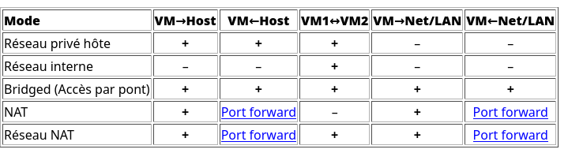

# Ping et machine virtuelle en LAN

## Effectuer un Ping

### D'un hôte à un autre dans le même LAN
Un hôte est un ordinateur présent dans un réseau. Je peux savoir si deux ordinateurs sont présents dans le même réseau si je pingue l'adresse IP de l'un depuis un terminal dans l'autre.

Pour tester la connectivité entre deux hôtes dans le même LAN, suivez ces étapes :

1.  **Obtenez les adresses IP des deux hôtes** :
  -   Sur chaque hôte, ouvrez un terminal.
  -   Tapez la commande suivante pour trouver l'adresse IPv4 :
    ```bash
    ip addr  # Pour Linux
    ```
    ```powershell
    ipconfig  # Pour Windows
    ```
  -   Notez les adresses IP des deux hôtes.

2.  **Effectuez le ping** :
  -   Sur l'hôte A, ouvrez un terminal et tapez :
    ```bash
    ping <adresse_IP_hôte_B> # ex : ping 192.168.1.102 
    ```
  -   Remplacez `<adresse_IP_hôte_B>` par l'adresse IP de l'hôte B.

Vous devriez voir des paquets de données s'afficher au fur et à mesure ainsi que le délai de transmission en millisecondes.

### **Configurez les VM** :
Pour qu'une VM puisse accéder à une autre machine (VM ou non), il faut que les deux machines soient considérées comme étant dans le même réseau. VirtualBox offre des configurations pour chaque cas de figure.

-   ***Ouvrez la configuration d'une VM dans VirtualBox (clic droit -> Configuration)***
-   Dans Réseau -> mode d'accès réseau, je peux dérouler une liste des différents modes d'accès réseau.



*Par exemple, si je veux faire une requête de VM vers VM*, les modes correspondants sont donc tous les modes sauf NAT (le mode par défaut).

Si je veux que la connexion se fasse entre une VM et un hôte, j'utilise le mode par pont (Bridged), le NAT, le réseau NAT ou le réseau privé hôte.

Certains réseaux sont plus simples à mettre en place que d'autres, par exemple le mode réseau interne nécessite de définir statiquement les adresses IP.

***Notez tout de même que le mode par pont (Bridged) fonctionne dans tous les cas.***

1.  **Réglez le mode d'accès réseau des deux VM sur *Accès par pont (Bridged)*** pour permettre la communication inter-VM.
2.  **Obtenez les adresses IP des VM** :
  -   Connectez-vous à chaque machine et ouvrez un terminal.
  -   Tapez la commande suivante pour trouver l'adresse IP :
    ```bash
    ip a  # Pour Linux
    ipconfig  # Pour Windows
    ```
  -   Notez les adresses IP des deux VM.

3.  **Effectuez le ping** :
  -   Sur la VM A, ouvrez un terminal et tapez :
    ```bash
    ping <adresse_IP_VM_B>
    ```
  -   Remplacez `<adresse_IP_VM_B>` par l'adresse IP de la VM B.
  -   Vous devriez voir des réponses si les deux VM sont dans le même réseau et que la connectivité est correcte.

## Activité - Connexion d'une VM vers une autre machine
### Lisez-moi !
Les commandes à connaître :
```bash
ip addr # permet de récupérer l'adresse IP d'une machine
ipconfig # Pour Windows
ping <adresse_ip> # permet de pinguer une adresse IP
```

Le tableau suivant définit les modes possibles pour des connexions de VM en fonction du besoin. Ces modes sont paramétrables après un clic droit sur une VM : *Configuration > Réseau > Mode d'accès réseau*.


*Table 6.1 de la documentation https://www.virtualbox.org/manual/ch06.html*

**Attention !** Pour certains modes de connexion, il est nécessaire de créer un réseau virtuel. Pour ouvrir le panneau de création des réseaux virtuels, faites : ***Ctrl+H*** dans VirtualBox.

### Questions :

Avec le mode de connexion de votre choix :

1.  Faites fonctionner un ping d'un hôte vers un autre hôte.
2.  Faites fonctionner un ping d'une VM vers le PC hôte et vice-versa.
3.  Faites fonctionner un ping d'une VM vers une autre VM.
4.  Faites fonctionner un ping d'une VM vers un PC du LAN et vice-versa.

*Plusieurs solutions sont possibles.*