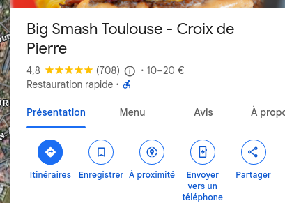

# Projet Maquettes

## Objectif

Réalisez l'intégration des maquettes HTML et CSS fournies dans le dossier `Maquettes`.

## Pré-requis
- HTML
- CSS
    - selecteurs

## Cahier des charges

| #  | Exigence                                                                                                                                         |
|----|--------------------------------------------------------------------------------------------------------------------------------------------------|
| 1  | Réalisez l'intégration des maquettes HTML et CSS fournies dans le dossier `Maquettes`.                                                           |
| 2  | Les maquettes doivent être responsives, c'est-à-dire s'adapter à différentes tailles d'écran (mobile, tablette, desktop).                        |
| 3  | Le projet doit être déposé dans un dépôt GitHub dédié.                                                                                           |
| 4  | La mise en production doit être effectuée via GitHub Pages, afin de rendre le projet accessible en ligne.                                        |

## Conseils pour la réalisation des maquettes

### Burger

Pour la maquette burger commencez par diviser votre pages en trois balises sections d'une hauteurs de 100vh chacune.


```html
<section class="hero-section">

</section>
<section class="map-section">

</section>
<section class="about-section">

</section>
``` 

La carte google peut être récupérée via une balise `<iframe>` que vous pouvea copié collez depuis Google Maps.

*1. Cliquez sur le bouton partager*



*2. Dans la pop up cliquez sur integrez une carte*


Vous pouvez copié le code HTML dans la balise `map-section` de votre maquette.

```html
<section class="hero-section">
    <!-- Remplir ici avec l'image du burger etc-->
</section>

<section class="map-section">
    <iframe src="https://www.google.com/maps/embed?pb=!1m18!1m12!1m3!1d16122.564928543632!2d1.4045258871581923!3d43.579055500000024!2m3!1f0!2f0!3f0!3m2!1i1024!2i768!4f13.1!3m3!1m2!1s0x12aebb7b393cfc27%3A0x18fa2bf896c3db72!2sBig%20Smash%20Toulouse%20-%20Croix%20de%20Pierre!5e1!3m2!1sfr!2sfr!4v1750793320765!5m2!1sfr!2sfr" width="600" height="450" style="border:0;" allowfullscreen="" loading="lazy" referrerpolicy="no-referrer-when-downgrade"></iframe>
</section>

<section class="about-section">
    <!-- Remplir ici avec les trois colonnes de description-->

</section>
```

### Portfolio

Pour la maquette portfolio, utilisez `display :grid;` pour les sections "What I Do" et "My Portfolio".

Egalement un box-shadow sur les cartes de la section "My Portfolio" pour donner un effet de profondeur.

```css
.portfolio-card {
    box-shadow: 0 5px 5px rgba(255, 255, 255, 0.50);
}
```


### Coffee


Utilisez `back-ground-size : cover` pour la section "Hero" de la maquette coffee, ainsi l'image de fond s'adaptera à la taille de la section.


