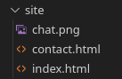
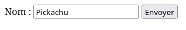
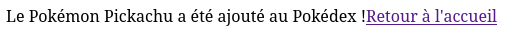

# HTML
Le **HTML (Hypertext Markup Language)** : langage de balisage utilisé pour structurer le contenu des pages web.

**HTML** est le langage descriptif utilisé pour créer des pages web. Il structure le contenu d'une page en utilisant des balises qui décrivent les éléments à afficher au navigateur.

## Documentation HTML
- La MDN (Mozilla Developer Network) propose une très bonne documentation exhaustive du HTML (ainsi que du CSS et du JS d'ailleurs) : https://developer.mozilla.org/fr/docs/Web/HTML. Ce site est une excellente ressource pour comprendre le fonctionnement précis des différentes balises HTML, leurs attributs et leurs cas d'utilisation.
- *W3Schools* est également une ressource populaire pour apprendre le HTML. Bien que moins détaillée que MDN, elle est plus concrète et permet d'obtenir l'information recherchée plus rapidement. Vous pouvez consulter leur documentation ici : https://www.w3schools.com/html/.

Avec ce cours, je souhaite vous faire comprendre comment fonctionne le HTML et pourquoi il fonctionne ainsi. Consultez toujours la documentation à chaque nouvelle balise, le HTML est un langage simple et il vous suffit de pratiquer pendant votre lecture pour acquérir les bases.

## Structure de base d'un document HTML

Un document HTML commence par une déclaration `<!DOCTYPE html>` pour indiquer au navigateur qu'il s'agit d'un document HTML5. Ensuite, les balises principales `html`, `head` et `body` sont utilisées pour structurer le document :

Placez donc ce code dans le fichier `index.html`.

*index.html*
```html
<!DOCTYPE html>
<html>
<head>
    <title>Ma première page</title>
    <meta charset="UTF-8"> <!-- Définit la table de caractères à utiliser et permet la présence, entre autres, des accents sur les lettres-->
</head>
<body>
    <h1>Bienvenue sur ma page</h1>
    <p>Ceci est un paragraphe.</p>
</body>
</html>
```

> Si vous tapez `!` puis la touche `tabulation` ou `entrée` dans VSCode, il va automatiquement générer la structure de base d'un document HTML5.

- La balise `<html>` englobe tout le contenu de la page.
- La balise `<head>` contient les méta-informations comme 
    - `<title>` : le titre de l'onglet 
    - des liens vers des fichiers CSS ou JavaScript, etc.
- **La balise `<body>` contient tout le contenu visible** de la page (texte, images, boutons, etc.).

> Il faut toujours mettre le contenu visible de la page dans la balise `<body>`.


## Arborescence d'un projet HTML
Un projet HTML est généralement organisé en plusieurs fichiers et dossiers. Voici une structure basique, copiez-la dans un dossier sur VSCode :

- `index.html` : la page d'accueil du site. Ce fichier doit obligatoirement s'appeler `index.html` car c'est le fichier par défaut que le serveur web va chercher.
- `contact.html` : une page de contact.
- `chat.png` : une image utilisée par la page, la voici :


## Lancer un serveur web 
Pour visualiser correctement les pages HTML, il est recommandé de lancer un serveur web local. Vous pouvez utiliser le serveur intégré de PHP en exécutant la commande suivante dans le terminal à la racine de votre projet :

```bash
php -S localhost:8000
```

Puis rendez-vous sur `http://localhost:8000` dans votre navigateur pour voir votre page d'accueil (le fichier `index.html`).

## Balise ouvrante et fermante 
Une balise HTML est généralement composée d'une balise ouvrante et d'une balise fermante. La balise ouvrante commence par `<` et se termine par `>`, tandis que la balise fermante commence par `</` et se termine par `>`.

```html
<h1>Bienvenue sur la boutique !</h1>
<p>Ceci est un paragraphe.</p>
```

Vous remarquez que les balises HTML possèdent un contenu entre la balise ouvrante et la balise fermante.

> Si vous oubliez le contenu entre les balises, la hauteur de la balise sera vide et donc la balise sera invisible. Faites attention à toujours mettre du contenu entre les balises ouvrantes et fermantes.

Voici la documentation w3schools des balises HTML les plus courantes :
- p : https://www.w3schools.com/tags/tag_p.asp
- a : https://www.w3schools.com/tags/tag_a.asp
- h1 à h6 : https://www.w3schools.com/tags/tag_hn.asp
- img : https://www.w3schools.com/tags/tag_img.asp
- div : https://www.w3schools.com/tags/tag_div.asp
- span : https://www.w3schools.com/tags/tag_span.asp
- ul : https://www.w3schools.com/tags/tag_ul.asp
- ol : https://www.w3schools.com/tags/tag_ol.asp
- li : https://www.w3schools.com/tags/tag_li.asp
- header : https://www.w3schools.com/tags/tag_header.asp
- footer : https://www.w3schools.com/tags/tag_footer.asp
- main : https://www.w3schools.com/tags/tag_main.asp
- section : https://www.w3schools.com/tags/tag_section.asp
- form : https://www.w3schools.com/tags/tag_form.asp


## Balise orpheline
Cependant, certaines balises HTML n'ont pas de balise fermante. On les appelle des **balises orphelines** ou **balises auto-fermantes**. Elles sont utilisées pour insérer des éléments qui n'ont pas besoin de contenu, comme une image, une vidéo ou un lecteur audio.
### Image
*La balise img permet d'afficher n'importe quelle image*
```html

```

1. Vérifiez que vous voyez l'image du chat sur votre page web à l'adresse `http://localhost:8000`.

### Vidéo
*La balise vidéo permet d'afficher une vidéo dans un lecteur*
```html
<video src="http://commondatastorage.googleapis.com/gtv-videos-bucket/sample/BigBuckBunny.mp4" controls>
```
1. Vérifiez que vous voyez la vidéo sur votre page web à l'adresse `http://localhost:8000`.
### Audio
*La balise audio permet d'afficher un lecteur audio*
```html
<audio src="https://www.soundhelix.com/examples/mp3/SoundHelix-Song-1.mp3" controls>
```
1. Vérifiez que vous voyez le lecteur audio sur votre page web à l'adresse `http://localhost:8000`.

### La balise `<a>` - Lier les pages entre elles
La balise `<a>` est utilisée pour créer des liens hypertextes entre les pages. Elle permet de naviguer d'une page à une autre en cliquant sur le lien.

C'est probablement la balise la plus importante du HTML, car elle permet de lier les pages entre elles et de créer une navigation sur le site.
```html
<a href="contact.html">Visitez notre site</a>
```

La page contact.html est au même niveau d'arborescence que la page index.html, donc on peut y accéder en cliquant sur le lien.

Si la page est dans un sous-dossier, il faut indiquer le chemin relatif vers la page. Par exemple, si la page `contact.html` est dans un dossier `pages`, on écrira :
```html
<a href="pages/contact.html">Visitez notre site</a>
```

#### Lien externe
La balise `<a>` peut également être utilisée pour créer des liens vers des sites externes. Pour cela, il suffit de mettre l'URL du site dans l'attribut `href`.

```html
<a href="https://www.google.com">Visitez Google</a>
<a href="https://www.leboncoin.fr">Cliquez ici pour aller sur leboncoin</a>
```


## Attributs HTML
Les attributs HTML sont des propriétés supplémentaires que l'on peut ajouter aux balises pour modifier leur comportement ou leur apparence. Ils sont placés dans la balise ouvrante et sont généralement sous la forme `attribut="valeur"`.

### Attributs globaux
Certains attributs sont globaux et peuvent être utilisés sur n'importe quelle balise HTML.
- `style` : permet d'ajouter des styles CSS à l'élément directement dans la balise.

```html
<p style="color: red;">Ceci est un paragraphe rouge.</p>
```
> Nous verrons le CSS plus tard, voici de la doc : https://www.w3schools.com/cssref/sel_class.php
- `class` : classe CSS de l'élément, similaire à l'id mais peut être utilisée sur plusieurs éléments différents.
```html
<p class="pokemon-name">Bulbizarre</p>
<p class="pokemon-name">Carapuce</p>
<style>
    .pokemon-name {
        color: green;
        font-weight: bold;
    }
</style>
```
- `id` : identifiant unique d'une balise, utilisé pour la cibler avec du CSS ou du JavaScript ou une ancre HTML. *Il est recommandé de réserver l'id aux ancres HTML et à quelques situations spéciales, mieux vaut privilégier l'utilisation de `class`.*
- `title` : texte qui s'affiche au survol de la souris sur l'élément.
- `hidden` : permet de masquer l'élément.

### Ancre HTML (liens internes)

Un lien dont l'attribut `href` commence par un `#` permet de créer une **ancre** vers un élément de la même page ayant un attribut `id` correspondant. Cela facilite la navigation interne, par exemple pour accéder rapidement à une section précise d'une page longue.

Exemple : un lien dans un texte qui référence l'id du troisième `<h2>` d'une page contenant plusieurs paragraphes pour espacer les sections.

```html
<p>
    On peut naviguer rapidement vers la <a href="#section3">section 3</a>
</p>


<h2 id="section1">Section 1</h2>
<p>Lorem ipsum dolor sit amet...</p>

<h2 id="section2">Section 2</h2>
<p>Lorem ipsum dolor sit amet...</p>

<h2 id="section3">Section 3</h2>
<p>Vous êtes arrivé à la section 3 !</p>
```

En cliquant sur le lien, la page défile automatiquement jusqu'à l'élément ayant l'id `section3`.

> Faites attention aux liens morts lorsque vous utilisez un lien externe.

## Balises HTTP
Certaines balises HTML sont capables d'effectuer des actions HTTP, comme envoyer des données à un serveur ou intégrer du contenu externe.

Vous connaissez déjà la balise `<a>` qui permet de créer des liens hypertextes.

### Formulaire HTML
La balise `<form>` est utilisée pour créer des formulaires HTML. Elle permet de collecter des données auprès de l'utilisateur et de les envoyer à un serveur pour traitement vers un script serveur, le plus souvent PHP (également Python ou JS).

> Nous verrons plus en détail les formulaires dans le chapitre sur les formulaires PHP.
1. Ajoutez le code suivant dans le fichier `index.html` pour créer un formulaire simple qui envoie des données à un script PHP nommé `traitement.php`.

*index.html*
```html
<form action="traitement.php" method="post">
    <label for="name">Nom :</label>
    <input type="text" id="name" name="pokemon_name" required>
    <input type="submit" value="Envoyer">
</form>
```

2. Créez un fichier `traitement.php` **à la racine de votre projet**. Ce fichier traitera les données envoyées par le formulaire.

*traitement.php*
```php
<?php
if(!isset($_POST['pokemon_name'])) {
    exit('Erreur : nom du Pokémon manquant.');
}

$name = $_POST['pokemon_name']; // Récupère le nom du Pokémon envoyé par le formulaire dans la balise <input>   
$fichier = fopen("pokedex.txt", "a+"); // Ouvre le fichier pokedex.txt en mode ajout

fwrite($fichier, "$name\n"); // Écrit le nom du Pokémon dans le fichier

fclose($fichier); // Ferme le fichier
echo "Le Pokémon $name a été ajouté au Pokédex !";
?>
<a href="/">Retour à l'accueil</a>
```

3. Testez le formulaire en accédant à `http://localhost:8000/index.html`. Saisissez un nom de Pokémon et cliquez sur "Envoyer". Vous devriez être redirigé vers `traitement.php` qui affichera un message de confirmation.

*index.html*


*traitement.php*


4. Observez comment le fichier pokedex.txt est créé puis rempli avec les noms des Pokémons que vous avez saisis dans le formulaire HTML ! C'est là la puissance du HTML et du HTTP.


- balise inline et block
- balise comportementale
    - iframe
- À savoir
    - google map embedded
    - google font
    - youtube video embedded

