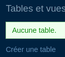
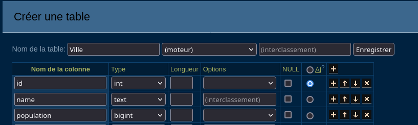
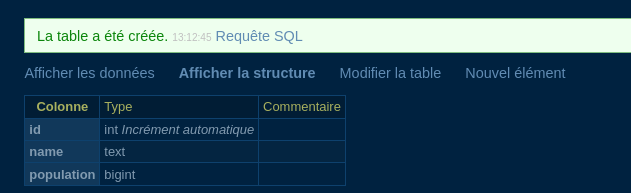

# Créer une table de données
Ce module a pour but de vous faire créer une application web complète avec un système d'authentification et une persistance de données pour stocker les tâches.

Une des premières étapes de la création d'une application est la création de ses tables de données. C'est-à-dire les différentes colonnes que chaque table possède.

## Rappel connexion à Adminer et à la BDD SQL.

*Relancez le serveur MySQL créé dans l'intro du module*
```bash
sudo docker start bdd
```

*Lancez Adminer sur le port 3030*
```bash
cd ~/adminer
php -S localhost:3030
```
Rendez-vous ensuite au lien suivant : http://localhost:3030/adminer.php

> Les identifiants sont :
> - host : `127.0.0.1`
> - username : `root`
> - password : `root`
> - database : `app-database`

## Créer une table dans Adminer

Nous allons prendre l'exemple d'une table Ville.


***1. Rendez-vous dans Adminer et créez une table Ville.***

Pour créer une table de données, cliquez sur "Créer une table" et entrez les informations suivantes :

1. *bouton créer une table*


2. *Formulaire de création de table*

- **Nom de la table** : `Ville`
- **Colonnes** :
    - `id` : Type `INT` et cochez *AI* : "Auto-increment"
    - `nom` : Type `TEXT`
    - `population` : Type `INT`

> Auto-increment permet de générer automatiquement un identifiant unique pour chaque enregistrement. Les lignes seront numérotées de 0 à *"l'infini"*.



3. Nouvel élément permet de créer un nouvel élément dans la table sans taper de commande SQL.
*cliquez sur nouvel élément*

*Tapez les informations de la nouvelle ligne*

*Un nouvel élément a été ajouté !*
 


### Exercices 

1. Ajoute une table Product qui respecte ce schéma :


2. Crée une table User selon ce schéma :


3. Ajoute une table Task qui respecte ce schéma :


4. Crée une table Category selon ce schéma :


5. Ajoute une table Comment qui respecte ce schéma :


6. Crée une table Project selon ce schéma :


7. Ajoute une table Tag qui respecte ce schéma :


## CREATE TABLE - Créer une table de données
Une table de données est définie par des colonnes et chaque colonne est définie par un nom et un type de données SQL.

Il est facile de créer des tables avec Adminer mais la méthode traditionnelle consiste à écrire du SQL.

La commande CREATE TABLE sert à cela.


**Syntaxe :**
```sql
CREATE TABLE table_name (
    column_name1 datatype,
    column_name2 datatype,
    column_name3 datatype,
    ...
    );
```

> **Un résumé des types de données les plus courants** ici : https://www.w3schools.com/sql/sql_datatypes.asp
> Pour des infos exhaustives sur les types de données SQL : https://dev.mysql.com/doc/refman/8.0/en/data-types.html.

**Exemple :**
```sql
CREATE TABLE category(
    id INT PRIMARY KEY AUTO_INCREMENT,
    name TINYTEXT,
    description TEXT
);
```
**Résultat :**

- `INT` signifie integer soit **un nombre entier**, c'est le type de la colonne `id`.
- `TINYTEXT` **est un texte de 255 caractères maximum**, c'est le type de la colonne `name`.
- `TEXT` **est un texte de 65 535 caractères maximum**, c'est le type de la colonne `description`.
- `PRIMARY KEY` **définit la colonne id comme étant l'identifiant unique des catégories ou *clé primaire*.** La majorité des tables SQL possèdent une colonne `id` en tant que clé primaire, cela simplifie l'accès aux éléments et permet la mise en relation de tables.
- `AUTO_INCREMENT` **définit automatiquement l'id d'un nouvel élément** en incrémentant de +1 par rapport à l'id du dernier élément créé.

> Il est obligatoire de placer AUTO_INCREMENT sur l'id INT pour que chaque élément ait un identifiant unique.

> Un caractère est habituellement stocké dans 1 octet et `TEXT` peut contenir 65 535 octets, il est bon de savoir qu'un emoji peut parfois prendre 3 ou 4 octets en mémoire.

1. Supprimez toutes les tables faites précédemment 

2. Accédez à l'invite de commande SQL dans Adminer.


Vous pouvez exécuter n'importe quelle commande SQL à partir d'ici :


> Je vous recommande fortement de vous exercer à TOUTES les commandes vues sur W3Schools ici.

> Connaitre le SQL écrit à la main est obligatoire pour l'oral du DWWM.

## Contraintes SQL

SQL permet un certain nombre de contraintes sur les tables :

Dont les plus importantes sont :

- UNIQUE : https://www.w3schools.com/sql/sql_unique.asp
- NOT NULL : https://www.w3schools.com/sql/sql_notnull.asp

### Exercices :

Pour chaque table que je vous fournis, créez-la avec la commande CREATE TABLE et les contraintes associées.

2. Crée une table `Order` avec les colonnes suivantes :  
    - id (clé primaire, auto-increment)
    - created_at (NOT NULL)
    - status (valeur unique)

3. Ajoute une table `Invoice` avec les colonnes suivantes :  
    - id (clé primaire, auto-increment)
    - total_amount (NOT NULL)
    - issued_at (NOT NULL)

4. Crée une table `Profile` avec les colonnes suivantes :  
    - id (clé primaire, auto-increment)
    - bio
    - avatar_url

5. Ajoute une table `Attachment` avec les colonnes suivantes :  
    - id (clé primaire, auto-increment)
    - file_path (NOT NULL)
    - uploaded_at (NOT NULL)