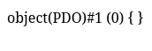
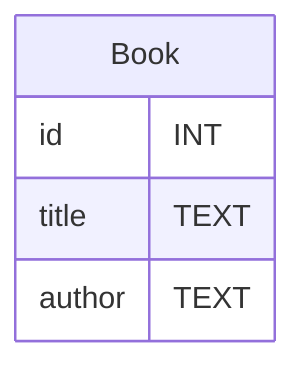
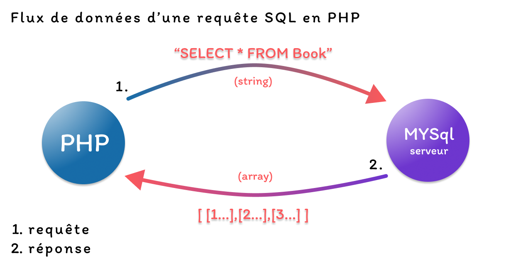
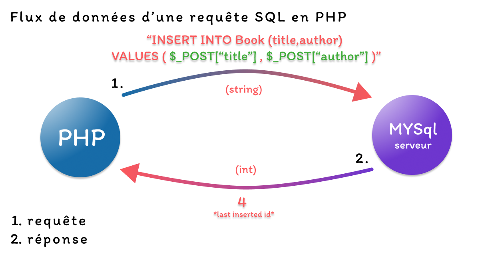

# PDO - Du SQL dans le PHP

Vous savez créez des tables et effectuer des commandes de lecture et d'écriture dessus.

Il est maintnenant tant d'utiliser PHP pour executer du SQL dans nos pages.

Vous saurez ensuite :

- Créer une nouvelle ligne dans une table a partir des données d'un formulaire PHP Post.
- Selectionner les données d'une table pour s'en servir en PHP.
- Selectionner les données d'une table SQL et l'afficher à l'écran dans une boucle for.

Pour ce faire nous allons utiliser la librairie `PDO` de PHP qui permet de se connecter à une base de données SQL et d'executer des requêtes SQL.


## Hello World - Connexion au serveur PHP

> Assurez-vous que le serveur mysql soit bien lancez : `sudo docker start bdd`.
Comment pour adminer pour vous connecter à la base de données il faut fournir :
- username : `root`
- password : `root`
- database : `app-database`
- host : `127.0.0.1`

Tout ces infos doivent être placées en paramètre de la fonction `new PDO()`.

*index.php*
```php
<?php
$host = "127.0.0.1";
$database_name = "app-database";

$bdd = new PDO("mysql:host=$host;dbname=$database_name", "root", "root");

var_dump($bdd);
``` 

Rendez-vous sur votre page web et observez le var_dump de la variable `$bdd`.



C'est cette variable qui nous permettra d'executer des requêtes SQL, c'est la variable la plus importante de notre projet.

> Si vous voyez un message d'erreur du type `SQLSTATE[HY000] [1045] Access denied for user 'root'@'localhost' (using password: YES)`, cela signifie que les informations de connexion à la base de données sont incorrectes. Vérifiez que vous avez bien utilisé les bonnes informations d'identification.

### Executer une requête SQL
Executer une requete sql se fait toujours en 3 étapes :
1. Préparer la requête SQL
2. Exécuter la requête SQL
3. Récupérer le résultat de la requête SQL

Ilustrons cela avec un exemple simple qui va multiplier 7 par 7 en SQL.

```php
<?php
$host = "127.0.0.1";
$database_name = "app-database";

$bdd = new PDO("mysql:host=$host;dbname=$database_name", "root", "root");

// VOTRE PREMIERE REQUETE SQL EN PHP
// Je prépare la requête
$request = $bdd->prepare("SELECT 7*7");

// Je l'execute
$request->execute();
// je récupère le resultat
$resultat = $request->fetch();

var_dump($resultat);
```
> Si vous vous dites que vous n'avez pas besoin de préparer la requête, c'est vrai, mais c'est une bonne pratique de le faire pour éviter les injections SQL.

## Lecture de donnée

Soit la table suivante :



En SQL :

```sql
CREATE TABLE Book (
    id INT AUTO_INCREMENT PRIMARY KEY,
    title TEXT NOT NULL,
    author TEXT NOT NULL
);
```

Avec le contenu suivants :

| id|title|author|
|-|-|-|
|1|Harry Potter|JK Rowling|
|2|Narnia|C.S. Lewis|
|3|Le Seigneur des Anneaux|J.R.R. Tolkien|

### Le flux des données d'une requete SELECT
La question que sont se pose est la suivante :

*Comment afficher les lignes d'une table SQL en PHP ?*

Pour afficher les lignes d'une table il faut effectuer une boucle foreach sur un tableau (array) PHP.

Pour récupérer ce tableau il faut effectuer une requête SQL depuis le code PHP vers le serveur MySQL, le serveur fournit un tableau dans sa réponse. C'est précisement ce tabeau qu'il nous faudra afficher avec une boucle foreach.

*schéma du flux de donnée de la requete SELECT*


0. Je prépare la requête SQL avec la fonction `prepare` de PDO.
1. La requête SQL est envoyée au serveur MySQL grâce à la fonction `execute` de PDO.
2. Le serveur MySQL exécute la requête SQL et renvoie un tableau de résultats que je récupère avec la fonction `fetchAll` de PDO.

```php
<?php
$database = new PDO("mysql:host=127.0.0.1;dbname=app-database","root","root");
// 1.Requete -> SELECT * FROM Product
$requete = $database->prepare("SELECT * FROM Book");
$requete->execute();
// 2.Reponse  <-- Array(3)
$products = $requete->fetchAll(PDO::FETCH_ASSOC);
?>

<!DOCTYPE html>
<html lang="en">
<head>
    <meta charset="UTF-8">
    <meta name="viewport" content="width=device-width, initial-scale=1.0">
    <title>Document</title>
</head>
<body>
    <h1>Afficher toutes les lignes de la table Book</h1>
    
    <?php foreach($products as $product): ?>
        <div class="product">
            <h2> Nom :<?= $product["titre"]?>  </h2>
            <p> Price : <?= $product["auteur"]?></p>
        </div>
    <?php endforeach ?>

</body>
</html>
```

Comme sur le schéma du flux de données, la requete SQL est d'abord envoyée au serveur MySQL.
```php
// 1.Requete -> SELECT * FROM Product
$requete = $database->prepare("SELECT * FROM Book");
$requete->execute();
```

Le tableau contenant tous les products est ensuite retourné en temps que réponse de la requête SQL.
```php
$products = $requete->fetchAll(PDO::FETCH_ASSOC);
```

> Pour rappel le type de valeur de retour de la fonction `fetchAll()` est `array`.


### Le flux des données d'une requête INSERT INTO

La question que l'on se pose est la suivante :

*Comment ajouter une ligne dans une table SQL en PHP ?*

Pour ajouter une ligne dans une table il faut effectuer une requête SQL `INSERT INTO` depuis le code PHP vers le serveur MySQL, le serveur exécute la requête et ajoute la ligne dans la table.

Au rechargement de la page, la ligne est visible dans la table grâce à la boucle foreach qui affiche toutes les lignes de la table.

*schéma du flux de donnée de la requete INSERT INTO*


0. Je prépare la requête SQL avec la fonction `prepare` de PDO.
1. La requête SQL est envoyée au serveur MySQL grâce à la fonction `execute` de PDO.
2. Le serveur MySQL exécute la requête SQL et ajoute une nouvelle ligne dans la table.

```php
<?php
// Je déclare une variable bool qui permet d'afficher un message SI la requete à réussi.
$isSuccess = false;

// Je test si titre et auteur on été posté par le formulaire
if(
    isset($_POST["titre"]) && 
    isset($_POST["auteur"])
){
    // Connexion à la database
    $database = new PDO("mysql:host=127.0.0.1;dbname=app-database","root","root");
    // Préparation de la requete INSERT
    $request = $database->prepare("INSERT INTO Book (titre,auteur) VALUES (?,?)");
    // Envoi de la requete
    $isSuccess = $request->execute([
        $_POST["titre"],
        $_POST["auteur"]
    ]);
    // Récupération de la réponse
    // Soit, l'id du nouveau livre inséré
    $lastInsertedId = $database->lastInsertId();
}
?>

<!DOCTYPE html>
<html lang="fr">
<head>
    <meta charset="UTF-8">
    <meta name="viewport" content="width=device-width, initial-scale=1.0">
    <title>Book</title>
</head>
<body>

    <form action="" method="post">
        <input type="text" name="titre">
        <input type="password" name="auteur">
        <button>Ajouter un livre</button>
    </form>
    <?php if($isSuccess == true): ?>
        <p> Nouveau livre ajouté avec succès ! </p>
    <?php endif; ?>
</body>
</html>
```