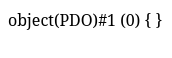
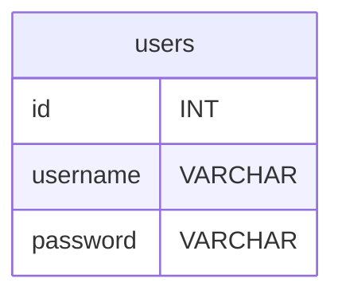

# PDO - Du SQL dans le PHP

Vous savez créez des tables et effectuer des commandes de lecture et d'écriture dessus.

Il est maintnenant tant d'utiliser PHP pour executer du SQL dans nos page.

Vous saurez ensuite :

- Créer une nouvelle ligne dans une table a partir des données d'un formulaire PHP Post.
- Selectionner les données d'une table pour s'en servir en PHP.
- Selectionner les données d'une table SQL et l'afficher à l'écran dans une boucle for.

Pour ce faire nous allons utiliser la librairie `PDO` de PHP qui permet de se connecter à une base de données SQL et d'executer des requêtes SQL.


## Hello World - Connexion au serveur PHP

> Assurez-vous que le serveur mysql soit bien lancez : `sudo docker start bdd`.
Comment pour adminer pour vous connecter à la base de données il faut fournir :
- username : `root`
- password : `root`
- database : `app-database`
- host : `127.0.0.1`

Tout ces infos doivent être placées en paramètre de la fonction `new PDO()`.

*index.php*
```php
<?php
$host = "127.0.0.1";
$database_name = "app-database";

$bdd = new PDO("mysql:host=$host;dbname=$database_name", "root", "root");

var_dump($bdd);
``` 

Rendez-vous sur votre page web et observez le var_dump de la variable `$bdd`.



C'est cette variable qui nous permettra d'executer des requêtes SQL, c'est la variable la plus importante de notre projet.

> Si vous voyez un message d'erreur du type `SQLSTATE[HY000] [1045] Access denied for user 'root'@'localhost' (using password: YES)`, cela signifie que les informations de connexion à la base de données sont incorrectes. Vérifiez que vous avez bien utilisé les bonnes informations d'identification.

### Executer une requête SQL
Executer une requete sql se fait toujours en 3 étapes :
1. Préparer la requête SQL
2. Exécuter la requête SQL
3. Récupérer le résultat de la requête SQL

Ilustrons cela avec un exemple simple qui va multiplier 7 par 7 en SQL.

```php
<?php
$host = "127.0.0.1";
$database_name = "app-database";

$bdd = new PDO("mysql:host=$host;dbname=$database_name", "root", "root");

// VOTRE PREMIERE REQUETE SQL EN PHP
// Je prépare la requête
$request = $bdd->prepare("SELECT 7*7");

// Je l'execute
$request->execute();
// je récupère le resultat
$resultat = $request->fetch();

var_dump($resultat);
```
> Si vous vous dites que vous n'avez pas besoin de préparer la requête, c'est vrai, mais c'est une bonne pratique de le faire pour éviter les injections SQL.

## Inserer des données dans une table SQL avec PDO

**Assurez vous d'avoir bien une table crée depuis Adminer avant d'effectuer vos requetes SQL !**

Soit la table suivante :
```sql
CREATE TABLE IF NOT EXISTS `users` (
  `id` int(11) NOT NULL AUTO_INCREMENT PRIMARY KEY,
  `username` varchar(255) NOT NULL,
  `password` varchar(255) NOT NULL
);
```



### INSERT INTO
Pour insérer des données dans une table SQL, on utilise la commande `INSERT INTO`.

```php
<?php
$host = "127.0.0.1";
$database_name = "app-database";

$bdd = new PDO("mysql:host=$host;dbname=$database_name", "root", "root");

// Je prépare la requête
$request = $bdd->prepare("INSERT INTO users (username,password) VALUES (?,?)");

// Je l'execute
$request->execute([
    "Billy",
    "1234"
]);

// Il n'est pas nécessaire de récupérer le résultat de l'insertion, mais vous pouvez vérifier si l'insertion a réussi en vérifiant le nombre de lignes affectées.
$resultat = $request->rowCount();

var_dump($resultat);
```

0. Rendez-vous dans adminer pour observer l'ajout de l'utilisateur `Billy` dans la table `users`.


1. Ajouter un utilisateur dans la table `users` avec le nom d'utilisateur `Billy` et le mot de passe `1234`.
2. Ajouter un utilisateur dans la table `users` avec le nom d'utilisateur `Alice` et le mot de passe `blabla`.
3. Vérifier que les utilisateurs ont bien été ajoutés en utilisant Adminer.
4. Modifier la table users pour ajouter la contrainte UNIQUE sur la colonne `username` pour éviter les doublons. 
> Utilisez la commande ALTER TABLE pour ajouter la contrainte UNIQUE.
> Consultez la doc W3Schools : https://www.w3schools.com/sql/sql_unique.asp
>```sql
>ALTER TABLE users ADD UNIQUE (username);
>```

5. Essayer d'ajouter un utilisateur avec le même nom d'utilisateur `Billy` et observer l'erreur.

## Lire des données dans une table SQL avec PDO
Pour lire des données dans une table SQL, on utilise la commande `SELECT`.

```php
// Je prépare la requête
$request = $bdd->prepare("SELECT * FROM users");

// Je l'execute
$request->execute();

// Je récupère le résultat
$users = $request->fetchAll();

var_dump($users);
```

### Afficher les utilisateurs
Pour afficher les utilisateurs dans une page web, vous pouvez utiliser une boucle `foreach` pour parcourir les résultats de la requête et afficher les informations de chaque utilisateur.
```php
<?php
// ... PDO

// Je prépare la requête
$request = $bdd->prepare("SELECT * FROM users");

// Je l'execute
$request->execute();

// Je récupère le résultat
$users = $request->fetchAll(PDO::FETCH_ASSOC);
// J'utilise le paramètre PDO::FETCH_ASSOC pour obtenir un tableau associatif en tant que tableau d'utilisateurs

var_dump($users);
?>

<!DOCTYPE html>
<html lang="fr">
<head>
    <meta charset="UTF-8">
    <meta name="viewport" content="width=device-width, initial-scale=1.0">
    <title>Liste des utilisateurs</title>
</head>
<body>
    <h1>Liste des utilisateurs</h1>
    <div class="users">
        <?php foreach ($users as $user): ?>
            <div class="user">
                <h2><?= htmlspecialchars($user['username']); ?></h2> -
                <p><?= htmlspecialchars($user['password']); ?></p>
            </div>
        <?php endforeach; ?>
    </div>
</body>
</html>
```

>

> Voir la doc de htmlspecialchars() : https://www.php.net/manual/fr/function.htmlspecialchars.php

### Exercices
1. Mettez en place un formulaire HTML pour ajouter un utilisateur dans la table `users` avec les champs `username` et `password`.

2. Modifiez le formulaire pour afficher un message de succès ou d’erreur après l’insertion, selon que l’ajout a réussi ou échoué (par exemple, si le nom d’utilisateur existe déjà).

3. Créez un formulaire permettant d’ajouter plusieurs utilisateurs à la suite (par exemple, 3 utilisateurs), puis insérez-les tous dans la base de données lors de la soumission.

4. Ajoutez une vérification côté PHP pour empêcher l’insertion d’un utilisateur si l’un des champs du formulaire est vide.

5. Affichez la liste de tous les utilisateurs présents dans la table `users` sous le formulaire, en utilisant une boucle PHP pour parcourir les résultats d’une requête `SELECT`.

6. Ajoutez un bouton de suppression à côté de chaque utilisateur affiché, permettant de supprimer l’utilisateur correspondant de la base de données.
> Voir $_GET pour récupérer l'id de l'utilisateur à supprimer vien un lien cliquable du type `<a href="delete.php?id=1">Supprimer</a>`.

7. Modifiez le formulaire pour que le mot de passe soit stocké de façon sécurisée (par exemple, en utilisant la fonction `password_hash()` de PHP avant l’insertion). Verifiez que les mots de passe ne sont plus affichés en clair dans la liste des utilisateurs.
