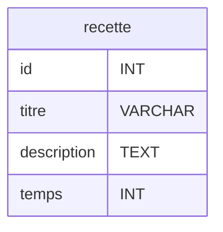

# Cours : Principe du CRUD et mise en œuvre avec une table d'aliments

## Introduction au principe du CRUD (Create, Read, Update, Delete)
Le **CRUD** est un acronyme représentant les quatre opérations fondamentales pour manipuler des données dans une base de données :
- **Create** : Ajouter de nouvelles données.
- **Read** : Lire ou récupérer des données existantes.
- **Update** : Modifier des données existantes.
- **Delete** : Supprimer des données existantes.

### Présentation d'une table de d'aliments
Prenons une table appelée `aliments`, qui permettra de stocker des informations sur les aliments. Voici un diagramme Entité-Relation (ER) simplifié :

| Attribut           | Type        | Description                       |
|---------------------|-------------|-----------------------------------|
| id                 | INT (PK)    | Identifiant unique de l'aliment  |
| nom                | VARCHAR     | Nom de l'aliment                 |
| type               | VARCHAR     | Type de l'aliment (fruit, légume, etc.) |
| calories           | INT         | Valeur calorique de l'aliment    |

## Listing des 5 fonctions CRUD basiques
Dans notre projet, nous mettrons en œuvre les 5 fonctions suivantes :

> le code suivant ne contient pas execute et prepare le detail du code php arrive juste apres, concentrez vous sur le concept.

### 1. Fonction Add : Ajouter un aliment
```php
//create
function add_aliment($nom, $type, $calories) {
    // Connexion à la base de données
    // Requête SQL pour insérer un nouvel aliment
    $sql = "INSERT INTO aliments (nom, type, calories) VALUES ('$nom', '$type', $calories)";
    // Exécution de la requête
}
```

### 2. Fonction GetById : Récupérer un aliment par son ID
```php
//read
function getById_aliment($id) {
    // Connexion à la base de données
    // Requête SQL pour sélectionner un aliment par ID
    $sql = "SELECT * FROM aliments WHERE id = $id";
    // Exécution de la requête et retour des résultats
}
```

### 3. Fonction GetAll : Récupérer tous les aliments
```php
//read
function getAll_aliment() {
    // Connexion à la base de données
    // Requête SQL pour sélectionner tous les aliments
    $sql = "SELECT * FROM aliments";
    // Exécution de la requête et retour des résultats
}
```

### 4. Fonction DeleteById : Supprimer un aliment par son ID
```php
//delete
function deleteById_aliment($id) {
    // Connexion à la base de données
    // Requête SQL pour supprimer un aliment par ID
    $sql = "DELETE FROM aliments WHERE id = $id";
    // Exécution de la requête
}
```

### 5. Fonction Update : Modifier un aliment par son ID
```php
//update
function update_aliment($id, $nom, $type, $calories) {
    // Connexion à la base de données
    // Requête SQL pour mettre à jour un aliment
    $sql = "UPDATE aliments SET nom = '$nom', type = '$type', calories = $calories WHERE id = $id";
    // Exécution de la requête
}
```

## Mise en place
Un CRUD est un ensemble de fonctions d'acces a une table de données. Il est d'usage de séparer ces fonctions dans un autres rochiers pour s'en servir partout dans le projet comme bon nous semble.

### 1. Création du fichier `crud-aliment.php`
Créez un fichier `crud-aliment.php` où seront définies toutes les fonctions CRUD ci-dessus. Voici un exemple de contenu pour ce fichier :

```php
<?php
// Connexion à la base de données
function connect() {
    // Remplacez les valeurs ci-dessous par celles de votre base de données
    $host = 'localhost';
    $dbname = 'votre_base';
    $user = 'votre_utilisateur';
    $password = 'votre_mot_de_passe';
    return new PDO("mysql:host=$host;dbname=$dbname", $user, $password);
}

//create
function add($nom, $type, $calories) {
    $db = connect();
    $sql = "INSERT INTO aliments (nom, type, calories) VALUES (:nom, :type, :calories)";
    $stmt = $db->prepare($sql);
    $stmt->execute(['nom' => $nom, 'type' => $type, 'calories' => $calories]);
}

//read
function getById($id) {
    $db = connect();
    $sql = "SELECT * FROM aliments WHERE id = :id";
    $stmt = $db->prepare($sql);
    $stmt->execute(['id' => $id]);
    return $stmt->fetch(PDO::FETCH_ASSOC);
}

//read
function getAll() {
    $db = connect();
    $sql = "SELECT * FROM aliments";
    return $db->query($sql)->fetchAll(PDO::FETCH_ASSOC);
}

//delete
function deleteById($id) {
    $db = connect();
    $sql = "DELETE FROM aliments WHERE id = :id";
    $stmt = $db->prepare($sql);
    $stmt->execute(['id' => $id]);
}

//update
function update($id, $nom, $type, $calories) {
    $db = connect();
    $sql = "UPDATE aliments SET nom = :nom, type = :type, calories = :calories WHERE id = :id";
    $stmt = $db->prepare($sql);
    $stmt->execute(['id' => $id, 'nom' => $nom, 'type' => $type, 'calories' => $calories]);
}
?>
```

### 2. Création du fichier `index.php`
Dans le fichier `index.php`, incluez le fichier `crud-aliment.php` à l'aide de `require_once`. Ajoutez un formulaire pour insérer un aliment et un affichage des aliments récupérés.

```php
<?php
require_once 'crud-aliment.php';

// Ajout d'un aliment via le formulaire
if ($_SERVER['REQUEST_METHOD'] === 'POST') {
    $nom = $_POST['nom'];
    $type = $_POST['type'];
    $calories = $_POST['calories'];
    add($nom, $type, $calories);
}

$aliments = getAll();
?>

<!DOCTYPE html>
<html>
<head>
    <title>CRUD Aliments</title>
</head>
<body>
    <h1>CRUD Aliments</h1>

    <!-- Formulaire pour ajouter un aliment -->
    <form action=""  method="POST">
        <input type="text" name="nom" placeholder="Nom de l'aliment" required>
        <input type="text" name="type" placeholder="Type de l'aliment" required>
        <input type="number" name="calories" placeholder="Calories" required>
        <button type="submit">Ajouter</button>
    </form>

    <!-- Liste des aliments -->
    <h2>Liste des aliments</h2>
    <ul>
        <?php foreach ($aliments as $aliment): ?>
            <li>
                <?= $aliment['nom'] ?> (<?= $aliment['type'] ?>) - <?= $aliment['calories'] ?> calories
            </li>
        <?php endforeach; ?>
    </ul>
</body>
</html>
```

## Exercices
### Exercice : Création d'un CRUD pour une table `recettes`

1. **Création de la table SQL**

    À partir du diagramme Entité-Relation ci-dessous, créez la table `recettes` dans votre base de données sur Adminer :


2. **Fonctions d'accès CRUD**
    - Créez les fonctions suivantes :
      - `add_recette($titre, $description, $temps)`
      - `getById_recette($id)`
      - `getAll_recette()`

3. **Formulaire d'ajout et affichage**
    - Implementez un formulaire POST pour ajouter une recette.
    - Affichez la liste de toutes les recettes avec un `foreach`, en affichant le titre, la description et le temps de préparation.

**Voici le code de votre index.php pour l'exercice :**

```php
<?php
function add_recette(string $titre, string $description, int $temps) {
    
}

function getById_recette($id) : array{

    $recette = /*FETCH TODO*/

    return $recette;
}

function getAll_recette() : array{
    $recettes = /*FETCH ALL TODO*/

    return $recettes;
}


$recettes = getAll_recette();

?>
<!DOCTYPE html>
<html lang="fr">
<head>
    <meta charset="UTF-8">
    <meta name="viewport" content="width=device-width, initial-scale=1.0">
    <title>CRUD Recettes</title>
</head>
<body>
    <h1>CRUD Recettes</h1>

    <!-- TODO Formulaire d'ajout -->
    
    
    
    <!-- TODO Foreach sur recettes -->
</body>
</html>
```

### Exercice : CRUD pour une table `users`
Comme dans l'exercice précédent, mettez en place un CRUD pour une table `users` avec les champs suivants :
```erDiagram
erDiagram
User {
    id INT
    username VARCHAR
    password VARCHAR
}
```
**Attention ! Utilisez la fonction password_hash au moment de l'INSERT INTO pour chiffrer le mot de passe !**