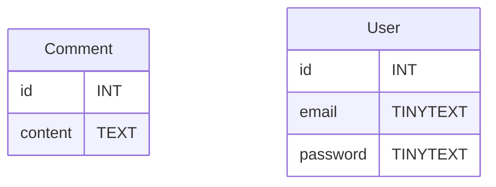
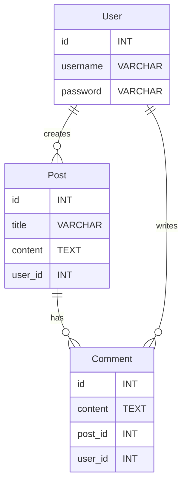

# Association entre les tables - One to Many

SQL est un langage de base de donnée relationnel. Ce qui signifie que ses tables de données peuvent être misent en relation pour simplifier l'accès au données.

Un exemple typique serait un `Commentaire` appartenant a un `Utilisateur`.

Soit ces tables :



En SQL ça donne ça :
```sql
CREATE TABLE IF NOT EXISTS `comment` (
  `id` int AUTO_INCREMENT PRIMARY KEY,
  `content` text NOT NULL
);
```
```sql
CREATE TABLE IF NOT EXISTS `user` (
  `id` int AUTO_INCREMENT PRIMARY KEY,
  `email` tinytext NOT NULL,
  `password` tinytext NOT NULL
);
```

*Comment faire pour obtenir tout les commentaires postés par un utilisateur spécifique ?*

Si je regarde le contenu de ses tables ne pourrait me permettre de SELECT tout les commentaire qui appartient à Alice par exemple :

*select * from user*
| id | email            | password   |
|----|------------------|------------|
| 1  | alice@mail.com   | secret123  |
| 2  | bob@mail.com     | passw0rd   |


*select * from comment*
| id | content                |
|----|------------------------|
| 1  | Super article !        |
| 2  | Merci pour l'info.     |
| 3  | Très utile, merci !    |

Il nous manque enfaite une colonne dans la table `Comment` !

## Relation One to Many et clé étrangère

Si je reprend la table d'utilisateur je remarque qu'il on tous un identifiant unique.

*select (id,email) from user*
| id | email            |
|----|------------------|
| ***1***  | alice@mail.com   |
| ***2***  | bob@mail.com     |

> Alice est l'utilisateur numéro 1
> Bob l'utilisateur numéro 2

***Il faut donc ajouter une colonne dans la table Comment qui défini le propriétaire du commentaire via son identifiant SQL (id).***

Comme ceci :

*select * from comment*
| id | content                | user_id |
|----|------------------------|---------|
| 1  | Super article !        | 1       |
| 2  | Merci pour l'info.     | 2       |
| 3  | Très utile, merci !    | 1       |

Et je pourais donc simplement y accéder avec une SELECT WHERE

```sql
SELECT * FROM Comment WHERE user_id=1;
``` 

```
| id | content                | user_id |
|----|------------------------|---------|
| 1  | Super article !        | 1       |
| 3  | Très utile, merci !    | 1       |
```

Il faut donc modifier la table.

### Clé étrangère

Cette nouvelle colonne `user_id` s'appelle une clé étrangère (`FOREIGN KEY`) c'est à dire : **un colonne qui contient la valeur d'une `PRIMARY KEY`.**

#### CREATE TABLE One to Many

> Rendez-vous dans Annexe-Anti-sèche du SQL pour une explication détaillée d'une relation One to Many.

Pour mettre en place cette relation il faut précisier la colonne contenant la FOREIGN KEY lors de la création de la table (CREATE TABLE).

```sql
CREATE TABLE IF NOT EXISTS `comment` (
  `id` int AUTO_INCREMENT PRIMARY KEY,
  `content` text NOT NULL,
  `user_id` int NOT NULL,
  FOREIGN KEY (user_id) REFERENCES user(id)
);
```

La ligne importante est la dernière ligne qui défini la contrainte FOREIGN KEY sur la nouvelle colonne `user_id`.

```sql
FOREIGN KEY (user_id) REFERENCES user(id)
```

Cette ligne permet à SQL de renvoyer une erreur si on essaye d'insérer un commentaire avec un `user_id` qui n'existe pas dans la table `user`.

## Lecture et Ecriture de données One To Many

### INSERT INTO avec une clé étrangère
Pour insérer des données dans une table avec une clé étrangère, il faut s'assurer que la valeur de la clé étrangère existe dans la table référencée.

1. Créer un utilisateur dans la table `user` :

```sql
INSERT INTO user (email, password) VALUES ('alice@mail.com', 'secret123');
```

2. Créer des commentaires pour cet utilisateur :

```sql
INSERT INTO comment (content, user_id) VALUES ('Super article !', 1);

INSERT INTO comment (content, user_id) VALUES ('Très utile, merci !', 1);
```

### SELECT avec une clé étrangère
Pour lire les données d'une table avec une clé étrangère, on peut utiliser une requête `SELECT` avec WHERE pour filtrer les résultats en fonction de la clé étrangère (user_id)

```sql
SELECT * FROM comment WHERE user_id = 1;
```
```
| id | content                | user_id |
|----|------------------------|---------|
| 1  | Super article !        | 1       |
| 3  | Très utile, merci !    | 1       |
```


### Exercices

#### Book et Author
1. **Créer deux tables `author` et `book`**  
    - Un auteur peut écrire plusieurs livres.  
    - Ajoute une clé étrangère dans la table `book` pour faire la relation.

2. **Insérer des données**  
    - Ajoute deux auteurs et trois livres (au moins deux livres pour le même auteur).

3. **Afficher tous les livres d’un auteur spécifique**  
    - Écris une requête SQL pour afficher les livres écrits par l’auteur ayant l’id 1.

4. **Modifier la clé étrangère**  
    - Change le propriétaire d’un livre pour qu’il appartienne à un autre auteur.

5. **Supprimer un auteur**  
    - Que se passe-t-il si tu supprimes un auteur qui possède des livres ?  
    - Teste et explique le résultat.
6. Mettez en place les fonctions CRUD pour les tables `author` et `book` :
   - `add_author($name)`
   - `add_book($title, $author_id)`
   - `getAll_books()`
   - `getAllBooksByAuthor($author_id)`
8. Implementez un formulaire POST pour un auteur.
7. Implementez un formulaire POST pour un livre, **IL DOIT permettre de choisir l'auteur id**.
9. Implementez l'affichage de tous les auteurs (id et nom).
10. Implementez une barre de cherche (form POST) qui affiche les livres d'un auteur en fonction de son id.
11. BONUS - La barre de recherche fonctionne aussi avec le nom de l'auteur.

#### Category et Product

1. **Créer une table `category` et une table `product`**  
    - Un produit appartient à une seule catégorie.  
    - Mets en place la relation One to Many.

2. **Lister tous les produits d’une catégorie**  
    - Écris une requête SQL pour afficher tous les produits de la catégorie ayant l’id 2.

3. **Mettre à jour une clé étrangère**  
    - Change la catégorie d’un produit existant.

4. **Créer une table `post` et une table `comment`**  
     - Un post peut avoir plusieurs commentaires.  
     - Crée les tables et la relation, puis insère des exemples de données.

5. **Association entre User, Post et Comment**  
    - Un utilisateur peut créer plusieurs posts.  
    - Un post peut avoir plusieurs commentaires.
    - Un commentaire appartient à un utilisateur et à un post.

