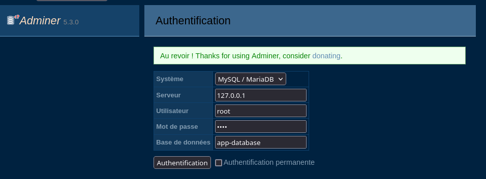
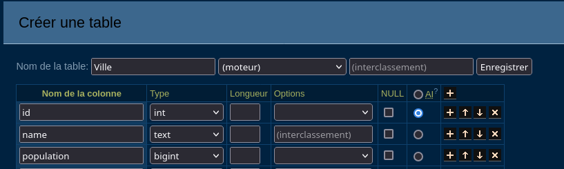
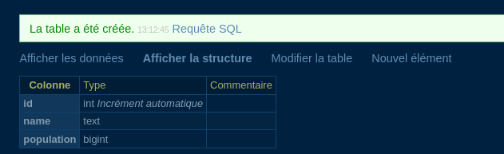
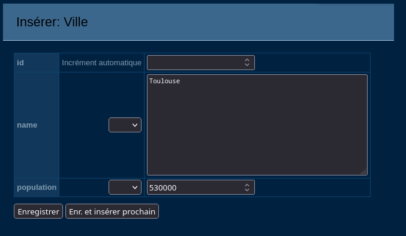
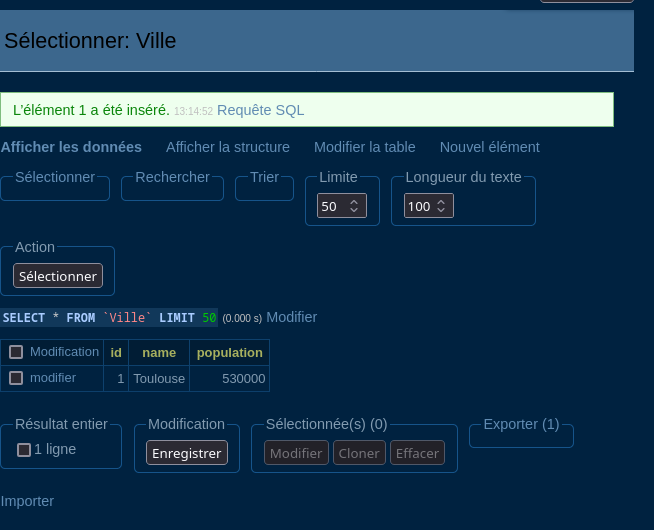

# Mise en place de l'envrionnement de développement

Pour cette dernière activité, nous avons besoin de : 
- PHP et son serveur web intégré : `php -S`
- Un serveur de base de données : `MySQL Server`
- Un interface visuelle pour gérer facilement la base de données : `Adminer`

Ainsi votre code PHP pourra intéragir avec une base de données SQL. Et vous pourrez administrer cette base de données avec Adminer.

L'objectif final de ce cours est de vous faire créer des données dans une table de données SQL via l'interface Adminer.

# Serveur MYSQL
Le moyen le plus simple et moderne de mettre en place un serveur MySQL est d'utiliser Docker.

Docker est un programme qui permet d'executer des *mini linux* appelés "containers". Ces containers sont isolés les uns des autres et permettent de faire tourner des applications sans avoir à les installer sur votre machine.

## 1. Installer Docker
```bash
sudo apt install docker.io
```
> Sous Windows, vous pouvez installer Docker Desktop depuis le site officiel de Docker.

## 2. Lancer un Server MySQL
```bash
sudo docker run --name bdd -e MYSQL_ROOT_PASSWORD=root -e MYSQL_DATABASE=app-database -d -p 3306:3306 mysql
```
Les informations suivantes sont importantes :
- `bdd` est le nom du serveur mysql
- `app-database` est le nom de la base de données
- `root` est le mot de passe de l'utilisateur `root`

### Relancer le serveur au démarrage de votre ordinateur
Quand vous redémarrez votre ordinateur, le serveur MySQL ne sera pas lancé automatiquement. Pour le relancer, vous pouvez utiliser la commande suivante :
```bash
sudo docker start bdd
```

## Annexe : en cas d'erreur

### Name already in use
Si vous rencontrez l'erreur suivante :
```
The container name "/bdd" is already in use by container ...
```

Il faut stoper le container bdd :
```bash
sudo docker stop bdd
```

> Pour vérifier si un serveur mysql occupe déjà le port 3306, vous pouvez utiliser la commande suivante :
```bash
systemctl status mysql
```
> Si il est marqué *actif* alors le port est déjà occupé.

> La commande `sudo docker rm bdd` peut supprimer un container peut supprimer un container.

### Port already in use
Il est possible que le port 3306 soit déjà utilisé par un autre service sur votre machine. Dans ce cas, vous pouvez arrêter le service MySQL existant avec la commande suivante :
```
systemctl stop mysql
```


## 3. Accéder à la base de données avec Adminer
Pour accéder à la base de données, vous pouvez utiliser Adminer. Il s'agit d'une interface web codé en PHP qui permet de gérer les bases de données MySQL.

1. Vérifiez que le container MySQL est en cours d'exécution :
   ```bash
   sudo docker ps
   ```
   Vous devriez voir le container `bdd` en cours d'exécution.
```
CONTAINER ID   IMAGE     COMMAND                  CREATED          STATUS          PORTS                                                    NAMES
b96dc41f6706   mysql     "docker-entrypoint.s…"   13 seconds ago   Up 12 seconds   0.0.0.0:3306->3306/tcp, [::]:3306->3306/tcp, 33060/tcp   bdd
```

> Si vous ne voyez refaite docker run si ce n'ets pas fait ou `docker start bdd` si le container est déjà créé.

### Téléchargez Adminer
Adminer est un simple script PHP, il nous suffit donc de :
- Télécharger le fichier `adminer.php`
- Lancer un serveur web PHP avec la commande `php -S localhost:3000` à l'emplacement du fichier `adminer.php`
- Acceder à Adminer via `http://localhost:3000/adminer.php`

Téléchargez le fichier `adminer.php` depuis le site officiel d'Adminer : https://www.adminer.org/en/


Ou bien en ligne de commande :
```bash
wget https://www.adminer.org/latest.php -O adminer.php
mkdir ~/adminer
mv adminer.php ~/adminer/
cd ~/adminer
```

### Lancer Adminer

### Pré-requis php extensions
Assurez-vous d'avoir les extensions PHP suivantes installées :
```bash
sudo apt install php-mysql php-pdo
```

Lancez le serveur web PHP dans le dossier où se trouve `adminer.php` :
```bash
php -S localhost:3000
```

Puis rendez-vous sur `http://localhost:3000/adminer.php` dans votre navigateur.

> Attention ! Il est possible que le fichier porte le nom de la version, par exemple `adminer-5.3.0.php`. Dans ce cas, vous devrez accéder à `http://localhost:3000/adminer-4.8.1.php`.
> Vous pouvez aussi renommer le fichier en `adminer.php` ou même `index.php` pour simplifier.

### Connexion à la base de données
Dans Adminer, connectez-vous avec les informations suivantes :
- **Système** : MySQL/MariaDB
- **Serveur** : `127.0.0.1`
- **Nom d'utilisateur** : `root`
- **Mot de passe** :`root`
- **Base de données** : `app-database`



### Exemple de création de table
Pour créer une table de données, cliquez sur "Créer une table" et entrez les informations suivantes :

1. *bouton créer une table*


2. *Formulaire de création de table*

- **Nom de la table** : `Ville`
- **Colonnes** :
    - `id` : Type `INT` et cochez *AI* : "Auto-increment"
    - `nom` : Type `TEXT`
    - `population` : Type `INT`

> Auto-increment permet de générer automatiquement un identifiant unique pour chaque enregistrement. Les lignes seront numérotées de 0 à *"l'infini"*.



3. Nouvelle element permet de créer un nouvel élément dans la table sans taper de commande SQL.
*cliquez sur nouvel élément*

*Tapez les informations de la nouvelle ligne*

*Un nouvel élément à été ajouté !*
