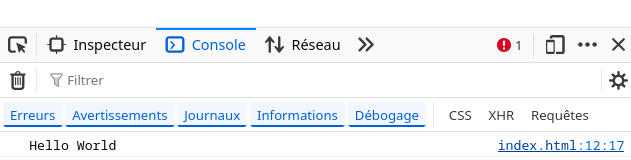
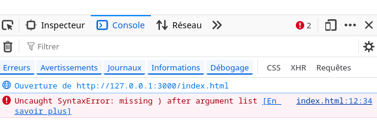
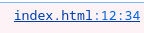
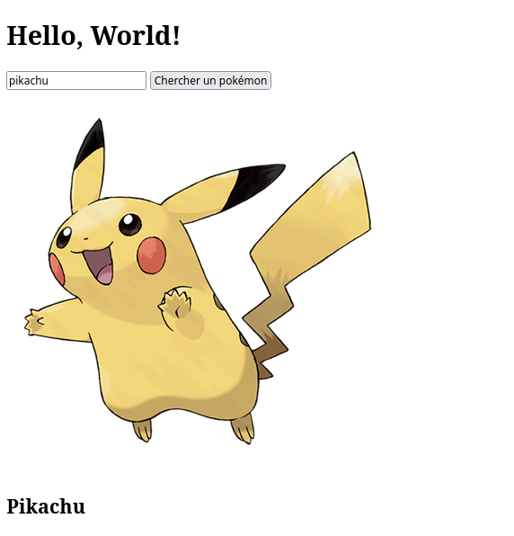

# Getting started - Introduction à JavaScript

Un site web est stocké sur un serveur web et, par conséquent, le code source qui permet son fonctionnement est également stocké sur le serveur web.

Lorsqu'un utilisateur effectue une action (soumettre un formulaire ou cliquer sur quelque chose), une requête HTTP doit obligatoirement être transmise au serveur web pour qu'un langage de programmation (souvent le PHP) puisse traiter ces informations et formater une page HTML en conséquence.

C'est un comportement normal pour un site web, mais il pose plusieurs problèmes :

- On ne peut pas modifier la page sans la recharger complètement, ce qui rend l'expérience utilisateur parfois assez pénible.
- Les pages du site sont donc statiques et très peu interactives.
- Il est impossible de construire des interfaces complexes affichant de nombreuses informations qui changent assez régulièrement comme ceci. La page devrait constamment être rechargée.

> Imaginez YouTube si la page de votre vidéo était rechargée quand vous postez un commentaire.

Il nous faut un moyen d'exécuter du code directement sur le navigateur, mais alors :

***Comment exécuter du code sans interroger le serveur ?***

Grâce à JavaScript.

## Hello World

1. Dans un dossier, créez un fichier `index.html`.

- Pour exécuter du JavaScript, il faut utiliser la balise `<script>...</script>`.
- La fonction `console.log(...)` permet d'afficher du texte dans la console du navigateur.

> Comme pour les balises `<style>` et `<?php ... ?>`, le code JavaScript doit toujours être écrit entre les balises `<script>...</script>`.

*index.html*
```html
<!DOCTYPE html>
<html lang="en">
<head>
    <title>Document</title>
</head>
<body>
    <h1>Hello World</h1>
   
   <script>
    // Écrivez votre code JavaScript ici...
    console.log("Hello World");
   </script>
</body>
</html>
```

2. Ouvrez votre site web (LivePreview ou `php -S`) et regardez la console du navigateur (clic droit -> inspecter -> console).

***Si vous voyez écrit 'Hello World' dans la console, c'est que tout fonctionne.*** 



Sinon, vous avez sûrement fait une erreur de syntaxe et la console vous indiquera où.

Par exemple, ici j'ai oublié la parenthèse fermante de l'appel de la fonction `console.log(...)` :
```js
console.log("Hello World"; 
```
Par conséquent, j'ai une erreur de syntaxe (*SyntaxError*) dans la console.



Elle indique la ligne et le fichier où se trouve l'erreur, ici ligne 12 du fichier `index.html`.



***Si vous voyez une erreur de syntaxe dans la console, vérifiez votre code et corrigez toutes les erreurs AVANT QUOI QUE CE SOIT. Laisser des erreurs dans votre console, c'est se condamner à des heures de débogage inutile.***

## Norme de codage

### CamelCase
Le code JavaScript s'écrit la plupart du temps en `camelCase`.

```js
let nbMedias_number = 10; // Correct 
```
```js
let nb_medias_number = 10; // X Déconseillé 
```

### Fichier .js
Comme pour le CSS, il faut travailler sur un fichier .js à part du HTML. N'écrivez donc jamais directement dans la balise `<script>` comme je l'ai fait dans l'exemple plus haut. ;)

1. Créez un fichier `index.html` :
```html
<!DOCTYPE html>
<html lang="en">
<head>
    <meta charset="UTF-8">
    <meta name="viewport" content="width=device-width, initial-scale=1.0">
    <title>Document</title>
</head>
<body>
    <h1>Hello, World!</h1>
</body>
</html>
```

2. Créez un fichier `script.js` ou `main.js` :

*script.js*
```js
console.log("Hello, je suis un script !");
```

3. Importez le fichier avec l'attribut `src` de la balise `<script>` **à la fin du HTML juste avant la fermeture du body** :
```html
<!DOCTYPE html>
<html lang="en">
<head>
    <meta charset="UTF-8">
    <meta name="viewport" content="width=device-width, initial-scale=1.0">
    <title>Document</title>
</head>
<body>
    <h1>Hello, World!</h1>

    <!-- J'importe le fichier script.js -->
    <script src="script.js"></script> 
</body>
</html>
```

> Il faut importer vos scripts **après** le HTML sinon vous risquez de ne pas pouvoir modifier les balises HTML en JavaScript car elles ne seront pas encore interprétées par le navigateur. 
> Le HTML étant un langage interprété, les lignes sont exécutées de haut en bas.

## Possibilités du JavaScript : ses APIs

Votre code JavaScript est exécuté par le navigateur web au même titre que le HTML et le CSS, ce qui signifie que vous avez accès, à travers le navigateur, à la machine de l'utilisateur.

Pour des raisons de sécurité, les navigateurs limitent l'accès du JavaScript à la machine du client : vous n'avez donc pas accès au FileSystem par exemple.

Cependant, tous les navigateurs modernes possèdent un jeu de bibliothèques appelé API qui fournissent une interface simple d'utilisation pour un grand nombre de fonctionnalités de la machine hôte.

- Souris
- Clavier
- DOM (accès au HTML et CSS)
- Géolocalisation
- Caméra
- Micro

Voici un exemple de code JS qui permet d'incrémenter un nombre contenu dans une balise HTML à chaque fois que l'utilisateur clique sur un bouton.

*clicker.html*
```html
<!DOCTYPE html>
<html lang="en">
<head>
    <meta charset="UTF-8">
    <meta name="viewport" content="width=device-width, initial-scale=1.0">
    <title>Document</title>
</head>
<body>
    <h1 class="titre">Hello</h1>
    <button class="plus_button">+</button>
    <script>
        // Je déclare une variable de type number
        let nbClick_number = 0; 
        // Je récupère la balise de classe plus_button en JS
        const balisePlusButton_obj = document.querySelector(".plus_button");
        // J'affecte une fonction à l'événement click de mon bouton HTML
        balisePlusButton_obj.onclick = function(){
            // À chaque clic, cette fonction est appelée
            const baliseTitre_obj = document.querySelector(".titre");
            nbClick_number++; // J'incrémente la variable globale
            baliseTitre_obj.innerText = "Hello " + nbClick_number; // Je mets à jour l'affichage
        }
    </script> 
</body>
</html>
```

1. Créez un nouveau projet et testez cette application dans le navigateur.

Ici, on récupère la position GPS de l'utilisateur et on l'affiche dans la console en continu.

*gps.js*
```js
navigator.geolocation.watchPosition(onPositionReceived_func);

function onPositionReceived_func(position_obj) {
    console.log("Latitude: " + position_obj.coords.latitude);
    console.log("Longitude: " + position_obj.coords.longitude);
}
```
> Attention, la géolocalisation ne fonctionne pas sur Firefox, utilisez plutôt Google Chrome.

1. Créez un nouveau projet et testez cette application dans le navigateur.

Vous l'avez peut-être remarqué, mais les fonctions en JavaScript sont des variables et sont très souvent passées en paramètre d'autres fonctions.

Ici, j'affiche `Bonjour` avec un délai de 3 secondes :

```js
function bonjour_func(){
    console.log("Bonjour");
}

setTimeout(bonjour_func, 3000); // Dans 3000ms, le navigateur va appeler la fonction bonjour
```

Je pourrais aussi écrire ceci pour passer directement la fonction en paramètre :
```js
setTimeout(function(){
    bonjour_func();
}, 3000); // Dans 3000ms, le navigateur va appeler la fonction bonjour
```

Voici un exemple plus complexe qui représente ce que vous serez capable de faire à la fin du module.

J'effectue une requête HTTP pour récupérer la réponse d'un serveur web qui fournit les données d'un Pokémon en fonction de son nom :

*Exemple en HTML JS d'une barre de recherche de Pokémon*
```html
<!DOCTYPE html>
<html lang="fr">
<head>
    <meta charset="UTF-8">
    <meta name="viewport" content="width=device-width, initial-scale=1.0">
    <title>Search pokemon exemple</title>
</head>
<body>
    <h1>Hello, World!</h1>
    <form class="form_pokemon">
        <input type="text" placeholder="Nom du pokémon" name="pokemon_name">
        <button>Chercher un pokémon</button>
    </form>
    <div>
        
        <h2 class="pokemon_name">Nom</h2>
    </div>
</body>
<script>
    /**
     * L'objectif est de rechercher et afficher un pokémon en fonction de son nom
     */

    // 1. Je récupère le formulaire HTML
    const formPokemon_obj = document.querySelector(".form_pokemon");
    
    // 2. J'affecte une fonction à l'événement submit du formulaire
    //   Cette fonction sera appelée à chaque fois que l'utilisateur soumettra le formulaire (via la touche entrée ou le bouton)
    formPokemon_obj.onsubmit = searchPokemon_func;

    // 3. Je déclare la fonction searchPokemon
    async function searchPokemon_func(formEvent_obj){
        // Annule le rechargement de la page
        formEvent_obj.preventDefault();  
        
        // Récupère les données du formulaire via un objet FormData
        const formData_obj = new FormData(formPokemon_obj); 

        // Grâce à l'objet FormData, je peux récupérer facilement les valeurs des champs du formulaire
        const pokemonName_str = formData_obj.get("pokemon_name"); // Récupère la valeur du champ "pokemon_name"
        console.log(pokemonName_str);

        // Envoi de la requête HTTP au serveur pokebuildapi.fr
        const response_obj = await fetch("https://pokebuildapi.fr/api/v1/pokemon/" + pokemonName_str);
        // Réponse de la requête HTTP : un objet pokemon au format JSON converti en objet JS
        const pokemon_obj = await response_obj.json();

        // Mise à jour de l'affichage
        document.querySelector(".pokemon_name").innerText = pokemon_obj.name;
        document.querySelector(".pokemon_image").setAttribute("src", pokemon_obj.image);
    }
</script>
</html>
```


1. Créez un nouveau projet appelé mini_pokedex et testez cette application :)

> Rendez-vous sur ce lien pour comprendre la réponse de l'API : https://pokebuildapi.fr/api/v1/pokemon/pikachu

> Habituellement, les serveurs web renvoient du HTML, mais certains serveurs web renvoient les données au format JSON et laissent ainsi le soin au client de formater les données comme il le souhaite.

2. Consultez l'article suivant pour comprendre ce qu'est le JSON : https://medium.com/@catherineisonline/what-is-json-ba631eeb0f32

## Conclusion
- JavaScript est un langage de programmation interprété par les navigateurs web.
- Il permet de rendre les pages web interactives **sans recharger la page**, à la différence des applications codées entièrement en PHP.
- Il permet d'accéder à certaines fonctionnalités de la machine hôte via les API des navigateurs : document, géolocalisation, fetch.
- Il permet d'effectuer des requêtes HTTP pour communiquer avec un serveur web via l'API Fetch.

