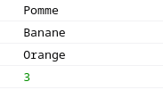
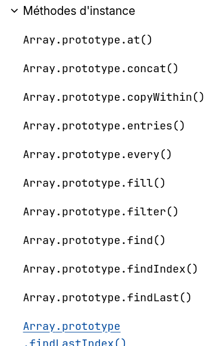

## Tour de JavaScript
Faisons un petit tour de JavaScript.

> Je pars du principe que vous connaissez déjà le PHP, le C ou un autre langage de programmation procédural.

### Variables et conditions

- `let` et `const` permettent de déclarer des variables ou des constantes.
- `if else` s'écrit comme en PHP.
- Le `+` permet de concaténer des chaînes de caractères en plus des additions.

```js
let age = 25;

if(age > 18){
    console.log("Vous êtes majeur : "+age+" ans");
} else {
    console.log("Vous êtes mineur");
}
```

> Attention même 

1. **Déclarez une variable `nom` contenant votre prénom, puis affichez-le dans la console.**
2. À partir d'une variable `age`, écrivez un programme qui affiche :
    - "Tarif Senior" si l'âge est supérieur ou égal à 65
    - "Tarif -26 ans" si l'âge est inférieur à 26
    - "Tarif Mineur" si l'âge est inférieur à 18
    - "Tarif Normal" dans les autres cas.

### Appel de fonction
Comme en PHP, on appelle une fonction avec son nom suivi de parenthèses.

```js
console.log("Hello World");
let age =  prompt("Quel est votre âge ?");
console.log("Vous avez " + age + " ans");
```

> En réalité, la fonction `prompt` n'est jamais utilisée dans une application web moderne, mais elle est utile pour faire des tests rapides.

1. **Demandez à l'utilisateur son prénom avec `prompt`, puis affichez un message personnalisé dans la console, par exemple "Bonjour, [prénom] !"**

2. **Demandez à l'utilisateur son année de naissance avec `prompt`, calculez son âge (en supposant que nous sommes en 2024) et affichez-le dans la console.**

3. **Demandez à l'utilisateur deux nombres avec `prompt`, additionnez-les et affichez le résultat dans la console.**

### Tableaux

En JavaScript, le tableau (Array) est le type de données le plus utilisé et important.

Un tableau est une liste de données ordonnée et indexée à partir de 0.

> Vous verrez plus tard que les tableaux en JavaScript sont en réalité des objets contenant de nombreuses fonctions utilitaires : `foreach, filter, map, reduce, etc.`

```js
const fruits = ["Pomme","Banane","Orange"];
console.log(fruits[0]); // Pomme
console.log(fruits[1]); // Banane
console.log(fruits[2]); // Orange
console.log(fruits.length); // 3
```
*résultat dans la console*


#### Conseil : déboguer un tableau avec la console
Si vous voulez connaître le contenu d'un tableau, la variable console contient deux fonctions très pratiques : `console.log(...)` et `console.table(...)`.

- `console.log()` affiche proprement le contenu de n'importe quelle variable dans la console, y compris les tableaux (équivalent de var_dump en PHP).
- `console.table()` affiche le contenu d'un tableau sous forme de tableau dans la console.

```js
const fruits = ["Pomme","Banane","Orange"];
console.log(fruits); // Affiche tout le tableau dans la console
console.table(fruits); // Affiche le tableau sous forme de tableau dans la console
```

#### La taille d'un tableau

Les tableaux en JavaScript sont des objets, ils possèdent donc des variables et des fonctions.

La variable `length` permet de connaître la taille d'un tableau.

On y accède avec le point (l'opérateur d'accès) : `monArray.length`.

```js
const fruits = ["Pomme","Banane","Orange"];
console.log(fruits.length); // 3
```

#### Ajouter un élément à un tableau
La fonction `push(...)` permet d'ajouter un élément à la fin d'un tableau.

```js
const eleves = ["Alice","Bob","Charlie"];
eleves.push("David");
console.log(eleves); // ["Alice","Bob","Charlie","David"]
```

> Un exemple concret de l'utilisation de push serait un tableau de messages qui s'agrandit à chaque fois qu'un utilisateur poste un nouveau message.

#### Exercices sur les tableaux

1. **Créez un tableau contenant les nombres de 1 à 5, puis affichez-le dans la console avec un console.log**

2. **Ajoutez un élément à la fin d'un tableau de fruits, puis affichez le tableau mis à jour dans la console.**

3. **Créez un tableau de prénoms et affichez le nombre d'éléments qu'il contient dans la console.**

### Fonctions 
En JavaScript, il y a deux types de fonctions :
- Les fonctions nommées
- Les fonctions anonymes

*Déclaration classique d'une fonction nommée.*
```js
function addition(a, b){
    return a + b;
}
let resultat = addition(2,3); // 5
console.log(resultat);

resultat = addition(30,10); // 40
console.log(resultat);
```

Mais je peux aussi stocker une fonction dans une variable. On appelle ce type de fonction une *fonction anonyme* car elle n'a pas vraiment de nom si ce n'est celui de la variable qui la stocke.

```js
const addition = function(a, b){
    return a + b;
}
let resultat = addition(2,3); // 5
console.log(resultat);
```

En JavaScript, il faut voir les fonctions comme des valeurs qui peuvent être stockées dans des variables, passées en argument à d'autres fonctions ou retournées par d'autres fonctions.

*Exemple setInterval :*

`setInterval` est une fonction qui permet d'exécuter une fonction de manière répétée à un intervalle donné.

Concrètement, je peux par exemple afficher un message toutes les 4 secondes.
```js
function afficherMessage(){
    console.log("Hello World");
}
setInterval(afficherMessage, 4000);
```

Ici, j'ai déclaré une fonction nommée `afficherMessage` et je l'ai passée en argument à la fonction `setInterval`.

Je pourrais aussi utiliser la syntaxe des fonctions anonymes.

```js
const afficherMessage = function(){
    console.log("Hello World");
}
setInterval(afficherMessage, 4000);
```

Ou encore plus simplement en utilisant une fonction anonyme directement dans l'appel de `setInterval`.

```js
setInterval(function(){
    console.log("Hello World");
}, 4000);
```

**Retenez bien cette syntaxe ! Il est très courant en JS de créer une fonction anonyme directement dans les paramètres de l'appel des fonctions.**

>On peut même écrire ça de manière plus concise avec les *fonctions fléchées*.
>
>```js
>setInterval( () => {
>    console.log("Hello World");
>}, 4000);
>// ou
>setInterval( () => console.log("Hello World"), 4000); 
>```

#### Exercices sur les fonctions et `setInterval`

1. **Créez une fonction nommée `saluer` qui prend un prénom en paramètre et affiche "Bonjour, [prénom] !" dans la console. Appelez cette fonction avec votre prénom. Ensuite, utilisez prompt pour demander le prénom à l'utilisateur.**

2. **Écrivez une fonction `addition` qui prend deux nombres en paramètres et retourne leur somme. Affichez le résultat dans la console en appelant la fonction avec deux valeurs de votre choix.**

3. **Utilisez `setInterval` pour afficher "Ceci s'affiche toutes les 2 secondes" dans la console toutes les 2 secondes.**

4. **Créez une fonction qui affiche la date et l'heure actuelles dans la console, puis utilisez `setInterval` pour exécuter cette fonction toutes les secondes.**
> Voir Date W3Schools : https://www.w3schools.com/js/js_date_methods.asp

### Boucle while
La boucle `while` s'écrit comme en PHP.

```js
let i = 0;
while(i < 5){
    console.log(i);
    i++;
}
```

### Boucle for

La boucle `for` s'écrit comme en PHP.

```js
for(let i = 0; i < 5; i++){
    console.log(i);
}
```

Je peux m'en servir pour parcourir un tableau.

```js
const fruits = ["Pomme","Banane","Orange"];
for(let i = 0; i < fruits.length; i++){
    console.log(fruits[i]);
}
```

La syntaxe for of est plus courte et plus lisible pour parcourir un tableau.

```js
const fruits = ["Pomme","Banane","Orange"];
for(const fruit of fruits){
    console.log(fruit); // fruit = fruits[i]
}
```

Mais la plupart du temps, on utilise la fonction `forEach` de l'objet array.

```js
const fruits = ["Pomme","Banane","Orange"];
fruits.forEach( function(fruit){
    console.log(fruit);
} );
```

1. **Créez un tableau contenant trois prénoms, puis affichez chacun d'eux dans la console à l'aide d'une boucle `for`.**

2. **Même chose avec la fonction forEach**

### Opérer sur un tableau - Les fonctions `filter`, `map` et `reduce`

En JavaScript, les tableaux possèdent des méthodes très puissantes pour manipuler et transformer les données : `filter`, `map` et `reduce`.

Je vous recommande la chaîne YouTube WebDevSimplified : https://www.youtube.com/watch?v=R8rmfD9Y5-c

> Il existe beaucoup de fonctions très utiles pour les tableaux, elles sont toutes décrites sur la MDN : https://developer.mozilla.org/fr/docs/Web/JavaScript/Reference/Global_Objects/Array
> 

##### `filter`
La méthode `filter` permet de créer un nouveau tableau contenant uniquement les éléments qui passent un test (une fonction de filtrage).

> Les fonctions contenu dans un objet sont appelées des *méthodes*.

**Exemple : Filtrer les notes au-dessus de 10**
```js
const notes = [8, 12, 15, 7, 18, 9];
const notesSuperieuresA10 = notes.filter(function(note) {
    return note > 10;
});
console.log(notesSuperieuresA10); // [12, 15, 18]
```

Étant donné que la fonction ne possède qu'une seule instruction, on peut faire disparaître le `return` et utiliser une fonction fléchée.
```js
const notes = [8, 12, 15, 7, 18, 9];
const notesSuperieuresA10 = notes.filter(note => note > 10);
console.log(notesSuperieuresA10); // [12, 15, 18]
```

##### `map`
La méthode `map` permet de créer un nouveau tableau en appliquant une fonction à chaque élément du tableau d'origine.

**Exemple : Mettre en majuscule tous les fruits d'un tableau**
```js
const fruits = ["pomme", "banane", "orange"];
const fruitsMajuscules = fruits.map(fruit => fruit.toUpperCase());
console.log(fruitsMajuscules); // ["POMME", "BANANE", "ORANGE"]
```

##### `reduce`
La méthode `reduce` permet de réduire un tableau à une seule valeur, en appliquant une fonction sur chaque élément (par exemple, faire une somme ou une moyenne).

**Exemple : Calculer la moyenne d'un tableau de notes**
La fonction reduce permet de parcourir le tableau comme foreach tout en se souvenant de la valeur de retour précédente de la fonction passée en paramètre.

On peut donc par exemple additionner tout un tableau en une ligne :

```js
const notes = [8, 12, 15, 7, 18, 9];
const somme = notes.reduce((prev, note) => prev + note, 0);
```

```js
const notes = [8, 12, 15, 7, 18, 9];
const somme = notes.reduce((previousReturn, note) => previousReturn + note, 0);
const moyenne = somme / notes.length;
console.log(moyenne); // 11.5
```

> Ces méthodes sont très utilisées en JavaScript moderne pour manipuler facilement les tableaux.

#### Objets

```js
const personne = {
    nom: "Dupont",
    age: 30,
    ville: "Paris"
};

console.log( personne.nom );
console.log( personne["age"] ); // On peut aussi accéder aux propriétés avec des crochets à la manière du PHP.
console.log( personne["nom"] );
```

> Par rapport au PHP, les objets en JavaScript sont plus proches des tableaux associatifs.
> ```php
> $personne = [
>     "nom" => "Dupont",
>     "age" => 30,
>     "ville" => "Paris"
> ];
> 
> echo $personne["nom"];
> echo $personne["age"];
> ```

1. **Déclarez un objet `voiture` avec les propriétés `marque`, `modele` et `annee`, puis affichez la marque et le modèle dans la console.**


## Exercices

Ecrit 10 exercices sur tout les sujets vus ci-dessus.

1. Créez une variable `ville` contenant le nom de votre ville, puis affichez-la dans la console.
2. Écrivez un programme qui demande à l'utilisateur son âge avec `prompt`, puis affiche "Vous êtes majeur" si l'âge est supérieur ou égal à 18, sinon affiche "Vous êtes mineur".
3. Créez un tableau `couleurs` contenant les couleurs "rouge", "vert" et "bleu", puis affichez chaque couleur dans la console à l'aide d'une boucle `for`.
4. Ajoutez la couleur "jaune" à la fin du tableau `couleurs`, puis affichez le tableau mis à jour dans la console.
5. Écrivez une fonction `multiplier` qui prend deux nombres en paramètres et retourne leur produit. Affichez le résultat dans la console en appelant la fonction avec deux valeurs de votre choix.
6. Utilisez `setInterval` pour afficher "Ceci s'affiche toutes les 3 secondes" dans la console toutes les 3 secondes.
7. Créez un tableau `nombres` contenant les nombres de 1 à 10, puis utilisez la méthode `filter` pour créer un nouveau tableau contenant uniquement les nombres pairs. Affichez ce nouveau tableau dans la console.
8. Utilisez la méthode `map` pour créer un nouveau tableau contenant les carrés des nombres du tableau `nombres`. Affichez ce nouveau tableau dans la console.
9. Utilisez la méthode `reduce` pour calculer la somme des nombres du tableau `nombres`, puis affichez le résultat dans la console.
10. Déclarez un objet `livre` avec les propriétés `titre`, `auteur` et `anneePublication`, puis affichez le titre et l'auteur dans la console.

D'autres exercices 

### Exercices d'algorithmique avec `prompt`

1. **Demandez à l'utilisateur un nombre avec `prompt`, puis affichez dans la console si ce nombre est pair ou impair.**

2. **Demandez à l'utilisateur un nombre, puis affichez la table de multiplication de ce nombre (de 1 à 10) dans la console.**

3. **Demandez à l'utilisateur un mot, puis affichez ce mot à l'envers dans la console.**
> A savoir : On peut accéder à un caractère d'une chaîne de caractères comme dans un tableau avec des crochets.
>```js
>const mot = "Bonjour";
>console.log(mot[0]); // B
>console.log(mot[1]); // o
>```

4. **Demandez à l'utilisateur un nombre, puis affichez la somme de tous les entiers de 1 jusqu'à ce nombre inclus.**

5. **Demandez à l'utilisateur une phrase, puis comptez et affichez le nombre de voyelles dans cette phrase.**

7. **Demandez à l'utilisateur un mot, puis vérifiez s'il s'agit d'un palindrome (un mot qui se lit dans les deux sens) et affichez le résultat dans la console.**

8. **Demandez à l'utilisateur deux nombres, puis affichez tous les nombres entre ces deux valeurs (inclus) dans la console.**

9. **Demandez à l'utilisateur une liste de nombres séparés par des virgules (ex: "4,7,2,9"), transformez cette chaîne en tableau, puis affichez le plus grand nombre dans la console.**

10. **Demandez à l'utilisateur un nombre, puis affichez la factorielle de ce nombre dans la console.**