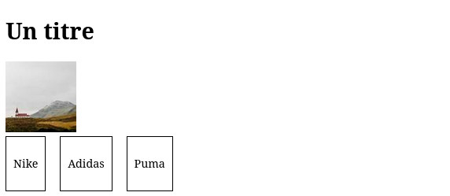
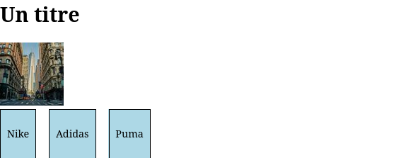

# Introduction - Récupérer un element HTML 
## Récuperer une balise HTML - La méthode querySelector
Comment tout objet `document` est fait d'attributs et de méthodes, la plus importante étant `querySelector`.
La méthode `querySelector` permet de récupérer une balise HTML en JS. Pour ce faire la méthode parcours la page HTML à la recherche d'une balise HTML qui correspond au selecteur CSS passé en paramètre.

Soit le HTML suivant :
```html
<!DOCTYPE html>
<html lang="fr">
<head>
    <meta charset="UTF-8">
    <meta name="viewport" content="width=device-width, initial-scale=1.0">
    <title>Document</title>
    <style>
        .produits_container {
            display: flex;
            gap: 20px;
        }
        .produit {
            border: 1px solid black;
            padding: 10px;
        }

        .produit {
            border: 1px solid black;
            padding: 10px;
        }
    </style>
</head>
<body>
    <h1>Un titre</h1>   
    

    <div class="produits_container">
        <div class="produit">
            <p>Nike</p>
        </div>
        <div class="produit">
            <p>Adidas</p>
        </div>
        <div class="produit">
            <p>Puma</p>
        </div>
    </div>
</body>
<!-- Lien vers le fichier JavaScript -->
<script src="script.js"></script>
</html>
```



```js
const h1 = document.querySelector("h1");    // HTMLElement
const photoProfil = document.querySelector("#photo_profil"); // HTMLElement
const produits = document.querySelectorAll(".produit"); // Array of HTMLElement
```

> Vous pouvez utilisez tout type de selecteur CSS mais je vous recommande d'utilisez un selecteur de classe.


1. Affichez les trois variables si dessus dans la console.

Comme pour l'objet document.body la valeur de la fonction querySelector est du type `Element`.

Je peux donc accéder à son style, par exemple : `Element.style.display`.

```js
const h1 = document.querySelector("h1");    // HTMLElement
const photoProfil = document.querySelector("#photo_profil"); // HTMLElement
const produits = document.querySelectorAll(".produit"); // Array of HTMLElement

h1.style.display = "none";
```

Et voilà le titre à disparu !

2. Comme dans l'exemple précedent modifier le code JS pour :
    - Faire disparaitre la photo de profil.
    - Changer la couleur de border de chaque produit en bleu.
    - Changer le `borderRadius` de la photo à `50%`.


<!-- ### Héritage
Les constantes `h1` et `photoProfil` sont des objets. Il hérite de la classe `Element` et implémentes les interfaces : `EventTarget`, `Node` et `HTMLElement`.

Tout les elements du document hérite de la classe `Element`, c'est l'une des  classes les plus importantes du DOM. Un `Element` est une representation objet d'une balise HTML. -->

### Récupérer plusieurs balises HTML - `querySelectorAll`

Accéder à une balise `<h1>` unique est plutot simple avec querySelector.

Mais comment accéder plusieurs balises d'une même classe d'un seul coup (comme les .produit de la page HTML ci-dessus) ?

La réponse est simple : un Array JavaScript.

```js
// Array of HTMLElement
const produits = document.querySelectorAll(".produit"); 
```

La méthode `querySelectorAll` renvoi un tableau d'`Element` (`Element[]`).

La constante `produits` est donc un tableau d'`Element`.

```js
console.log(produits[0]); // La div des Nike
console.log(produits[1]); // La div des Adidas
console.log(produits[2]); // La div des Puma
console.log(produits.length);
```

> `querySelector` renvoi le premier `Element` rencontré en fonction du selecteur CSS , alors que `querySelectorAll` renvoi tout les `Element` correspondant au selecteur CSS.

Typiquement l'on voudra recupérer un tableau d'élement avec `querySelectorAll` et les parcourir via une boucle `for`.

*Affichez le texte de chaque balise `p` contenu dans une div `.produit`*
```js
produits.forEach(produit=>{
    // Les objet Element possède également la fonction querySelector.
    console.log(produit.querySelector("p").innerText);
});
```

1. Modifiez le couleur de fond de chaque produit en `lightblue`.



2. Rendez-vous sur la documentation MDN et prennez connaissance de toutes les variables et fonctions disponible dans un objet Element : https://developer.mozilla.org/fr/docs/Web/API/HTMLElement .


