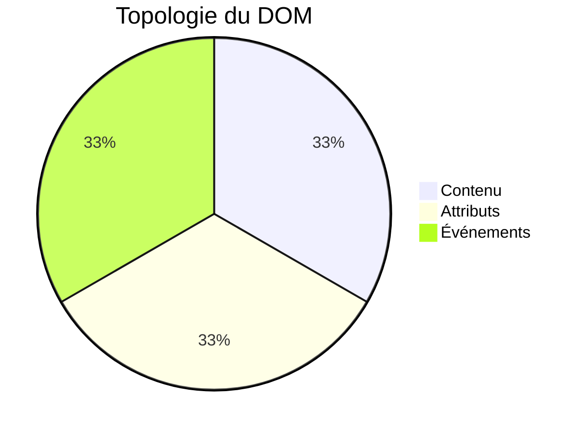
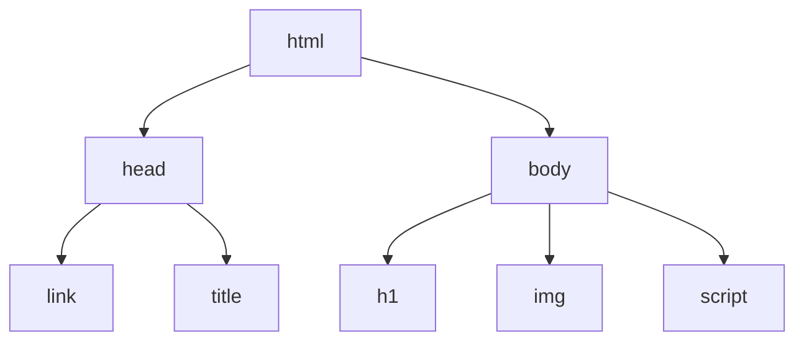
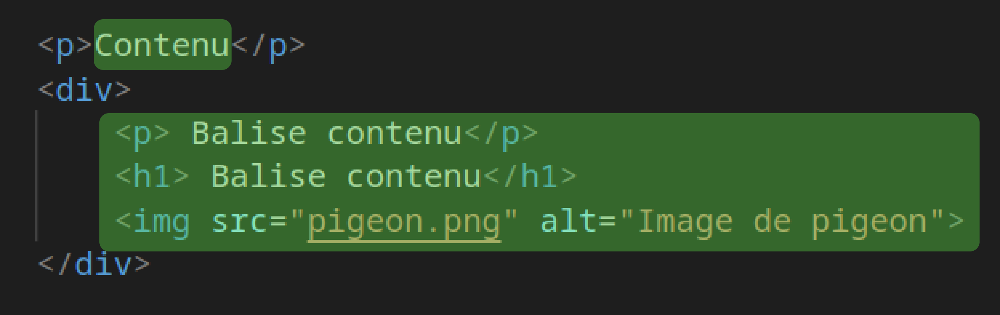

# La topologie du DOM
L'utilisation du DOM peut être divisée en 3 parties : le contenu, les attributs, les événements.
Lorsque je veux utiliser le DOM, je me pose toujours la question suivante : "À quoi est-ce que je veux accéder ? : le contenu d'une balise, les attributs d'une balise ou les événements d'une balise ?".

Le DOM est un arbre composé de branches, au bout de chaque branche se trouve un nœud. Le premier nœud est la balise `<html>` qui contient toutes les autres balises.

## Le Contenu : le texte interne ou une balise fille
C'est le contenu d'une balise qui peut être soit un texte, soit une balise fille.

```html
<p>Texte interne du paragraphe.</p>
<a href="http://youtube.com">Texte interne d'un lien</a>
<h1>Texte interne d'un titre</h1>
```
*Contenu : texte interne d'une balise.*
```html
<div>
    <p>AirMax taille 42</p> <!-- Balise fille du div -->
     <!-- Balise fille du div -->
</div>
```
*Contenu : balises filles d'une balise.*

Le contenu d'une balise peut être un texte ou d'autres balises filles.
Grâce à la partie *contenu* du DOM, vous pourrez : changer le texte, **récupérer** des balises (`querySelector`), les **supprimer** (`remove`) ou même en **ajouter** de nouvelles (`appendChild`).
>Cela peut paraître bête mais le contenu d'une balise est forcément soit un texte, soit d'autres balises, ainsi est fait le HTML.

## Les Attributs HTML
Les attributs HTML sont accessibles et modifiables grâce au DOM.
Parmi les attributs les plus classiques, on retrouve : `href`, `src` ou encore `class`.
```html
<balise attributHTML="Exemple d'attribut HTML">Une balise HTML</balise>

<a href="lienClicable">Go to youtube.</a>
```
On accède aux attributs pour deux raisons : la **lecture** (`getAttribute`) ou la **modification** (`setAttribute`).

Par exemple :
- Je veux **modifier** l'attribut `src` d'une image.
- Je veux connaître le lien d'un texte en **lisant** l'attribut `href`.
- Je veux ajouter une classe CSS en **modifiant** l'attribut `class`.

## Les événements
Le principal avantage du JavaScript est la facilité avec laquelle on peut réagir à des événements. **Un événement est une action de l'utilisateur à laquelle on peut associer une fonction.**
Parmi les événements les plus connus, on retrouve :
- "click" : L'utilisateur a cliqué
- "dblclick" : L'utilisateur a double-cliqué
- "scroll" : L'utilisateur a fait défiler la page
- "change" : L'utilisateur a modifié la valeur d'une balise input
- "input" : L'utilisateur a écrit un caractère dans une balise input
- "submit" : L'utilisateur a soumis un formulaire
- "copy" / "paste" : L'utilisateur a copié (Ctrl+C) ou collé (Ctrl+V)

```html

```

> Liste d'événements : https://www.w3schools.com/js/js_events.asp

En HTML, on peut exécuter du JavaScript lors d'un événement grâce à l'attribut HTML `onclick`. Cette méthode propose peu de flexibilité et ne permet pas de séparer le JS du HTML. ***Je déconseille donc son utilisation*** au profit de `Element.addEventListener`.

