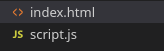
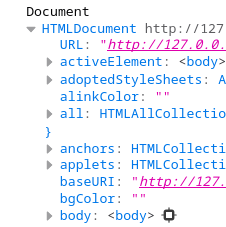

# JavaScript - Le DOM, Document Object Model

Parmi les API des navigateurs web, la plus utile est sans doute le DOM.

DOM signifie Document Object Model, c'est-à-dire la représentation objet de votre page HTML.
Le DOM est une API du navigateur web qui permet d'accéder aux balises du document HTML via l'objet `document`.

L'objet `document` est, au même titre que `console`, un attribut de l'objet global `window` : il est donc accessible partout dans votre code JavaScript sans avoir besoin de l'importer ou de le déclarer.

## Documentation

- https://www.w3schools.com/js/js_htmldom.asp

## Pré-requis
Il vous faut un serveur web pour votre site ainsi qu'au minimum les deux fichiers suivants :

1. Créez un dossier vide contenant les deux fichiers suivants :
- index.html
- script.js



2. Le fichier `index.html` doit contenir le code HTML de base suivant :

*index.html*
```html
<!DOCTYPE html>
<html lang="fr">
<head>
    <meta charset="UTF-8">
    <meta name="viewport" content="width=device-width, initial-scale=1.0">
    <title>Document</title>
</head>
<body>
    
</body>
<!-- Lien vers le fichier JavaScript -->
<script src="script.js"></script>
</html>
```
>N'oubliez pas d'inclure le fichier JS dans le fichier HTML via l'attribut `src` de la balise `<script>`.

3. Le fichier `script.js` doit contenir le code JavaScript de base suivant :

*script.js*
```js
console.log("Hello World !");
```

4. Lancez un serveur web dans le dossier contenant `index.html`. Vous avez trois options :
- Avec l'extension Live Preview de VSCode (recommandé)
- `php -S localhost:8000` si vous avez PHP d'installé
- `python3 -m http.server` si vous avez Python d'installé


5. Verifiez que le message `Hello World !` s'affiche dans la console du navigateur.
    
## Le DOM
Le DOM est une API qui permet d'accéder aux balises HTML via la variable `document`.

`document` est un objet : il possède donc de nombreux attributs (variables) et méthodes (fonctions) qui permettent de manipuler le HTML.

Si vous affichez `document` dans la console, vous verrez qu'il contient tout le HTML de la page.

```js
console.log("Document", document);
```

1. Cherchez l'attribut body dans l'objet document affiché dans la console, il contient tout votre HTML.


`document` est un accès direct à toutes les propriétés du HTML. Je peux, par exemple, modifier le style CSS de la balise body.

```js
document.body.style.backgroundColor = "red";
```


> Modifier le style CSS d'un élément de cette façon n'est pas une bonne pratique ; ici, c'est surtout un exemple pour vous faire réaliser le lien entre la variable `document` en JavaScript et l'état du document HTML.

<!-- ## Les Projets

Une fois les activités théoriques terminées, vous aurez compris les principales spécificités du JavaScript.

Il est temps de réaliser des projets. **Dans le dossier Projets, vous en trouverez une dizaine, faites-les dans l'ordre**.

Pour avoir un aperçu des projets, vous pouvez naviguer dans les cours et les projets en lançant un serveur HTTP Python après avoir cloné le dépôt.

```bash
git clone https://github.com/CHAOUCHI/parcours_dwwm/
cd parcours_dwwm
cd 4.\ Introduction\ JavaScript\ et\ les\ langages\ interprétés/API/Browser/DOM/Projets/
python3 -m http.server
``` -->

