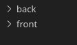
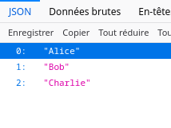
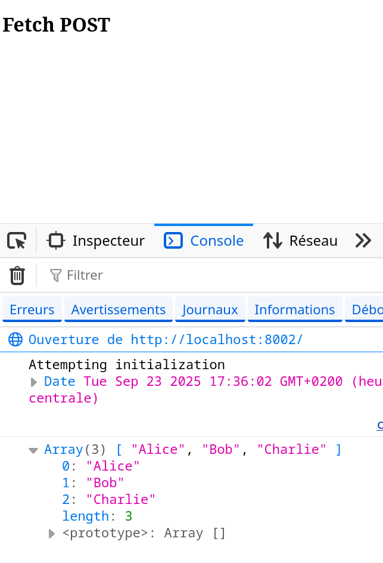

# POST Envoyer un donnée au serveur
Dans cette section nous allons voir comment envoyer des données à un serveur en utilisant la méthode POST avec Fetch API.

## 1. **Serveur PHP qui renvoie un tableau (array)**
Etant donnée que vous connaissez le PHP, nous allons commencer par créer un serveur simple qui renvoie un tableau. 

Ensuite, nous utiliserons Fetch pour envoyer une requête HTTP à ce serveur et afficher le résultat dans la console du client.

1. Créez deux dossier un dossier `backend` et un dossier `frontend`.



### Backend (PHP)
2. Dans le dossier `backend`, créez un fichier `index.php` avec le contenu suivant :

```php
<?php
// Permet les requêtes cross-origin (fetch)
header('Access-Control-Allow-Origin: *'); 

header('Content-Type: application/json');
$users = ["Alice", "Bob", "Charlie"];
echo json_encode($users);
?>
```

3. Lancez un serveur PHP local dans le dossier `backend`.
```bash
cd backend
php -S localhost:8001
```

4. Rendez-vous sur http://localhost:8001 dans votre navigateur pour vérifier que le serveur fonctionne et affiche le tableau JSON.




### Frontend (JavaScript)

5. Dans le dossier `frontend`, créez un fichier `index.html` avec le contenu suivant :
```html
<!DOCTYPE html>
<html lang="en">
<head>
    <meta charset="UTF-8">
    <meta name="viewport" content="width=device-width, initial-scale=1.0">
    <title>Fetch POST Example</title>
</head>
<body>
    <h1>Fetch POST Example</h1>
</body>
<script>

  main();

  async function main(){
    const response_obj = await fetch("http://localhost:8001");
    // JE RECUPERE LES DONNEES (la variable $users)
    const users_arr = await response_obj.json();
    console.log(users_arr); // Affiche le tableau dans la console
  }

</script>
</html>
```

6. Rendez-vous dans le dossier `frontend`et lancez un serveur local pour le front :
```bash
cd frontend
php -S localhost:8002
```
7. Rendez-vous sur http://localhost:8002 dans votre navigateur et ouvrez la console (F12) pour voir le tableau affiché.



## Exercice 1

1. Créez un back et un front :
   - Le back doit renvoyer le tableau suivant au format JSON : 
   ```json
   [
     {"name": "Alice", "age": 25},
     {"name": "Bob", "age": 30},
     {"name": "Charlie", "age": 35}
   ]
   ```
   - Le front doit afficher dans la console chaque nom et âge du tableau reçu.
2. Bonus : Affichez les données dans le DOM, chaque user dans une balise `<div>` comme suit :

```html
<div class="users">
  <div class="user">
    <p>Alice</p>
    <p>25 ans</p>
  </div>

  <div class="user">
    <p>Bob</p>
    <p>30 ans</p>
  </div>
  
  <div class="user">
    <p>Charlie</p>
    <p>35 ans</p>
  </div>
</div>
```

## Exercice 2

1. Clonez le repo suivant (votre template de base) :
```bash
git clone https://github.com/CHAOUCHI/fetch-post-template-exercice-cdpi-dwwm.git
```
> Lien du repo github : https://github.com/CHAOUCHI/fetch-post-template-exercice-cdpi-dwwm

2. Codez le back et le front pour qu'il renvoie les lignes de la table SQL `Users` suivante :
```sql
CREATE TABLE Users (
    id INT PRIMARY KEY AUTO_INCREMENT,
    name VARCHAR(100) NOT NULL,
    age INT NOT NULL
);
INSERT INTO Users (name, age) VALUES 
('Alice', 25), 
('Bob', 30), 
('Charlie', 35);
```

> Vous pouvez utilisez `phpMyAdmin` ou `Adminer` pour gérer votre base de données MySQL facilement.
> Ou vous connecter en ligne de commande MySQL et copier/coller les commandes SQL ci-dessus.
> ```bash
> sudo mysql
> ```

> Si il vous manque un serveur mysql
> ```bash
> sudo docker run --name mysql -e MYSQL_ROOT_PASSWORD=root -e MYSQL_DATABASE=app-database -p 3306:3306 -d mysql:latest
> ```
> Les identifiants de connexion sont :
> - Host : 127.0.0.1
> - Port : 3306
> - User : root
> - Password : root
> - Database : app-database