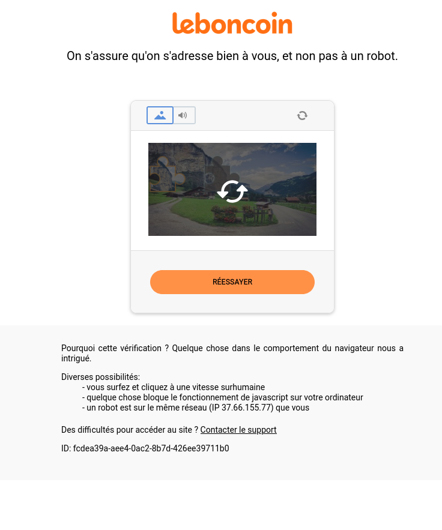

# L'API Fetch, récupérer des données depuis un serveur.

Pré-requis : https://developer.mozilla.org/fr/docs/Web/HTTP/Overview#les_messages_http

## Documentations
- fetch() : https://developer.mozilla.org/fr/docs/Web/API/Fetch_API/Using_Fetch
- Promise : https://developer.mozilla.org/fr/docs/Web/JavaScript/Guide/Using_promises
- Promise.prototype.then() : https://developer.mozilla.org/fr/docs/Web/JavaScript/Reference/Global_Objects/Promise/then
- Promise.prototype.catch() : https://developer.mozilla.org/fr/docs/Web/JavaScript/Reference/Global_Objects/Promise/catch
- Response : https://developer.mozilla.org/en-US/docs/Web/API/Response
- Response.prototype.json() : https://developer.mozilla.org/en-US/docs/Web/API/Response/json
- Response.prototype.text() : https://developer.mozilla.org/en-US/docs/Web/API/Response/text

## I - Qu'est-ce que c'est ?
L'*API Fetch* est un client HTTP utilisable en JavaScript. Au même titre que les objets : `console`, `document` ou `localStorage`, l'*API Fetch* est accessible via l'objet window.

## II - Résumé de `fetch`
Le code suivant affiche le nom des 10 premiers pokémons dans la console.
```js
fetch("https://pokebuildapi.fr/api/v1/pokemon/limit/10")
.then(response => response.json())
.then(pokemons => {
    pokemons.forEach(pokemon => {
        console.log(pokemon.name);
    });
});
```

**L'API Fetch est utilisable via la méthode `window.fetch`.**
```js
fetch(url : string, options : Object) : Promise<Response> 
```

Comme dit plus haut, `fetch` est un client HTTP, ce qui signifie qu'il permet d'envoyer une requête HTTP à un serveur HTTP et ainsi recevoir une réponse HTTP.

Votre navigateur est déjà capable d'effectuer des requêtes HTTP. Il le fait d'ailleurs à chaque chargement de page. `Fetch` permet simplement de récupérer des données sans charger toute une nouvelle page. Les données les plus courantes peuvent être :
- Une liste de produits d'une boutique en ligne qui change en fonction d'un filtre de prix.
- Des suggestions de recherche lorsque l'utilisateur tape au clavier.
- Des données géographiques du serveur de Google Maps.
- L'envoi d'un message via un formulaire sans recharger toute la page.
- La mise en ligne d'un tweet sur Twitter.
- L'affichage des posts Facebook au fur et à mesure du défilement de la page.

Toutes ces opérations nécessitent l'envoi d'une requête HTTP à un serveur, mais nécessitent également de rester sur la page actuelle. Il faut donc envoyer la requête en JavaScript via la méthode `fetch`.

>**L'envoi de requête HTTP avant `fetch` :**
>Avant, l'envoi de requêtes HTTP en JavaScript, la seule façon de récupérer ou d'envoyer des données à un serveur HTTP était via un formulaire HTML ou l'URL et le langage PHP.
>
>PHP s'exécute sur le serveur et génère le HTML côté serveur, le navigateur devait donc recharger toute la page pour afficher les nouvelles données. Ce qui rendait la navigation sur le web bien moins fluide que sur des applications mobiles ou de bureau.

## III - La méthode fetch en détail
La méthode `fetch` de l'objet `window` renvoie un objet de la classe `Promise` fournissant une réponse HTTP, soit : "une promesse de réponse HTTP". Elle prend en paramètre obligatoire l'URL du serveur (`string`) vers lequel effectuer la requête HTTP.

**Définition de la fonction**

```js
fetch(url [, options]) : Promise<Response> 
```
> Les paramètres notés entre crochets *[]* sont optionnels, cette norme est utilisée dans la plupart des documentations techniques.
> ```js
>functionName(param [, paramOptionnel1, paramOptionnel2])
>```
> Ici *param* est obligatoire alors que les *paramOptionnel1* et *2* ne le sont pas.

> Les deux-points *:* après la fonction indiquent le type de la valeur de retour de la fonction, ici un objet de la classe `Promise` qui fournira un objet de la classe `Response`.
> ```js
> Math.random() : number
> prompt(message) : string
> Math.round() : number
>```

### Paramètres
#### `url : string`
Une chaîne de caractères contenant l'URL de la ressource demandée.

Cela peut être un nom de domaine comme https://www.leboncoin.fr/voitures/offres, une adresse IP comme 127.0.0.1:8000/users ou encore la route d'une API REST fournissant du JSON comme l'API Pokebuild : https://pokebuildapi.fr/api/v1/pokemon/limit/10

#### `options : Object`
Un objet JavaScript possédant de nombreux attributs optionnels, les plus utiles étant :

- `method` : `string` - Une string contenant la méthode HTTP à utiliser (`GET`, `POST`, `DELETE`, ...). Par défaut `"GET"`.
- `headers` : `Headers` - Un objet de la classe `Headers` contenant les éventuels headers HTTP à utiliser comme "Content-type : application/json" par exemple pour envoyer du JSON.
- `body` : `string` - Le body de la requête HTTP, la plupart du temps vous fournirez une string JSON mais d'autres formats sont possibles.

**Exemple : Ajouter un produit**
Nous voulons rajouter un produit à une base de données en utilisant la route `POST /product` d'une API REST, le produit à rajouter est contenu dans le body de la requête HTTP.

Il est d'usage que les serveurs demandent au client de définir la méthode d'envoi comme POST. Dans les faits, ça ne change pas grand-chose à l'envoi mais la plupart des serveurs (y compris ceux que vous allez concevoir) vous demanderont de préciser la méthode pour leur simplifier le travail.

Par exemple, la route `GET /product` peut envoyer tous les produits alors que `POST /product` sert à ajouter un nouveau produit.

```js
let newProduct = JSON.stringify({ name: "Adidas taille 42", price: 99 });   // Je transforme un produit en string JSON
fetch("localhost/product", {
    method: "POST",        // Par défaut fetch fait un GET, donc je précise POST
    body: newProduct 
})
.then((reponseHTTP) => reponseHTTP.json())
.then((data) => {
    console.log(data);
});
```

Voir la MDN pour plus d'attributs : https://developer.mozilla.org/fr/docs/Web/API/fetch#init

### Valeur de retour
La méthode fetch renvoie une `Promise<Response>`.

La méthode `fetch` permet d'effectuer une requête et renvoie "une promesse de réponse HTTP", c'est-à-dire un objet de la classe `Promise` qui fournira un objet de la classe `Response` lors de sa résolution.
En JavaScript, une `Promise` est un objet que l'on utilise lorsqu'une action nécessite un certain temps pour s'accomplir comme la lecture d'un fichier ou la réception d'une réponse HTTP.

#### La problématique du temps de réponse
Une réponse HTTP met au minimum plusieurs centaines de millisecondes à arriver alors qu'une ligne de code met environ quelques millisecondes à s'exécuter. Il y a donc un souci : le code s'exécute plus vite que le temps de réponse.

La solution à un cas comme celui-ci est l'asynchrone. C'est-à-dire une ligne de code qui ne va pas s'exécuter avant un temps plus ou moins connu. Vous avez déjà connu ce cas de figure par le passé avec des méthodes ancestrales du JavaScript comme `addEventListener` ou `setTimeout`.
```js
const button = document.querySelector(".button_validate");
console.log("1");
button.addEventListener("click", () => {
    console.log("2");
});
console.log("3");
/* --- Résultat --- */
> 1
> 3
> 2
```
Les `console.log()` ne s'exécutent pas de haut en bas comme habituellement en programmation. L'action est donc asynchrone.

```js
console.log("1");
setTimeout(() => {
    console.log("2");
}, 1000);
console.log("3");
/* --- Résultat --- */
> 1
> 3
> 2
```
Même chose avec `setTimeout`, `"2"` sera affiché dans la console une seconde après la fin du script, soit après l'affichage de `"3"`.

Vous remarquez que le code asynchrone utilise les fonctions callback : "Dans X secondes tu appelles cette fonction", "Quand il se passe cet événement tu appelles cette fonction".
> Une fonction callback est une fonction passée en paramètre d'une fonction.

## IV - Les Promises - l'asynchrone
### Théorie
Imaginez. 
Vous êtes au restaurant et vous demandez un café au serveur, seulement le serveur ne peut pas faire instantanément apparaître un café sur votre table quand vous le demandez, alors il vous fait une promesse : 
\- "Je vous ramène votre café dans quelques instants.", quelque instant plus tard le serveur revient avec le résultat de sa promesse.
\- "Voici votre café !"

Magnifique !

Lorsque vous avez demandé un café, le serveur vous a fourni un objet : **une promesse** intangible d'un café à venir et en tant qu'être humain vous êtes tout à fait à l'aise avec ce concept ! Vous demandez quelque chose et l'on vous donne, non pas la chose demandée mais une promesse, puis la chose demandée arrive au bout d'un certain temps.

En JavaScript, les choses fonctionnent de la même manière. Le serveur est la méthode `fetch` qui vous fournit une promesse. 
```js
const promise = fetch(url);
```
### La méthode Response.prototype.then()
```js
Promise.prototype.then(callback : Function) : Promise
```
Le résultat de la promesse n'est pas un café mais une réponse HTTP fournie dans la méthode `then`.
```js
promise.then(function(response){
    /*Buvez votre café...*/
    /*Ou plutôt consommez votre réponse HTTP.*/
})
```
> L'objet response fourni dans la méthode `then` est un objet de la classe `Response`. Il possède donc des attributs et des méthodes relatives à une réponse HTTP, on peut accéder au code de statut (200, 404, 500), aux headers et surtout au body (HTML pour une page, JSON pour une donnée).

Les `Promises` sont une façon moderne de gérer l'asynchrone en JavaScript. Elles s'utilisent en deux étapes : la création d'une promise puis le passage de la fonction callback de résolution qui fournit la donnée demandée via la méthode `then`.
```js
console.log("1");
const promise = fetch(url);
promise.then((response) => {
    console.log("2");
})
console.log("3");
/* --- Résultat --- */
> 1
> 3
> 2
```
> La `Promise` "travaille" et exécutera votre fonction callback quand elle aura fini de "travailler". Dans le cas de la `Promise` créée par `fetch`, lorsqu'elle recevra la réponse HTTP du serveur.

On récupère le résultat d'une promise en tant que paramètre de la fonction callback présente dans le `then`, ce qui signifie que le résultat est accessible uniquement localement dans cette fonction callback. Cela n'est pas gênant et nous permettra tout de même d'effectuer des `querySelector`, `createElement`, ou `addEventListener`; il nous faudra cependant les écrire dans la fonction callback du `then`.

#### Enchaîner les `then`
Chose importante à savoir : la méthode `then` renvoie la `Promise` appelante, ce qui permet d'enchaîner les appels de `then`.

```js
console.log("Début");
let promise = fetch("https://api.open-meteo.com/v1/forecast?latitude=48.8534&longitude=2.3488");
promise.then(response => {
    console.log("1er then !");
})
.then(() => {
    console.log("2eme then !");
})
.then(() => {
    console.log("3eme then !");
});
console.log("Fin");

> Début
> Fin
> 1er then !
> 2eme then !
> 3eme then !
```
Les `then` s'enchaînent à la manière d'une phrase en anglais.

> Pour qu'une méthode renvoie son objet appelant il suffit qu'elle renvoie `this`.
>```js
>const compteur = {
>    value : 0,
>    add(){
>        this.value++;
>        return this;
>    }
>};
>compteur.add().add().add().add();
>console.log(compteur.value);        // => 4
>```
>`this` == `compteur`.

#### La valeur de retour de la fonction callback de la méthode `then`
Si l'on place un `return` dans la fonction callback, celle-ci va fournir sa valeur de retour en paramètre du `then` suivant.

```js
let promise = fetch("https://api.open-meteo.com/v1/forecast?latitude=48.8534&longitude=2.3488");
promise.then(response => {
    return "Je viens du 1er then !";
})
.then((value) => {
    console.log(value);     // => "Je viens du 1er then !"
    return "Je viens du 2eme then !";
})
.then((value) => {
    console.log(value);     // => "Je viens du 2eme then !"
});
```

#### Retourner une `Promise` dans la fonction callback de la méthode `then`
Si l'on retourne une `Promise` dans la callback d'un `then`, le `then` suivant ne fournira pas la `Promise` mais la donnée promise par la `Promise`.
C'est exactement ce qui se passe lorsque l'on utilise la méthode `response.json()` pour récupérer un objet JavaScript à partir du body de la réponse HTTP reçue.
```js
const promise = fetch(url)
promise.then((response) => {
    return response.json();     // json() renvoie une Promise
})
.then((data) => {  // Le résultat de cette Promise est le paramètre data
    console.log(data);
});
```
Ce fonctionnement évite de devoir imbriquer des `Promises` dans des `Promises` de cette façon : 
```js
const promise = fetch(url)
promise.then((response) => {
    response.json().then(data => {
        console.log(data);
    });
});
```
### Gérer les erreurs avec les `Promises`
```js
Promise.prototype.catch(callback : Function) : Promise
```
Si une erreur apparaît lors d'une promise, la méthode `catch` est disponible. La méthode catch fonctionne de la même manière que then à la différence que sa fonction callback contient l'erreur.
```js
const promise = fetch(url)
promise.then((response) => {
    return response.json();     // json() renvoie une Promise
})
.then((data) => {  // Le résultat de cette Promise est le paramètre data
    console.log(data);
})
.catch((error) => {
    console.error(error.message);
})
```
`error` est un objet de la classe `Error`.
> Une bonne pratique consiste à toujours ajouter un `catch` aux appels de `Promise`. L'absence de `catch` est un indice d'un code trop fragile.

## V - L'objet Response
L'objet `Response` est le résultat d'une `Promise` fabriquée par la méthode `fetch`. C'est la représentation objet d'une réponse HTTP.
Comparons une réponse HTTP brute reçue avec un client HTTP comme REST Client ou Postman avec l'objet `réponse` reçu par `fetch`.

Soit la requête suivante :
```http
GET https://api.open-meteo.com/v1/forecast?latitude=48.8534&longitude=2.3488 HTTP/2
```
Envoyée avec fetch comme ceci :
```js
fetch("https://api.open-meteo.com/v1/forecast?latitude=48.8534&longitude=2.3488");
```

On reçoit cette réponse HTTP :
```http
HTTP/2 200 
Content-type: application/json;

{
    "latitude":48.86,
    "longitude":2.3399997,
    "generationtime_ms":0.0020265579223632812,
    "utc_offset_seconds":0,
    "timezone":"GMT",
    "timezone_abbreviation":"GMT",
    "elevation":43.0
}

```
L'objet réponse fourni dans le `then` :
```js
Response{
    body: ReadableStream { locked: false }
    bodyUsed: false
    headers: Headers { "content-type" → "application/json; charset=utf-8" }
    ok: true
    redirected: false
    status: 200
    statusText: ""
    type: "cors"
    url: "https://api.open-meteo.com/v1/forecast?latitude=48.8534&longitude=2.3488"​
}
```

L'objet réponse contient des attributs analogues à la réponse HTTP brute :
- `200` - l'attribut status, 200 signifie un succès.
- `Content-type : application/json` - fourni dans l'attribut headers

### Accéder au body de la réponse
La réponse HTTP présente dans le `then` ne fournit pas directement le body JSON, il nous faut y accéder via la méthode Response.prototype.json(). 
La conversion d'un body JSON en tableau JS peut être une opération lourde et peut parfois échouer en cas d'erreur dans le JSON, voilà pourquoi il nous faut une promise pour la conversion.

#### La méthode `json()` de la classe `Response`
```js
Response.prototype.json() : Promise<Object | Array>
```
La méthode `response.json()` renvoie une `Promise` qui se résout en un objet JavaScript.
> Si le body contient un tableau JSON, la `Promise` fournira un tableau JavaScript.

> **Attention** si le body ne correspond pas à une string JSON valide, fetch() produira une erreur.


```js
fetch("https://api.open-meteo.com/v1/forecast?latitude=43.297&longitude=5.3811&hourly=temperature_2m&forecast_days=1")
.then(response => {
    return response.json();
})
.then(data => {
    console.log(data);

    console.log("Température à Marseille aujourd'hui heure par heure");
    data.hourly.temperature_2m.forEach((temp, heure) => {
        console.log(heure, "h :", temp, data.hourly_units.temperature_2m);
    });
});
```
> Voir la doc de l'API OpenMeteo : https://open-meteo.com/en/docs#latitude=43.297&longitude=5.3811&forecast_days=1

L'objet data ressemble à ceci, il contient des informations météorologiques :

```js
Object {
    elevation: 30
    generationtime_ms: 0.013947486877441406
    hourly: Object { time: (24) […], temperature_2m: (24) […] }
    hourly_units: Object { time: "iso8601", temperature_2m: "°C" }
    latitude: 43.3
    longitude: 5.379999
    timezone: "GMT"
    timezone_abbreviation: "GMT"
    utc_offset_seconds: 0
}
```
Les attributs de l'objet data sont analogues au body de la réponse HTTP brute suivante (celle de l'API OpenMeteo) :

```http
HTTP/1.1 200 OK
Content-Type: application/json; charset=utf-8

{
  "latitude": 43.3,
  "longitude": 5.379999,
  "generationtime_ms": 0.016927719116210938,
  "utc_offset_seconds": 0,
  "timezone": "GMT",
  "timezone_abbreviation": "GMT",
  "elevation": 30.0,
  "hourly_units": {
    "time": "iso8601",
    "temperature_2m": "°C"
  },
  "hourly": {
    "time": [
      ...
    ],
    "temperature_2m": [
      5.1,
      6.6,
      6.2,
      5.3,
      4.6,
      3.8,
      4.7,
      6.0,
      6.7,
      7.8,
      9.8,
      8.5,
      8.8,
      9.6,
      9.7,
      9.9,
      9.7,
      9.5,
      9.0,
      8.1,
      7.4,
      7.2,
      7.0,
      7.1
    ]
  }
}
```

#### La méthode `response.text()` de la classe `Response`

```js
Response.prototype.text() : Promise<string>
```
La méthode `response.text()` fonctionne comme `response.json()` à la différence qu'elle ne produit pas un objet JavaScript mais une `string` contenant le body de la réponse HTTP, quel qu'il soit.

Cela permet de récupérer le texte brut de la réponse.

```js
const promesse = fetch("http://leboncoin.fr");
promesse.catch(error => {
    console.log(error)
});

console.log(promesse);
```

1. Testez ce code dans le navigateur.

Le serveur HTTP de leboncoin.fr est protégé contre les clients HTTP inhabituels, voilà pourquoi la promesse est à l'état (*state*) *rejected* et qu'une erreur apparaît dans la console.

> J'ai volontairement omis les appels aux méthodes then car je sais que la requête échoue dans tous les cas. J'ai juste récupéré (*catch*) son erreur pour l'afficher dans la console.


Soit la requête HTTP suivante :
```http
GET leboncoin.fr HTTP/1.1
```


1. Testez cette requête. 
    - Téléchargez l'extension VSCode *Rest Client*.
    - Écrivez la requête HTTP précédente dans un fichier client.http
    - Cliquez sur le lien *Send Request* qui est normalement apparu au-dessus du texte de la requête.

Le serveur de leboncoin.fr nous renvoie du HTML dans le body.

2. Cherchez le HTML dans le body de la réponse affichée dans VSCode.

Voici le résultat du HTML une fois ouvert dans un navigateur web.




### Comprendre la réponse

Soit la réponse HTTP brute de la requête `GET localhost:8080` :
```http
HTTP/1.1 403 Forbidden
Content-Type: text/html; charset=utf-8
Content-Length: 739
Connection: close
Date: Sun, 23 Feb 2025 17:39:33 GMT
set-cookie: datadome=NgrywLNkijyTRUj8PULoVqd1VR687dxkZfQkwabNLa~v6QREydP7Nan2~3XhLCnxGIlfvizqt3yZebfcjXtl17eRtDA~LpEdMe~0zHNVLQvN5_GYr5hWSBrtD6Nf7Xiu; Max-Age=31536000; Domain=.leboncoin.fr; Path=/; Secure; SameSite=Lax
strict-transport-security: max-age=15768000
referrer-policy: no-referrer-when-downgrade
content-security-policy: frame-ancestors *.leboncoin.fr *.leboncoin.io *.leboncoin.ci; report-uri https://api.leboncoin.fr/api/csp-report/v1/report/;
content-security-policy-report-only: object-src *.leboncoin.fr *.leboncoin.io *.leboncoin.ci; frame-ancestors *.leboncoin.fr *.leboncoin.io *.leboncoin.ci; report-uri https://api.leboncoin.fr/api/csp-report/v1/report/;
x-datadome: protected
accept-ch: Sec-CH-UA,Sec-CH-UA-Mobile,Sec-CH-UA-Platform,Sec-CH-UA-Arch,Sec-CH-UA-Full-Version-List,Sec-CH-UA-Model,Sec-CH-Device-Memory
charset: utf-8
cache-control: max-age=0, private, no-cache, no-store, must-revalidate
pragma: no-cache
access-control-allow-credentials: true
access-control-expose-headers: x-dd-b, x-set-cookie
access-control-allow-origin: *
x-datadome-cid: AHrlqAAAAAMAZszSnSVyBa4AJUKbTQ==
x-dd-b: 1
X-Cache: Error from cloudfront
Via: 1.1 d5ee2aa873a3cb23609433e0272dd41c.cloudfront.net (CloudFront)
X-Amz-Cf-Pop: CDG50-P2
X-Amz-Cf-Id: Kg2O0rWNv7PxBi8L23HbQIhHavF_z3r74KAEEut8hka_yxtrIUUJ2A==

<html lang="en"><head><title>leboncoin.fr</title><style>#cmsg{animation: A 1.5s;}@keyframes A{0%{opacity:0;}99%{opacity:0;}100%{opacity:1;}}</style></head><body style="margin:0"><p id="cmsg">Please enable JS and disable any ad blocker</p><script data-cfasync="false">var dd={'rt':'c','cid':'AHrlqAAAAAMAZszSnSVyBa4AJUKbTQ==','hsh':'05B30BD9055986BD2EE8F5A199D973','t':'fe','qp':'','s':2089,'e':'6d1daa7957d27b1ad23ab8ecc85d07bd3754746397dc6e809787d353e1dcd114','host':'geo.captcha-delivery.com','cookie':'NgrywLNkijyTRUj8PULoVqd1VR687dxkZfQkwabNLa~v6QREydP7Nan2~3XhLCnxGIlfvizqt3yZebfcjXtl17eRtDA~LpEdMe~0zHNVLQvN5_GYr5hWSBrtD6Nf7Xiu'}</script><script data-cfasync="false" src="https://ct.captcha-delivery.com/c.js"></script></body></html>
```

Voici la première ligne d'une réponse HTTP.
```http
HTTP/1.1 403 Forbidden
```

On y voit :
    - la version de HTTP utilisée par le serveur
    - Le StatusCode de réponse (comme le fameux 404 Not Found)
    - Le message explicatif du StatusCode

1. Selon vous, pourquoi la requête de REST Client a-t-elle été refusée ? (Forbidden : Interdite) 


> Réponse : Le user-agent (le client HTTP) n'a pas été reconnu comme fiable par le serveur HTTP de leboncoin.fr. Il a donc renvoyé un status 403 : ressource interdite au client.
> Ressource : la donnée que le client 

## Idée de projet pour apprendre fetch
- Créer un pokédex à partir des données de l'API REST Pokebuild.
- Si vous connaissez un langage back-end comme PHP, créer une boutique e-commerce ou un blog avec un back-end PHP (API REST JSON) et un front-end JavaScript.
- Créer une application météo à partir de l'API REST OpenMeteo et l'API Geolocation de JavaScript.

