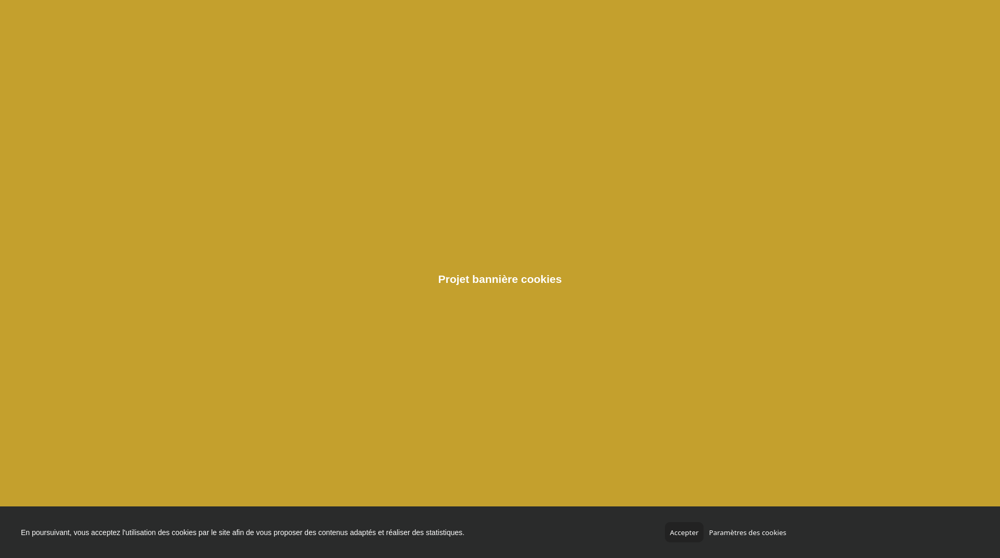

# Projet 1 - Bannière

**Besoin** : Créer une bannière de cookies qui disparaît lorsque l'utilisateur accepte les cookies.



# Prérequis

## DOM

- Récupérer une balise HTML en JS
- Réagir à un événement *click*
- Modifier les classes CSS d'une balise HTML en JS

```js
const balise = document.querySelector(cssSelector);
balise.classList.add(className);    // Ajouter
balise.classList.remove(className); // Supprimer
balise.classList.toggle(className); // Inverser la présence
```

# Cahier des charges

| Tâches | Description | Contraintes |
|---|---|---|
| Intégration HTML/CSS | Intégrer le HTML et le CSS pour afficher une page de test avec une bannière en bas de page demandant d'accepter les cookies. | Quelle que soit la longueur de la page, la bannière doit rester collée en bas de page, au-dessus du contenu. |
| Clic sur le bouton Accepter | Lors du clic sur le bouton Accepter, la bannière disparaît. | |
| Animation CSS | Une animation CSS de fondu (fade out) se produit sur la bannière lorsque l'on accepte les cookies. | |

