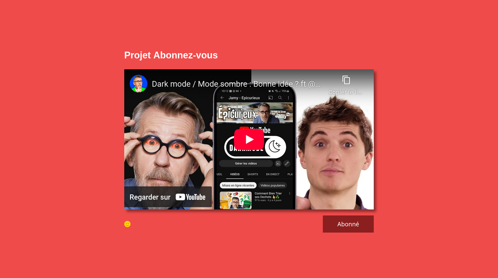

# Projet 2 - Abonne-toi

**Besoin** : Concevoir un système de like et d'abonnement type "YouTube". La page doit contenir une vidéo, une icône de like et un bouton "Abonnez-vous" qui changent d'état et d'apparence lorsque l'utilisateur aime ou s'abonne.

# Prérequis
- Manipulation du DOM
- Utilisation de Font Awesome

# Cahier des charges

| Tâches                  | Description                                                                 | Contraintes |
|-------------------------|-----------------------------------------------------------------------------|-------------|
| Icône de like           | L'icône de like change d'apparence au clic                                  |             |
| Bouton "Abonnez-vous"   | Change de couleur au clic et le texte passe de "Abonnez-vous" à "Abonné"    |             |