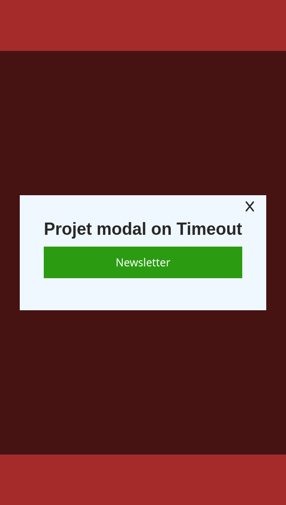

# Projet 5.5 - Modal Timeout

## Le besoin
Faire apparaître une fenêtre pop-up au bout de 3 secondes.

## Pré-requis
- Fonction asynchrone avec `setTimeout`

# Cahier des charges

| Tâches | Description | Contraintes |
|---|---|---|
| Intégrer les sections HTML | Créer une page contenant 4 ou 5 sections, chacune occupant la hauteur d'un écran. |  |
| Pop-up | Ajouter un pop-up centré, fixe à l'écran, contenant un texte et un bouton de fermeture (croix). | Par défaut, le pop-up est caché et peut être fermé avec la croix. |
| Apparition du pop-up | Afficher le pop-up après 3 secondes suivant le chargement de la page. |  |