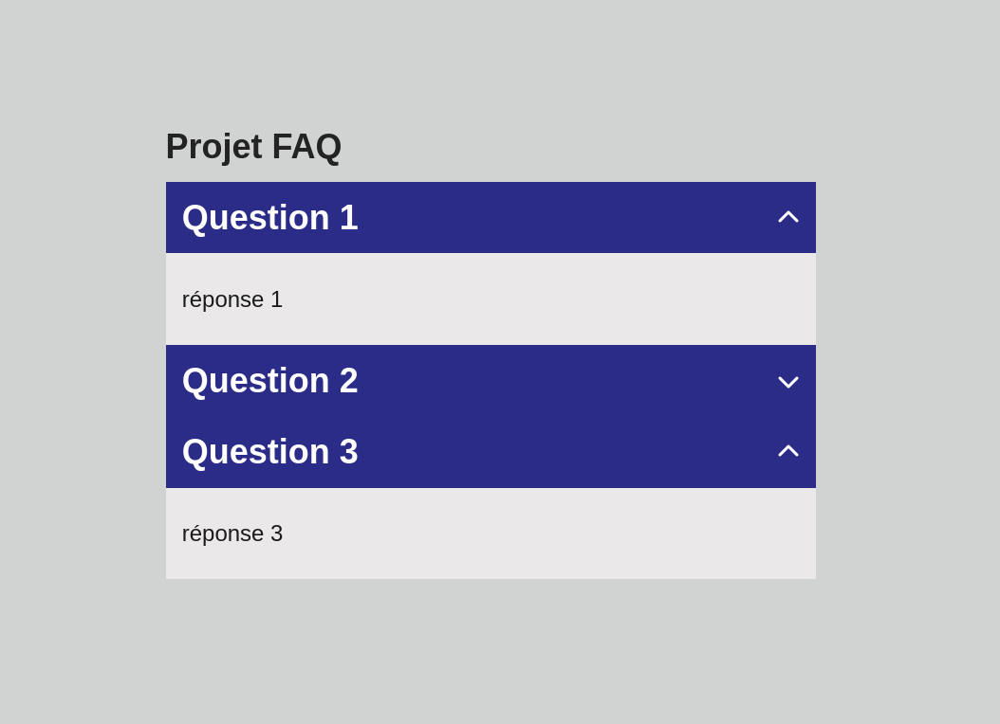

# Projet 7 - FAQ

## Le besoin
Créer un élément de type FAQ qui affiche ou masque du contenu sous forme de tiroirs.



## Pré-requis
- L'événement *click*
- Modifier dynamiquement les classes CSS
- Sélectionner des balises sœurs et enfants

```html
<div>
    <p>1er élément</p>
    <p>2ème élément</p>
    <p>3ème élément</p>
    <p>Dernier élément</p>
</div>
```

```js
const conteneur = document.querySelector("div");

// Récupérer le premier élément enfant
const premier = conteneur.firstElementChild;
// Récupérer le dernier élément enfant
const dernier = conteneur.lastElementChild;

// Récupérer l'élément suivant au premier
const deuxieme = premier.nextElementSibling;
// Récupérer l'élément précédent au dernier
const troisieme = dernier.previousElementSibling;
```

## Cahier des charges
| Tâches | Description | Contraintes |
|---|---|---|
| Intégrer trois questions FAQ composées d'une question et d'un texte de réponse | Créer une structure FAQ avec trois questions et leurs réponses | Respecter la structure HTML et l'interactivité demandée |
| Faire apparaître la réponse au clic sur la question correspondante | Afficher ou masquer la réponse associée à chaque question lors d'un clic | Utiliser les événements et la manipulation du DOM |

