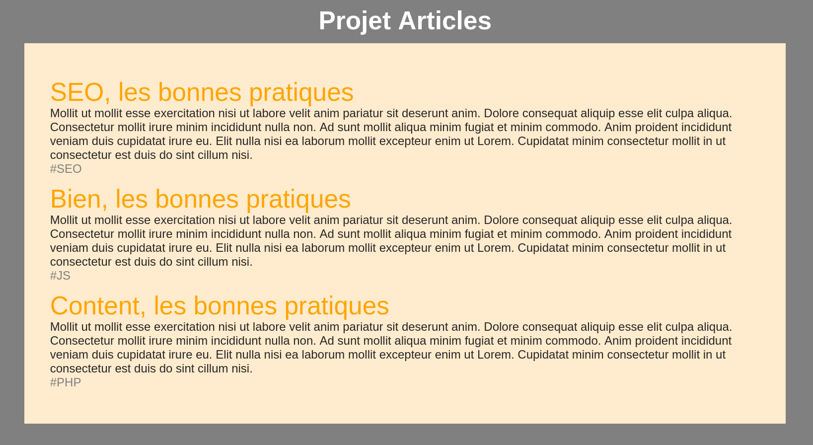

# Projet 9 - Blog

## Le Besoin
Afficher dynamiquement le contenu d'une base de données. Ces données sont des articles de blog.



## Pré-requis
- CSS Grid
- La boucle for
- Savoir créer dynamiquement des balises HTML en JS

# Cahier des charges
| Tâches | Description | Contraintes |
|---|---|---|
| Intégrer le conteneur d'articles en HTML/CSS | Créer la structure et le style du conteneur qui accueillera les articles. | Respecter les bonnes pratiques HTML/CSS |
| Remplir le conteneur d'articles avec les données. | Chaque article doit respecter le schéma : titre cliquable, description, tags. | Utiliser le tableau de données fourni |

# La base de données
Copiez ce tableau d'objets dans votre code et utilisez-le comme une base de données. Le plus souvent, les serveurs envoient un tableau d'objets comme celui-ci pour formater les données d'une BDD.

```js
const posts_arr = 
[
    {
        titre: "SEO, les bonnes pratiques",
        hashtag: "#SEO",
        link: "#",
        extrait: "Mollit ut mollit esse exercitation nisi ut labore velit anim pariatur sit deserunt anim. Dolore consequat aliquip esse elit culpa aliqua. Consectetur mollit irure minim incididunt nulla non. Ad sunt mollit aliqua minim fugiat et minim commodo. Anim proident incididunt veniam duis cupidatat irure eu. Elit nulla nisi ea laborum mollit excepteur enim ut Lorem. Cupidatat minim consectetur mollit in ut consectetur est duis do sint cillum nisi."
    },
    {
        titre: "JS, les bonnes pratiques",
        hashtag: "#JS",
        link: "#",
        extrait: "Mollit ut mollit esse exercitation nisi ut labore velit anim pariatur sit deserunt anim. Dolore consequat aliquip esse elit culpa aliqua. Consectetur mollit irure minim incididunt nulla non. Ad sunt mollit aliqua minim fugiat et minim commodo. Anim proident incididunt veniam duis cupidatat irure eu. Elit nulla nisi ea laborum mollit excepteur enim ut Lorem. Cupidatat minim consectetur mollit in ut consectetur est duis do sint cillum nisi."
    },
    {
        titre: "PHP, les bonnes pratiques",
        hashtag: "#PHP",
        link: "#",
        extrait: "Mollit ut mollit esse exercitation nisi ut labore velit anim pariatur sit deserunt anim. Dolore consequat aliquip esse elit culpa aliqua. Consectetur mollit irure minim incididunt nulla non. Ad sunt mollit aliqua minim fugiat et minim commodo. Anim proident incididunt veniam duis cupidatat irure eu. Elit nulla nisi ea laborum mollit excepteur enim ut Lorem. Cupidatat minim consectetur mollit in ut consectetur est duis do sint cillum nisi."
    }
];
```

Vous pouvez accéder aux données de cette façon :
```js
console.log(posts_arr[0].titre); // Affiche le titre du premier article
console.log(posts_arr[1].extrait); // Affiche l'extrait du deuxième article
```

Ou avec une boucle for :
```js
for (const post_obj of posts_arr){
    console.log(post_obj.titre); // Affiche le titre de chaque article
}
```