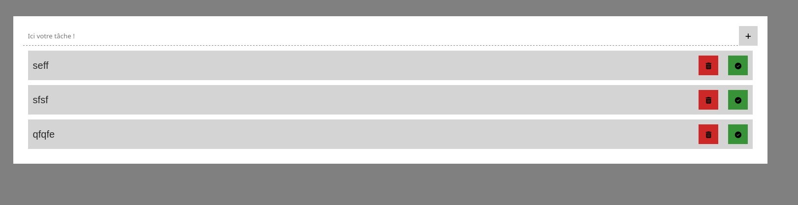
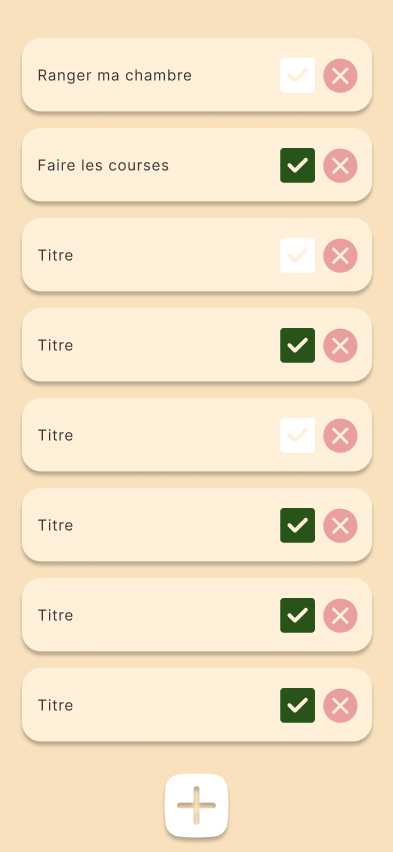
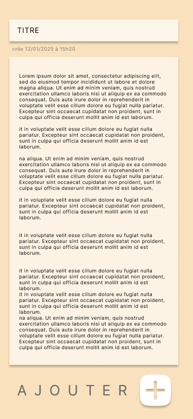

# TODOList LocalStorage

Une application web pour lister et suivre les choses à faire.

## Qu'est-ce qu'une tâche ?

Une tâche est une chose à faire, elle contient plusieurs informations :

- un titre
- une description 
- une case à cocher (checkbox) pour valider la tâche comme faite
- un bouton (poubelle) pour supprimer une tâche
- un bouton "voir plus" qui affiche la description dans un menu déroulant

## Comment ajouter une tâche

Il faut appuyer sur le bouton "AJOUTER UNE Tâche" pour ajouter une nouvelle tâche.

## FORK ET CLONE TEMPLAET REPO
Le template du projet vous devez le fork et le cloner : https://github.com/CHAOUCHI/todolist-template

## Proposition de maquette

### Lien proto Figma interactif 
https://www.figma.com/proto/e4qUHkuVIG9kX9MaqR6tJW/Untitled?node-id=101-10&t=t8VKEBFTkTtxBZVB-1&scaling=scale-down&content-scaling=fixed&page-id=0%3A1&starting-point-node-id=101%3A10

### Maquettes

#### Version simpliste


#### BONUS Accueil


#### BONUS Formulaire d'ajout de tâche


## Cahier des charges

### 1. Version simpliste

Le cahier des charges ci-dessous contient tous les détails du projet.

Dans un premier temps, vous devez faire la version simpliste :


http://localhost:9090/11%20-%20todolist/

### 2. Version complète

L'application est une Single Page Application (SPA), c'est-à-dire qu'elle ne possède qu'une page `index.html`. C'est grâce à votre maîtrise du DOM que vous allez pouvoir modifier l'affichage :) .

| Tâches | Description | Cas critique |
| - | - | - |
| Formulaire d'ajout de tâche | Une tâche est composée d'un titre, d'une description, d'une case à cocher pour valider la tâche, d'un bouton supprimer et d'une date de création | Les tâches ajoutées doivent être stockées dans le localStorage sous la forme d'un tableau JSON pour permettre aux tâches d'être sauvegardées |
| Afficher les tâches | Afficher toutes les tâches contenues dans le localStorage | Affichage des tâches au chargement de la page et mise à jour des tâches quand une tâche est ajoutée |
| Version mobile | La version mobile est prioritaire et doit être faite en premier |
| UX | - Le formulaire d'ajout apparaît en slide-in comme dans le proto Figma <br> - Le bouton ajouter doit toujours être visible |
| Valider une tâche | Si l'utilisateur valide une tâche, ses changements doivent être répercutés dans le localStorage |
| (BONUS) Barre de recherche | Ajouter une barre de recherche pour afficher uniquement les tâches qui contiennent le texte tapé |
| (BONUS) Trier par date | L'utilisateur doit pouvoir trier les tâches de la plus vieille à la plus récente et inversement |
| (BONUS) Épingler une tâche | Ajouter une icône épingle sur chaque tâche pour les faire apparaître en haut de la page par défaut et les mettre en avant | Il faut pouvoir épingler et désépingler une tâche |
| (BONUS) Trier par # Tag | Chaque tâche peut avoir un ou plusieurs hashtags lors de la création. Il faut pouvoir trier les tâches par hashtag comme sur YouTube |  |

*Exemple de hashtag*


**LISEZ L'ANNEXE !!!**

## Annexe localStorage et JSON Array

La plupart des bases de données sont des tableaux, ici des tableaux de tâches.

Il est possible d'enregistrer une liste JS dans le localStorage très facilement grâce au format JSON.

### Enregistrer les données

La fonction `JSON.stringify` permet de transformer n'importe quelle variable JavaScript en une chaîne de caractères.

```js
const fruits = [
    {"name":"pomme","color":"rouge"},
    {"name":"banane","color":"jaune"},
    {"name":"kiwi","color":"vert"},
];

const fruitsJSON = JSON.stringify(fruits);

console.log(fruitsJSON); // J'ai une string JSON qui représente mon tableau

// J'ajoute la string au localStorage sous le nom "fruits"
localStorage.setItem("fruits", fruitsJSON);
```
Rendez-vous dans Inspecter > Storage > localStorage pour voir votre tableau enregistré sous la forme d'une string JSON.

### Récupérer les données

La fonction `JSON.parse` permet de transformer une string JSON en variable JavaScript.

```js
const fruitsJSON = localStorage.getItem("fruits");

if (fruitsJSON != null) {
    const fruits = JSON.parse(fruitsJSON);
} else {
    console.log("item fruits unknown");
}
```

### Encapsuler dans un getter et setter

Une application a régulièrement besoin d'accéder à une BDD. Il est donc d'usage de créer au moins deux fonctions : getter (récupérer) et setter (ajouter).

*Une fonction getter*
```js
/**
 * Retourne les fruits ou un tableau vide si la base de données n'est pas définie
 */ 
function getAllFruits() {
    const fruitsJSON = localStorage.getItem("fruits");

    if (fruitsJSON == null) return [];
    
    const fruits = JSON.parse(fruitsJSON);

    return fruits;
}
```

*Une fonction setter*
```js
function addFruit(newFruit) {
    const fruitsJSON = localStorage.getItem("fruits") ?? "[]";
    // si fruitsJSON est null j'utilise une string JSON vide "[]"
    
    const fruits = JSON.parse(fruitsJSON);
    fruits.push(newFruit);

    localStorage.setItem("fruits", JSON.stringify(fruits));

    return;
}
```

Ici, je n'ai fait que deux fonctions mais il est habituel de créer plusieurs fonctions plus ou moins spécifiques pour former un CRUD (Create, Read, Update, Delete).
```
- getFruitByName(name){}
- getFruitById(id){}
- getFruitsByCategory(category){}
- deleteFruitById(id){}
- ...
```
## Annexe Tableau de Tasks

Je vous recommande de créer un tableau de tâches avec la structure suivante :

```js
const task = {
    title : "Titre de la tâche",
    description : "Description de la tâche",
    done : false // true si la tâche est faite
}
```

Et d'utiliser les fonctions suivantes pour manipuler le tableau de tâches dans le localStorage :

```js
function getAllTasks() {
    const tasksJSON = localStorage.getItem("tasks") ?? "[]";
    const tasks = JSON.parse(tasksJSON);
    return tasks;
}

function addTask(newTask) {
    const tasks = getAllTasks();
    tasks.push(newTask);
    localStorage.setItem("tasks", JSON.stringify(tasks));
    return;
}
```


## Annexe Architecture orientée Composant

Je recommande d'adopter une architecture orientée composants, c'est-à-dire créer des fonctions qui renvoient des Node en utilisant les balises `template`. 

Vous trouverez ici un repo qui vous décrit une proposition d'architecture logicielle :

https://github.com/CHAOUCHI/VanillaJS-Component-Oriented.git