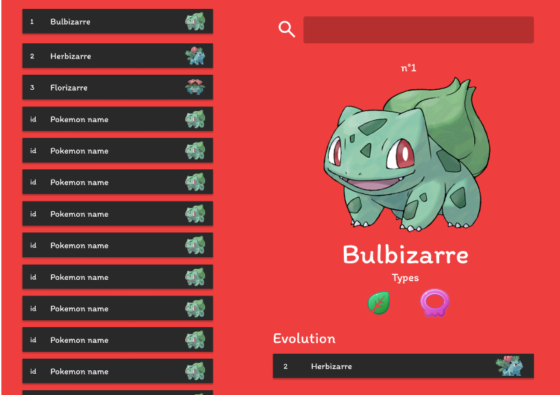

# Pokedex



Pour la récupération des pokémons, nous utiliserons l'API Pokebuild qui contient toutes les informations sur les pokémons.

Cette API REST est accessible à l'adresse : https://pokebuildapi.fr/api/v1

## Repo à forker

Forkez ce dépôt GitHub : https://github.com/CHAOUCHI/cdpi-dwwm-fetch-pokedex-project

## Conseil : Programmation orientée composant

Je vous recommande grandement de concevoir votre application sous la forme de composants, c'est à dire des fonctions qui renvoient un objet HTMLElement.

En partant du principe que `pokemon_obj` soit le pokemon retourné par l'API, voici un exemple de fonction qui créer un composant pokémon.

``` js
function createPokemon(pokemon_obj) {
  const pokemonDiv = document.createElement('div');
  pokemonDiv.classList.add('pokemon');

  const img = document.createElement('img');
  img.src = pokemon.image;
  pokemonDiv.appendChild(img);

  const name = document.createElement('p');
  name.textContent = pokemon.name;
  pokemonDiv.appendChild(name);
  return pokemonDiv;
}


const pikachu = {
  id: 25,
  name: "Pikachu",
  image: "https://raw.githubusercontent.com/PokeAPI/sprites/master/sprites/pokemon/25.png",
  // ...
}
const pokemonContainer = document.querySelector('.pokemon-container');
const pikachuComponent = createPokemon(pikachu);
pokemonContainer.appendChild(pikachuComponent);
```


## Cahier des charges

|Tâches|
|-|
|Lister tous les pokémons dans une liste défilante sur la gauche de l'écran.|
|Afficher les détails d'un pokémon sur la droite lorsque l'on *clique* sur un pokémon de la liste.|
|Afficher l'évolution du pokémon dans les détails et permettre, comme pour la liste de pokémons, le clic sur ce pokémon pour en voir les détails.|
|Mettre en place une barre de recherche qui affiche le pokémon tapé dans le menu détails sur la droite de l'écran.|


> Astuce : il est possible de stocker une donnée dans la balise HTML avec l'attribut `data-*`. Par exemple `<div class="pokemon" data-id="1">...</div>`
> [https://developer.mozilla.org/fr/docs/Web/HTML/Global_attributes/data-*](https://developer.mozilla.org/fr/docs/Web/HTML/Global_attributes/data-*)

<!-- ## Maquette

Voici la maquette Figma qui permet de récupérer facilement les couleurs hexadécimales et les assets si besoin.

Lien Figma : https://www.figma.com/file/eZkyaB5YcGxTsTgn4ZEcv2/Untitled?type=design&node-id=59%3A111&mode=design&t=QfImaCXxk6vqaSfd-1 -->

