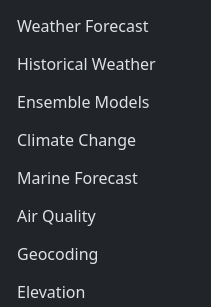
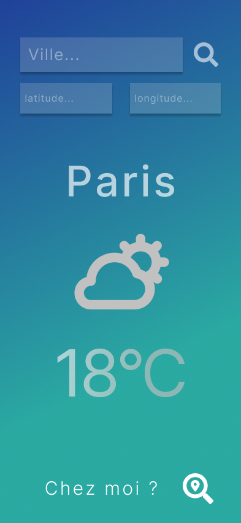

# Météo

Utilisez l'API REST https://open-meteo.com/en/docs pour concevoir une petite application météo qui donne des informations météorologiques lorsque l'on tape le nom d'une ville.

L'API REST Open-Meteo possède en fait plusieurs APIs.

À vous d'utiliser les bons outils pour obtenir :
- Les informations météo en fonction de la position GPS (latitude, longitude)
- La position GPS (latitude, longitude) en fonction du nom de la ville.

## Maquette

https://www.figma.com/proto/SxzRQi4Gdf3NkEvVr0gvg5/Untitled?node-id=1-2&t=VxVuPYHtZZgQDDAg-1&scaling=scale-down&content-scaling=fixed&page-id=0%3A1

## Cahier des charges

| Tâche |
| - |
| Barre de recherche qui affiche la météo en fonction de la position GPS (latitude, longitude) saisie |
| Recherche en fonction du nom de la ville |
| Afficher une image cohérente en fonction du temps   - pluie → image d'un nuage pluvieux - soleil → image d'un soleil plein - etc... |
| [BONUS] : Utiliser l'API native de géolocalisation pour afficher la météo de l'utilisateur dès qu'il arrive sur le site : https://developer.mozilla.org/en-US/docs/Web/API/Geolocation_API/Using_the_Geolocation_API |
| [BONUS] - Changer la couleur de fond en fonction de l'heure (jour ou nuit) |

## À propos de l'API de géolocalisation sur Firefox

L'implémentation de l'API de géolocalisation dépend du navigateur, il est donc possible que la géolocalisation ne fonctionne pas sur certains navigateurs comme Firefox ou Chromium. (À ma connaissance, tout fonctionne bien sur Google Chrome.)

Il faut prévoir le cas où l'utilisateur utilise un navigateur défectueux.

Si l'API de géolocalisation ne fonctionne pas sur un navigateur, utilisez une API REST permettant de récupérer la position en fonction de l'IP.

Il en existe plusieurs, mais vous pouvez utiliser celle de Google.

https://developers.google.com/maps/documentation/geolocation/overview?hl=fr
