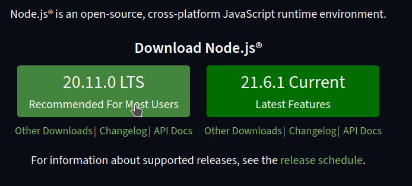
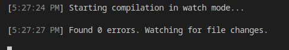

# Pré-requis

# NPM
Le code TypeScript que nous écrivont n'est pas compréhensible du navigateur (il ne comprend que le JS), il nous faut donc installer le *TypeScript Compiler* (`tsc`), qui compile le code TypeScript en code JavaScript.

Pour installer le compilateur TypeScript nous utilisons le Node Package Manager (`NPM`), c'est le gestionnaire d'extension de JavaScript. NPM est inclu dans l'installation de NodeJS, il nous suffit donc d'installer NodeJS.

## Installer NodeJS et NPM sous Windows
Télécharger NodeJS Long term Support (LTS) ici : https://nodejs.org/en

> Long Term Support signifie que cette version de NodeJS est stable et toutes les failles seront corrigées pendant encore un moment. C'est donc une version fiable à utiliser pour la plupart des projets.

## Installer NodeJS et npm sous Linux
```bash
apt install nodejs npm
```
## Installer NodeJS et npm sous Mac
Avec HomeBrew le gestionnaire de paquet MacOS :
```bash
brew install node
```
Ou bien via une application fenêtrée via le lien suivant : https://nodejs.org/en/download/

## Installer le compilateur TypeScript
Dans un invité de commande, executez la commande suivante pour installer *TypeScriptCompiler* (tsc) :
```bash
npm install -g typescript
```
> `-g` signifie `global`, le compilateur TypeScript est donc disponible sur l'ensemble de votre ordinateur; peu importe le dossier dans lequel vous vous trouverez.
## Arborescence du projet
Dans VSCode créer un nouveau dossier pour votre projet nommé : `EarthDefender`. 

Ce dossier contient :
- un fichier `index.html`, la page d'accueil de votre jeu
- un dossier nommé `src`, il contiendra notre code TypeScript
- un dossier nommé `build`, il contiendra le code JavaScript généré par TypeScriptCompiler. Ce sera ce code qui sera importé par la balise `<script>` dans le fichier `index.html`.
- un fichier nommé `tsconfig.json`, il dictera à TypeScriptCompiler comment se comporter.
- le dossier `public` contiendra nos medias : images, sons.

*Arborescence du projet EarthDefender*


Dans le dossier `src`, créez un fichier nommée `script.ts` et placez y le code suivant :

*src/script.ts*
```ts
let gameName : string = "EarthDefender!";
console.log(gameName);
```
> Vous remarquez qu'en TypeScript on peut préciser le type d'une variable. Ainsi si je fais une erreur et tente de mettre, par exemple, un `number` dans une `string`, le compilateur TypeScript me retournera une erreur.

## Configurer *TypeScriptCompiler*

Nous avons écrit un peu de TypeScript. Avant de le complier, nous allons indiquer au compilateur TypeScript de placer les fichiers compilés dans le dossier `build`.

Dans `tsconfig.json` écrivez le code suivant :

*tsconfig.json*
```json
{
    "compilerOptions": {
        "rootDir": "./src", // Les fichiers à compiler sont dans ./src
        "outDir": "./build",    // Les fichiers JavaScript compilés seront dans ./build
        "module": "ESNext"  /* Le JavaScript généré lors de la compilation utilise
         la norme ECMAScript la plus récente.*/
    }
}
```

> ### **Rappel : "module" : "ESNext"**
> Le nom de la norme qui défini la syntaxe et le comportement du langage JavaScript est ECMAScript. A l'heure où j'écrit ce cours nous somme à ECMAScript2024. 
>
> Dans `tsconfig.json`, **si le paramètre `module` prend la valeur `ESNext`, le compilateur compilera toujours le code dans le respect de la norme ECMAScript la plus récente.** En 2025 il utilisera donc la norme ECMAScript2025.
> - Tout la norme ECMAScript est définie ici : https://tc39.es/ecma262/, c'est ce document qui est utilisé par les concepteurs de navigateur web pour implementer JavaScript.
> - Plus de détail sur le fichier `tsconfig.json` ici : https://www.typescriptlang.org/docs/handbook/tsconfig-json.html

## Compiler mon code TypeScript en JavaScript

Pour compiler, rendez-vous à la racine du projet et tapez cette ligne de commande :
```bash
tsc
```
TypeScript va compiler votre code pour transformer le TypeScript en JavaScript. Un fichier `script.js` est apparu dans le dossier `build`, nous pouvons donc l'importer dans le fichier `index.html`.

*index.html*
```html
<!DOCTYPE html>
<html lang="fr">
<head>
    <meta charset="UTF-8">
    <meta name="viewport" content="width=device-width, initial-scale=1.0">
    <title>Earth Defender</title>
    
</head>
<body>
      
</body>
<script type="module" src="./build/script.js"></script>
</html>
```
> #### Pourquoi type="module"
> Vous remarquez l'utilisation du `type=module` sur la balise `<script>`. Il est obligatoire de préciser `type=module` car à l'avenir le fichier `script.js` importera des classes contenu dans d'autres fichiers JavaScript or ceci n'est possible que si le navigateur interprète le fichier `script.js` comme un module JavaScript.

Ouvrez votre projet dans le navigateur (j'utilise l'extension VSCode *Live Preview* en tant que serveur web). Si tout c'est bien passé, il est écrit dans la console : `"Earth Defender!"`.

## Watch mode - Compiler lors de la sauvegarde
A chaque modification d'un fichier TypeScript il faut relancer la commande `tsc` pour recompiler le code en JavaScript; c'est génant.

Nous souhaitons donc voir TypeScript compiler notre code à chaque fois que l'on sauvegarde un fichier pour ne pas avoir à lancer le compilateur à la main à chaque modification.

Pour ceci, rien de plus simple, il suffit de lancez le compilateur en mode *watch*.
```bash
tsc -w
```


Voilà ! A present TypeScript surveille nos fichiers et recompile le code à chaque modifications !
