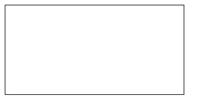

# Canva HTML
Avant de concevoir notre jeu grâce à la POO il convient de comprendre les bases de l'API Canvas. 

Un canvas HTML est une balise HTML (`<canvas>`) qui permet de dessiner librement des formes à l'intérieur. L'intérieur d'un canvas fait exeption à la manière traditonnel d'afficher des éléments en HTML et par conséquant le CSS ne vous sera d'aucune utilité à l'interieur du canva.

Tout les éléments interne au canva devront être dessiné en JavaScript.

Soit le fichier HTML suivant qui permet d'afficher un canvas vide a la bordure noire :

*index.html*
```html
<!DOCTYPE html>
<html>
<head>
    <style>
        canvas{
            border : black solid 1px;
        }
    </style>
</head>
<body>
    <canvas>

    </canvas>
</body>
<script type="module" src="./build/script.js"></script>
</html>
```
*Résultat*


Une fois ce code HTML mis en place, la suite du code se passera en TypeScript dans le dossier `src`.

## Initaliser le canva
Avant de pouvoir dessiner il faut recupérer ce que l'on nomme le *contexte de canvas*. C'est un objet qui contient des fonctions permettant de dessiner dans le canvas.
```ts
// Je récupère la balise nommée canvas
const canvas = document.querySelector("canvas");
// Je récupère le contexte du canvas
// pour pouvoir, à l'avenir, dessiner dedans.
const context = canvas.getContext("2d");
```
Pour finir l'initalisation du canvas nous allons définir sa taille comme étant de *900x500px*.
```ts
const CANVAS_WIDTH = 900;
const CANVAS_HEIGHT = 500;

const canvas = document.querySelector("canvas");
const context = canvas.getContext("2d");

canvas.width = CANVAS_WIDTH;
canvas.height = CANVAS_HEIGHT;
```
Voilà c'en ai fini de l'initalisation du canvas! 

Nous avons le contexte qui nous permettra de dessiner, nous avons ajouté une bordure noire autour du canvas pour le voir facilement et également défini une taille à ce canvas (900x500).

## Définir la couleur de fond du canvas
La méthode `context.fillRect` permet de colorier une zone du canvas.
L'attribut `context.fillStyle` permet de définir la couleur utilisée par la méthode `fillRect` lors du remplissage.
```ts
context.fillStyle = "#141414";  // HexaDecimal Gris foncé
context.fillRect(
    0,0,            // [x,y] supérieur gauche
    CANVAS_WIDTH,CANVAS_HEIGHT // [x,y] inférieur droit
);
```
Les coordonnées [x,y] d'un canvas démarre à [0,0] en haut à gauche du canvas, ont appel ceci l'origine. 

Ici la fonction `fillRect` à besoin des coordonnées supérieur gauche et inférieur droit de la zone à remplir. Nous lui fournissont donc l'origine du canvas et le coin inférieur droit pour remplir l'entièreté du canvas.

> Pour rappel, la largeur correspond à l'axe x (l'abscisse) et la hauteur correspond à l'axe y (l'ordonnée).
## Effacer le contenu du canvas
Pour effacer tout le contenu du canvas ont utilise la méthode `context.clearReact` qui est similaire à `fillRect` dans ses paramètres mais efface tout ce qui se trouve entre les coordonnée fournis.
```ts
context.clearRect(0,0,CANVAS_WIDTH,CANVAS_HEIGHT);
```
## Afficher une image
La méthode `context.drawImage()` permet de dessiner une image dans le canvas. 

Pour se faire elle à besoin : 
- d'un élément `HTMLImageElement` ( une balise ``)
- des coordonnées où dessiner l'image x et y

Un `HTMLImageElement` est récupérable via la méthode `querySelector()`.

### Ajouter l'image dans le HTML
Dans le dossier `/public/images/` placer l'image suivant sous le nom `Alien.png`.

*/public/images/Alien.png*

> Cette image est également disponible depuis le lien figma du projet.

Dans le code HTML placez l'image, comme d'habitude, avec une balise `` mais en rajoutant l'attribut HTML `hidden` qui permet de cacher l'image.

*index.html*
```html
...
<body>
    
    <canvas>

    </canvas>
</body>
...
```

### Afficher l'image dans le canvas
L'affichage d'une image se fait via la fonction `drawImage`. 

La fonction `drawImage` prend 4 paramètres :
- une balise image
- la position x
- la position y
- la largeur de l'image en pixel
- la hauteur de l'image en pixel

```ts

// Je récupère une image qui à pour classe alien
// querySelector renvoie un Objet de la classe HTMLElement
// Je précise HTMLImageElement en tant que type de la variable image 
// pour transtyper la classe HTMLElement en un classe fille HTMLImageElement
const image : HTMLImageElement = document.querySelector("img.alien");

let position = {
    x : 0,
    y : 0
};

// J'attend que toutes les images soit chargées
window.onload = ()=>{
    // Je l'affiche
    context.drawImage(
        image,
        position.x,  
        position.y,
        image.width,
        image.height
    );
}
```

Voilà un alien est affiché en haut à gauche du canvas !

## Attendre le chargement de tout les assets
Le navigateur charge les ressources de façon asyncrone et peut parfois charger le script avant l'image se qui fait que l'image ne s'affiche pas dans le canvas.

Pour corrigé ça nous utilisont la fonction window.onload qui s'execute quand toutes les ressources on bien chargé.

Au fur et a mesure que l'application va grandrir de nombreuses ressources (sons, images) devront être chargé et pour s'assurer que toutes seront bien charger nous allons placer notre programme dans une grande fonction main qui est appelée au chargement de la page (window.onload).

Notre code TypeScript est donc comme ceci :

```ts
window.onload = main;

function main(){
    const CANVAS_WIDTH = 900;
    const CANVAS_HEIGHT = 500;
    
    const canvas = document.querySelector("canvas");
    const context = canvas.getContext("2d");
    
    canvas.width = CANVAS_WIDTH;
    canvas.height = CANVAS_HEIGHT;
    
    context.fillStyle = "#141414";  // HexaDecimal Gris foncé
    context.fillRect(
        0,0,            // [x,y] supérieur gauche
        CANVAS_WIDTH,CANVAS_HEIGHT // [x,y] inférieur droit
    );
    
    const image : HTMLImageElement = document.querySelector("img.alien");
    let position = {
        x : 0,
        y : 0
    };
    context.drawImage(
        image,
        position.x,  
        position.y,
        image.width,
        image.height
    );
}
```

Tout code devra être écrit dans la fonction main pour s'assurer qu'il soit bien chargé après le chargements des assets.

**Pour le reste du TP partez du principe que tout le code est dans la fonction `main`**
