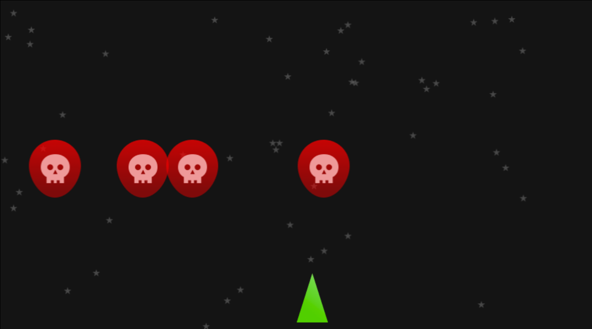

# TP Earth Defender, première essai sans POO

Avant de commencer à utiliser la programmation orientée objet pour crée notre jeu testons d'abord la solidité du code procédural utilisé plus haut.

## Exercice 3 :

### Aliens
Faites apparaitre 4 aliens chacun à une position aléatoire. Chaque aliens se déplace tout droit vers le bas du canvas.

### Joueur
Faire se déplacer le joueur de gauche à droite

### Stars
Faire apparaitre des étoiles à des positions aléatoires.

### Résultat



### Pré-requis :
- L'image d'un étoile dispo sur la maquette figma.
- `Math.random()`
- Le code ci-dessous :
```ts
window.onload = main;

function main(){
    // Canvas initalisation----------------//
    const CANVAS_WIDTH = 900;
    const CANVAS_HEIGHT = 500;

    const canvas = document.querySelector("canvas");
    const context = canvas.getContext("2d");

    canvas.width = CANVAS_WIDTH;
    canvas.height = CANVAS_HEIGHT;

    type Direction = 0 | 1 | -1;
    let direction : Direction = 0;


    // Game event loop -------------------------//
    setInterval(()=>{
        
        // Clear context
        context.clearRect(0,0,CANVAS_WIDTH,CANVAS_HEIGHT);
        // Draw back background color
        context.fillStyle = "#141414";
        context.fillRect(0,0,CANVAS_WIDTH,CANVAS_HEIGHT);
        
        // Draw 50 random stars 
        // use a for loop
        // Code here ...

        // Draw and move random aliens
        // Code here ...


        // Draw and move Player
        // Code here ...

    },10);

    // Input Handling--------------------------------//
    // Key Down
    document.addEventListener("keydown",(event)=>{
        switch (event.key) {
            // Go right
            case "d":
            case "D":
                direction = 1;
                break;
            // Go left
            case "q":
            case "Q":
                direction = -1;
                break;
            default:
                break;
        }
    });

    // Key Released
    document.addEventListener("keyup",(event)=>{
        switch (event.key) {
            // Player Stops
            case "d":
            case "D":
            case "q":
            case "Q":
                direction = 0;
            break;

            default:
                break;
        }
    });
}
```

```html
<!DOCTYPE html>
<html lang="fr">
<head>
    <meta charset="UTF-8">
    <meta name="viewport" content="width=device-width, initial-scale=1.0">
    <title>Document</title>
    <style>
        canvas{
            border : black 1px solid;
        }
    </style>
    
</head>
<body>
    
    
    
    <canvas></canvas>
</body>
<script type="module" src="./build/script.js"></script>
</html>
```

### Correction exercice 3
```ts
window.onload = main;

function main(){
    // Canavas initalisation----------------//
    const CANVAS_WIDTH = 900;
    const CANVAS_HEIGHT = 500;

    const canvas = document.querySelector("canvas");
    const context = canvas.getContext("2d");

    canvas.width = CANVAS_WIDTH;
    canvas.height = CANVAS_HEIGHT;

    type Direction = 0 | 1 | -1;
    let direction : Direction = 0;

    const alienPosition1 = {
        x : Math.random()*500,
        y : 0
    };
    const alienPosition2 = {
        x : Math.random()*500,
        y : 0
    };
    const alienPosition3 = {
        x : Math.random()*500,
        y : 0
    };
    const alienPosition4 = {
        x : Math.random()*500,
        y : 0
    };
    const alienImage : HTMLImageElement = document.querySelector("img.alien");  

    const playerImage : HTMLImageElement = document.querySelector("img.player");
    const playerPosition = {
        x : CANVAS_WIDTH/2,
        y : CANVAS_HEIGHT-playerImage.height-10
    };
    const starImage : HTMLImageElement = document.querySelector("img.star");

        

    // Game event loop -------------------------//
    setInterval(()=>{
        
        // Clear context
        context.clearRect(0,0,CANVAS_WIDTH,CANVAS_HEIGHT);
        // Draw back background color
        context.fillStyle = "#141414";
        context.fillRect(0,0,CANVAS_WIDTH,CANVAS_HEIGHT);
        
        // Draw random stars
        // Code here ...
        for (let i = 0; i < 50; i++) {   
            context.drawImage(
                starImage,
                Math.random()*CANVAS_WIDTH,
                Math.random()*CANVAS_HEIGHT,
                starImage.width,
                starImage.height
            );
        }
        

        // Draw and move random aliens
        // Code here ...
        context.drawImage(
            alienImage,
            alienPosition1.x,
            alienPosition1.y,
            alienImage.width,
            alienImage.height
        )
        context.drawImage(
            alienImage,
            alienPosition2.x,
            alienPosition2.y,
            alienImage.width,
            alienImage.height
        )
        context.drawImage(
            alienImage,
            alienPosition3.x,
            alienPosition3.y,
            alienImage.width,
            alienImage.height
        )
        context.drawImage(
            alienImage,
            alienPosition4.x,
            alienPosition4.y,
            alienImage.width,
            alienImage.height
        )
        alienPosition1.y+=1;
        alienPosition2.y+=1;
        alienPosition3.y+=1;
        alienPosition4.y+=1;


        // Draw and move Player
        // Code here ...
        context.drawImage(
            playerImage,
            playerPosition.x,
            playerPosition.y,
            playerImage.width,
            playerImage.height,
        )
        // Move player
        playerPosition.x+=direction*10;

    },10);

    // Input Handling--------------------------------//
    // Key Down
    document.addEventListener("keydown",(event)=>{
        switch (event.key) {
            // Go right
            case "d":
            case "D":
                direction = 1;
                break;
            // Go left
            case "q":
            case "Q":
                direction = -1;
                break;
            default:
                break;
        }
    });

    // Key Released
    document.addEventListener("keyup",(event)=>{
        switch (event.key) {
            // Player Stops
            case "d":
            case "D":
            case "q":
            case "Q":
                direction = 0;
            break;

            default:
                break;
        }
    });
}
```