# Exercices TypeScript – L’Héritage

L’héritage permet à une classe (dite *classe fille*) de **réutiliser et de modifier** les fonctionnalités d’une autre classe (la *classe mère*).
On utilise le mot-clé `extends` pour établir la relation.

Exemple :
```ts
// 1.Je déclare une classe Parent
class Parent {
    money : number;
    looseMoney(loss: number) {
        this.money -= loss;
    }
    greet() {
        console.log("Hello from Parent");
    }
}
// 2. Je déclare une classe Child qui hérite de Parent
class Child extends Parent {
    greet() {
        console.log("Hello from Child");
    }
}
// 3. Je crée un objet Child
const kid = new Child();
kid.money = 10;
kid.looseMoney(3);
console.log(kid.money); // Affiche 7
// 4. J'appelle bien la méthode greet de Child et non de Parent
kid.greet(); // Affiche "Hello from Child"

// 1. Je crée un objet Parent
const mother = new Parent();
mother.money = 1000;
// 2. J'affiche bien la méthode greet de Parent
mother.greet(); // Affiche "Hello from Parent"
mother.looseMoney(400);
console.log(mother.money); // Affiche 600

const father = new Parent();
father.money = 1000;
father.greet(); // Affiche "Hello from Parent"
father.looseMoney(430);
console.log(father.money); // Affiche 570


/**
 * Parent et Child ont des méthodes greet différentes.
 * Mais possède la même méthode looseMoney car Child l'hérite de Parent sans modifier looseMoney.
 */
```


##  Partie 1 – Héritage sans `protected`

###  Exercice 1 – Héritage simple
Crée une classe `Animal` avec une méthode `makeSound()` qui affiche `"Un animal fait un bruit."`.  
Crée une classe `Dog` qui hérite de `Animal` et redéfinit la méthode `makeSound()` pour afficher `"Le chien aboie."`.

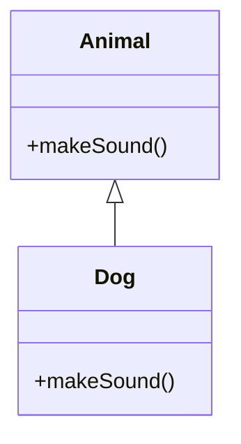

###  Exercice 2 – Ajouter des propriétés
Crée une classe `Person` avec une propriété `name` et une méthode `introduce()`.  
Crée une classe `Student` qui hérite de `Person` et ajoute une propriété `school`.  
Ajoute une méthode `study()`.

1. Testez les attributs et méthodes des classes.

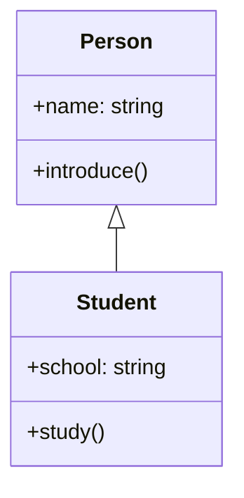


###  Exercice 3 – Appeler le constructeur parent
Crée une classe `Vehicle` avec une propriété `brand`.  
Crée une classe `Car` qui hérite de `Vehicle`.  
Appelle le constructeur du parent avec `super(brand)`.

1. Testez les attributs et méthodes des classes.

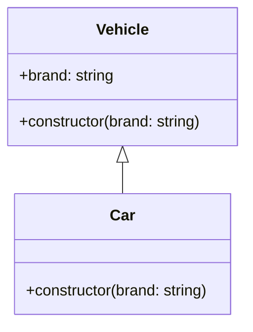


###  Exercice 4 – Redéfinition de méthode
Crée une classe `Shape` avec une méthode `getArea()` qui retourne `0`.  
Crée une classe `Rectangle` qui hérite de `Shape` et redéfinit `getArea()` pour calculer l’aire réelle.

1. Testez les attributs et méthodes des classes.

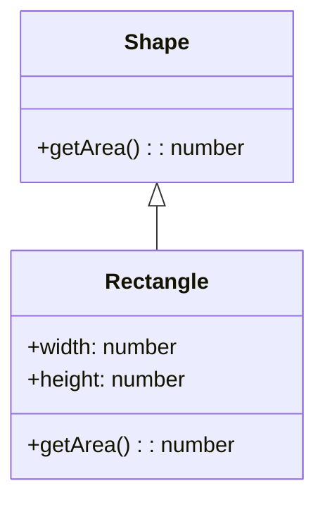


###  Exercice 5 – Multi-niveaux d’héritage
Crée trois classes :  
`LivingBeing` → `Animal` → `Cat`.  
Chaque classe doit avoir une méthode spécifique :  
- `LivingBeing`: `breathe()`  
- `Animal`: `eat()`  
- `Cat`: `meow()`

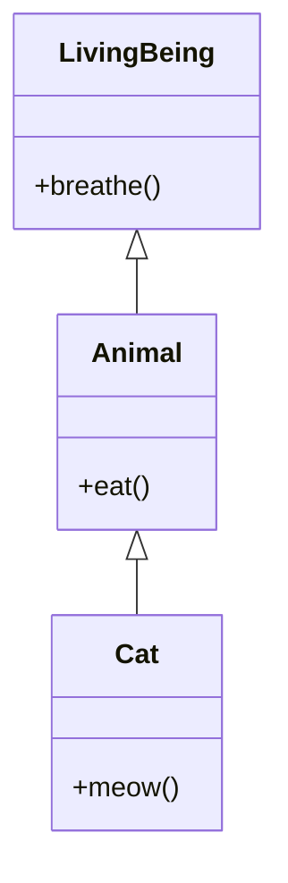

1. Testez les attributs et méthodes des classes.


###  Exercice 7 – Ajout d’une méthode spécifique
Crée une classe `Device` avec une méthode `turnOn()`.  
Crée une classe `Smartphone` qui hérite de `Device` et ajoute une méthode `takePhoto()`.

1. Testez les attributs et méthodes des classes.

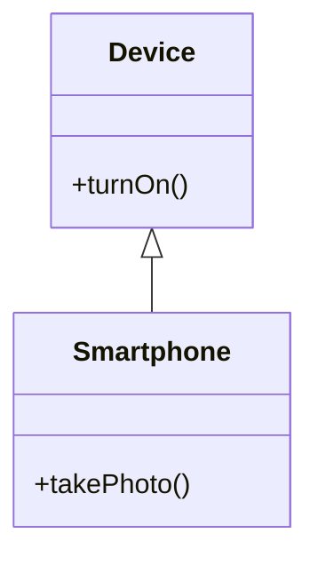


###  Exercice 8 – Héritage et tableau d’objets
Crée une classe `Vehicle` et une classe `Bike` qui hérite de `Vehicle`.
Crée un tableau contenant des `Vehicle` et des `Bike`.  
Parcours le tableau et appelle l'attribut speed commun sur chacun.

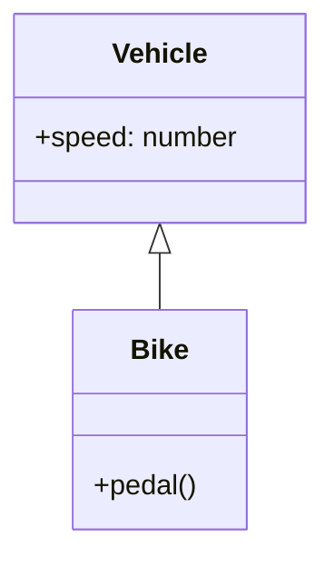

###  Exercice 9 – Appeler une méthode du parent
Crée une classe `Artist` avec une méthode `createArt()`.  
Crée une classe `Painter` qui hérite de `Artist` et appelle la méthode du parent avant d’ajouter un message.

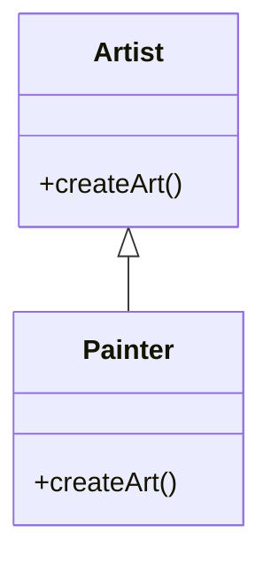


###  Exercice 10 – Hiérarchie simple d’objets
Crée une classe `Product` (nom, prix).  
Crée une classe `Book` qui hérite de `Product` et ajoute un `author`.  
Affiche les informations d’un livre complet.

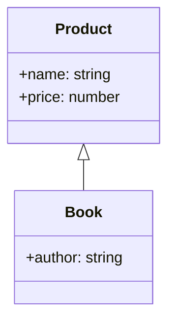


##  Partie 2 – Héritage avec `protected`

###  Exercice 11 – Utiliser un attribut `protected`
Crée une classe `Account` avec un attribut `protected balance`.  
Crée une classe `SavingAccount` qui hérite de `Account` et ajoute une méthode `addInterest()` qui modifie `balance`.

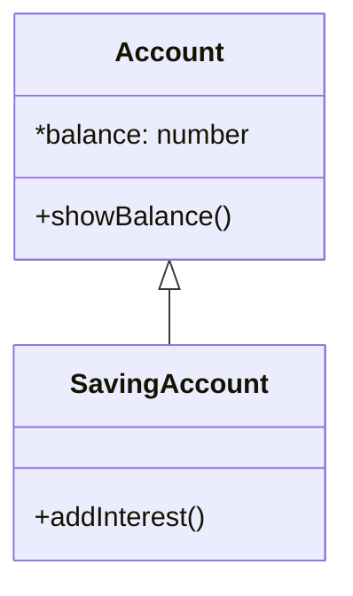


###  Exercice 12 – Méthode `protected`
Crée une classe `Machine` avec une méthode `protected logStatus()`.  
Crée une classe `Printer` qui hérite de `Machine` et appelle `logStatus()` depuis une méthode publique `print()`.

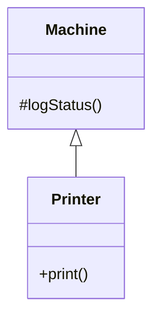


###  Exercice 13 – Accès à un attribut `protected`
Crée une classe `Character` avec un attribut `protected health`.  
Crée une classe `Hero` qui hérite de `Character` et ajoute une méthode `heal()` qui augmente la santé.

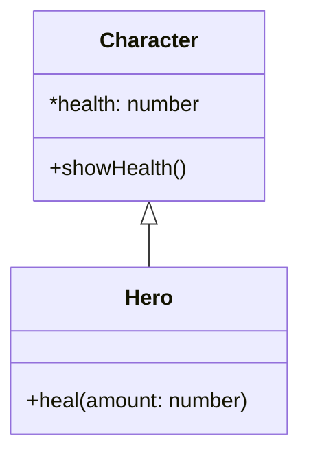


###  Exercice 14 – Extension de classe avec `protected`
Crée une classe `Animal` avec un attribut `protected energy`.  
Crée une classe `Bird` qui hérite de `Animal` et une méthode `fly()` qui diminue `energy`.

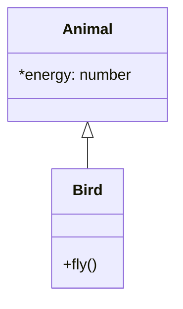


###  Exercice 15 – Gestion de compte bancaire
Crée une classe `BankAccount` avec un `protected balance`.  
Crée une classe `BusinessAccount` qui hérite de `BankAccount` et ajoute une méthode `applyFees()`.  
La méthode doit réduire le solde de 5%.

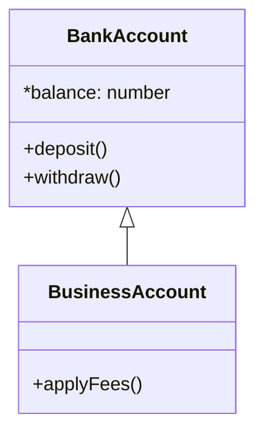


###  Exercice 16 – Reutilisation avec `protected`
Crée une classe `Vehicle` avec un attribut `protected speed`.  
Crée une classe `Car` et une classe `Truck` qui héritent toutes deux de `Vehicle`.  
Les deux classes utilisent `speed` dans des méthodes différentes.

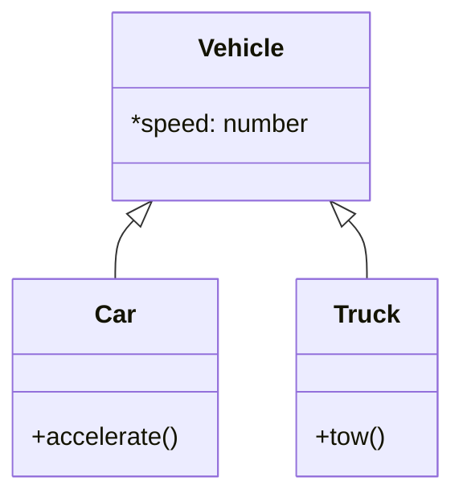


###  Exercice 17 – Chaînage d’héritage avec `protected`
Crée une classe `Employee` avec un `protected salary`.  
Crée `Manager` → `Director`, où chaque sous-classe peut accéder et modifier `salary`.

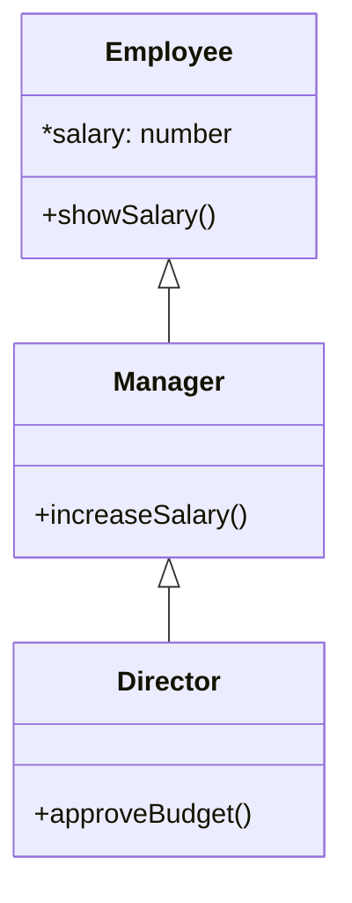


###  Exercice 18 – Méthode utilitaire `protected`
Crée une classe `Computer` avec une méthode `protected checkBattery()`.  
Crée une classe `Laptop` qui hérite de `Computer` et appelle cette méthode avant de démarrer.

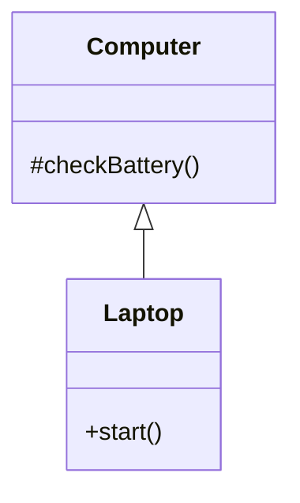


###  Exercice 19 – Communication entre parent et enfant
Crée une classe `Parent` avec un attribut `protected message`.  
Crée une classe `Child` qui hérite de `Parent` et affiche ce message via une méthode publique.

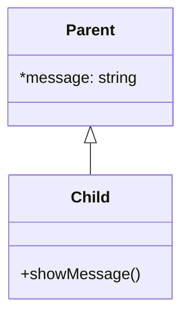


###  Exercice 20 – Diagramme d’ensemble
Représente mentalement une hiérarchie avec trois classes :
`Person` → `Employee` → `Manager`.  
`Employee` possède un attribut `protected department`.  
`Manager` peut modifier ce département et afficher les informations complètes.

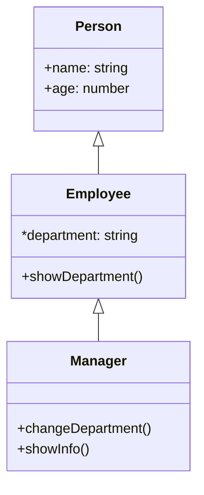

