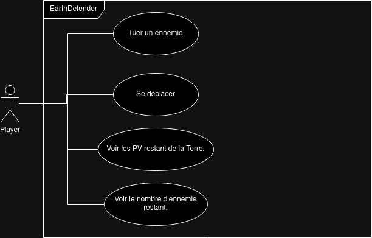

# La POO par l'exemple - EarthDefender

Pour apprendre la POO, nous allons concevoir un petit jeu vidéo nommé *EarthDefender*.

## Pré-requis
- Avoir terminé le TP 1 sur HTML Canvas et *EarthDefender* sans POO.

## Concept du jeu
Ce jeu est une version simplifiée de *Space Invaders* où un petit vaisseau spatial détruit des aliens pour protéger la Terre.

Les aliens se déplacent vers la Terre et lui font perdre des points de vie lors de leurs collisions.

Le joueur contrôle le vaisseau spatial, qui se déplace latéralement. Il peut également tirer des missiles qui détruisent un alien lors d'une collision.

Retrouvez tous les assets graphiques du projet via ce lien Figma : https://www.figma.com/file/Th3KWNwiV7TtXDKNSMv6do/EarthDefender?type=design&node-id=0%3A1&mode=design&t=MUCNIKJfrDGeNUtj-1

## Diagramme de cas d'utilisation
Voici le diagramme de cas d'utilisation de l'application.

## Technologies nécessaires

- NPM
- TypeScript
- HTML Canvas

Cette application a besoin d'une forte interactivité, il nous faudra donc JavaScript. Nous utiliserons également un Canvas HTML pour afficher le jeu.

Nous utiliserons TypeScript plutôt que JavaScript pour sa syntaxe orientée objet. TypeScript nécessitera cependant de compiler le code en JavaScript.

TypeScript est une surcouche de JavaScript développée par Microsoft. Il renforce JavaScript en lui ajoutant les types. C'est un langage moins permissif que JavaScript et il est obligatoire de le connaître pour utiliser, à l'avenir, le framework Angular. Tout code TypeScript sera de toute façon transformé en code JavaScript après la compilation.

> À l'origine, TypeScript a été créé par Microsoft pour faciliter le développement des versions Web de la suite Office. Le premier programme développé en TypeScript est VSCode. Le développement de VSCode a permis à Microsoft de tester TypeScript en conditions réelles. Pour plus d'infos, je recommande ce documentaire sur les conditions de développement de TypeScript : https://www.youtube.com/watch?v=U6s2pdxebSo&t=2189s.

## Cahier des charges
| Tâche | Description | Contraintes |
|-------|-------------|-------------|
| Créer le canvas du jeu | Le HTML Canvas est un rectangle qui prend presque tout l'écran | Il possède un fond d'écran similaire à celui de la maquette. |
| Afficher le joueur | Afficher le joueur sur le HTML Canvas. | Le joueur se trouve à quelques pixels du bord inférieur du canvas. |
| Mouvement du joueur | Le joueur peut se déplacer de gauche à droite avec les touches 'Q' ou 'D'. | |
| Apparition d'un alien | Faire apparaître un alien | L'alien avance tout droit vers le bas du canvas. |
| Afficher la Terre | La Terre possède 3 PV | Afficher les PV restants de la Terre. |
| Perte de PV de la Terre | La Terre perd 1 PV si un alien la touche. | |
| Mort du joueur | Le joueur meurt si un alien le touche. | Le jeu recommence. |
| Tir du joueur | Le joueur tire des missiles qui détruisent un alien au contact | Les missiles vont tout droit vers le haut de l'écran. La touche espace tire un missile. Le joueur peut tirer à une cadence maximale de 200 ms. |
| Vague d'aliens | Faire apparaître de nombreux aliens qui arriveront petit à petit de façon aléatoire. | Il n'y a maximum que 10 aliens en jeu et le nombre d'aliens tués est affiché en haut de l'écran. |
| Bonus SON Joueur | Émettre un son au tir du joueur. | |
| Bonus SON musique | Faire tourner une musique en boucle en fond. | |

