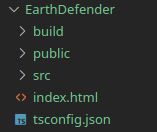
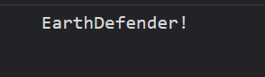

## Mise en place du projet

### Logiciels prérequis
Installation du compilateur TypeScript :
```bash
npm install -g typescript
```
### Arborescence

> Le squelette du projet est disponible ici : https://github.com/CHAOUCHI/earth_defender  

1. Faite un fork du projet
2. Clonez le projet fork sur votre machine
3. Ouvrez le dossier du projet dans votre éditeur de code (ex : VS Code)

> Vous trouverez également la solutions aux exercices étapes par étapes sous la formes de git branches.


- `build` contient le code JS compilé.
- `src` contient notre code TypeScript (TS).
- `public` contient les assets : images, sons.
- `index.html` est la page d'accueil du site.
- `tsconfig.json` configure le compilateur TS.

### tsconfig.json
```json
{
    "compilerOptions": {
        "rootDir": "./src",
        "outDir": "./build",
        "module": "ESNext"
    }
}
```
### Compiler le TypeScript
Dans le fichier */src/script.ts* :
```ts
const gameName: string = "EarthDefender!";
console.log(gameName);
```
Dans le fichier */index.html* :
```html
<!DOCTYPE html>
<html lang="fr">
<head>
    <meta charset="UTF-8">
    <meta name="viewport" content="width=device-width, initial-scale=1.0">
    <title>Earth Defender</title>
    <style>
        canvas {
            border: 1px solid black;
        }
    </style>
</head>
<body>
    <canvas></canvas>
    <script type="module" src="./build/script.js"></script>
</body>
</html>
```

Lancez le compilateur TypeScript en mode *watch* avec la commande :
```bash
tsc -w
```
> Il faut être à la racine du dossier, au même niveau que le fichier *tsconfig.json*.

*Résultat dans la console du navigateur* :  


Si vous avez ce message dans la console, tout fonctionne !

