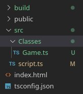
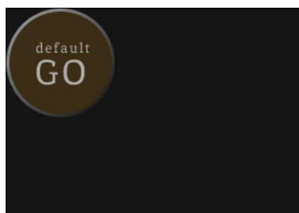
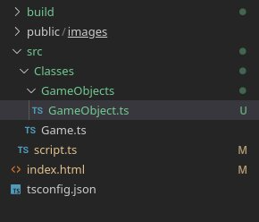
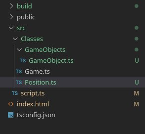

## Partie 1 - Initialisation du programme

### Chapitre 1 - Afficher le jeu
1. Créez un dossier nommé `Classes` dans `src`, il contiendra toutes nos classes.
2. Dans le dossier `Classes` créez un fichier `Game.ts`



Le point d'entrée de l'application est la classe Game.

#### Exercice 1 - Implémenter le constructeur de la classe Game

Dans le constructeur de la classe Game :
- Initialisez le canvas HTML pour qu'il possède un contexte 2D en tant qu'attribut privé de la classe.
- Utilisez les attributs privés `CANVAS_WIDTH` et `CANVAS_HEIGHT` pour définir la taille du canvas.

> N'oubliez pas, on accède aux attributs d'une classe avec `this.`.
> Exemple :
> ```ts
> this.context = ...
> this. ... = this.CANVAS_WIDTH
>```

*/src/Classes/Game.ts*
```ts
export class Game{

    private context : CanvasRenderingContext2D;
    public readonly CANVAS_WIDTH : number = 900;
    public readonly CANVAS_HEIGHT : number = 600;
    
    constructor(){
        // Init Game canvas
        // Codez ici ...


    }
}
```

> En TypeScript `readonly` permet de définir un attribut d'objet comme constant; il est impossble d'utiliser le mot clé `const` pour déclarer un attribut car la déclaration d'un attribut n'est pas la même que la déclaration d'une variable pour le compilateur. Concrètement `readonly` et `const` ont le même fonctionnement.

> Lien vers la Doc de readonly : https://www.typescriptlang.org/docs/handbook/typescript-in-5-minutes-func.html#readonly-and-const
> Lien vers la doc de getContext : https://developer.mozilla.org/en-US/docs/Web/API/HTMLCanvasElement/getContext
> Lien vers la doc de HTMLCanvasElement.height : https://developer.mozilla.org/en-US/docs/Web/API/HTMLCanvasElement/height
> Lien vers la doc de HTMLCanvasElement.width : https://developer.mozilla.org/en-US/docs/Web/API/HTMLCanvasElement/width

##### Solution Exercice 1
https://github.com/CHAOUCHI/cdpi-dwwm/blob/1-phase2-use-case-projects-mvc/Phase%202%20-%20MVC%20REST%20et%20SPA/2.%20OOP%20TypeScript/Projet%20EarthDefender/Solution%20Exercices/Exercice1.md

J'importe ensuite la classe `Game` pour instancier une partie dans le fichier script.ts.

*src/script.ts*
```ts
import {Game} from "./Classes/Game.js";

const game = new Game();
```
> Pour éviter les soucis de type de fichier lors de l'import des scripts par le navigateur, précisez bien `Game.js` et non `Game.ts` dans l'import.
> Ce sera le nom final du script après compilation et c'est ce nom dont le navigateur aura besoin.

La méthode `Game.start()` lancera le jeu, c'est donc dans cette méthode que nous allons, pour l'instant, colorier le fond du jeu.

J'ajoute la méthode `Game.start()`.

#### Exercice 2 - Colorier le fond du canvas
1. Coloriez le fond du canvas dans la méthode `Game.start()`.

2. Utilisez le code hexadécimal : `#141414` comme couleur.

*src/Classes/Game.ts*
```ts
export class Game{
    // Public attributs
    
    // Private attributs
    private context : CanvasRenderingContext2D;
    public readonly CANVAS_WIDTH : number = 900;
    public readonly CANVAS_HEIGHT : number = 600;
    
    constructor(){
        // Init Game canvas
        const canvas : HTMLCanvasElement = document.querySelector("canvas");
        canvas.height = this.CANVAS_HEIGHT;
        canvas.width = this.CANVAS_WIDTH;
        this.context = canvas.getContext("2d");
    }

    // Public methods

    public start() : void{
        //Codez ici ...

    }
}
```

> N'oubliez pas d'appeller la méthode `start()` pour lancer pour voir le canvas noir pendant vos tests ;) sinon il ne va pas se passer grand chose.

Et je l'appelle dans `script.ts` pour lancer le jeu.

*src/script.ts*
```ts
import {Game} from "./Classes/Game.js";

const game = new Game();
game.start();
```

*Résultat : un canvas noir*


##### Solution Exercice 2
https://github.com/CHAOUCHI/cdpi-dwwm/blob/1-phase2-use-case-projects-mvc/Phase%202%20-%20MVC%20REST%20et%20SPA/2.%20OOP%20TypeScript/Projet%20EarthDefender/Solution%20Exercices/Exercice2.md


### Chapitre 2 - Créer et afficher un GameObject
Nous allons maintenant afficher notre premier GameObject à l'écran !  Il se trouvera en haut à gauche de l'écran. :)




Nous allons avoir besoin d'images pour nos `GameObjects`.

Si vous utilisez le squelette de l'appli, vous avez d'office tous les assets inclus dans le dossier `/public/assets/images`.

> Vous pouvez aussi copier les assets graphiques qui se trouvent dans le lien Figma dans un dossier `/public/assets/images`.

Voici l'image par défaut pour les GameObjects :
*DefaultGameObject.png*


Importez l'image dans le fichier index.html

*index.html*
```html
<!DOCTYPE html>
<html lang="fr">
<head>
    <meta charset="UTF-8">
    <meta name="viewport" content="width=device-width, initial-scale=1.0">
    <title>Earth Defender</title>
    <style>
        canvas{
            border : 1px solid black;
        }
    </style>
</head>
<body>
    
    <canvas>

    </canvas>
</body>
<script type="module" src="./build/script.js"></script>
</html>
```

#### Attendre le chargement des images

Le jeu doit se lancer une fois toutes les images chargées.
Il faut donc attendre le chargement de la page avec la fonction `window.onload` avant de démarrer le jeu.

*/src/script.ts*
```ts
import {Game} from "./Classes/Game.js";

window.onload = ()=>{
    const game = new Game();
    game.start();
}
```

#### Créer un GameObject

En POO tout doit être une classe. Chaque classe a sa propre responsabilité. Game s'occupe de l'affichage correct du jeu et de ses éléments. La classe GameObject quant à elle s'occupe d'un GameObject : sa position, son image, sa vie.

1. Dans un dossier */src/Classes/GameObjects* créez un fichier nommé *GameObject.ts*

*src/Classes/GameObjects/GameObject.ts*
```ts
export class GameObject{

    constructor(){
    }
}
```



#### La position d'un GameObject
La position d'un GameObject est définie par deux nombres x et y.

1. Créez donc une interface Position qui possède deux attributs x et y dans un fichier `Position.ts`.

*/src/Classes/Position.ts*
```ts
export interface Position{
    x : number;
    y : number;
}
```



Ajoutez ensuite une position à notre GameObject.

*/src/Classes/GameObjects/GameObject.ts*
```ts
import { Position } from "../Position.js";

export class GameObject{
    
    private position : Position;
    
    constructor(){
        this.position = {
            x : 0,
            y : 0
        };
    }
}
```


En POO la chose la plus importante est l'encapsulation. Les attributs d'une classe sont privés et pourront éventuellement être modifiés via des méthodes publiques *getter* et *setter*.

#### L'image d'un GameObject

> Assurez-vous qu'une balise image avec pour id *asset_default* existe dans le index.html
> ```html
> 
> ```

Notre jeu contiendra de nombreux assets graphiques. En POO chaque classe a sa propre responsabilité ; il faut donc créer une classe `Assets` qui gère les assets graphiques.

*/src/Classes/Assets.ts*
```ts
export class Assets{
    public static getDefaultImage(){
        const image : HTMLImageElement = document.querySelector("img#asset_default");
        if(image == null){
            throw Error("No assets found");
        }
        return image;
    }
}
```
> Notez que nous provoquons une erreur si l'image n'est pas trouvée. La bonne pratique veut que l'on privilégie `throw` en cas d'erreur plutôt qu'une valeur de retour comme `null` ou `false`.

> Assets n'est qu'une façade pour récupérer des données, à l'inverse de GameObject qui représente un élément du jeu. Je ne vais donc jamais directement instancier la classe Assets, ses méthodes sont donc *static*.
> Une méthode static est accessible directement en tant qu'attribut de la classe. Pas besoin donc de l'instancier avec `new`.

Une fois la fonction *getter* ajoutée, je peux m'en servir dans le constructeur de `GameObject`.

*/src/Classes/GameObjects/GameObject.ts*
```ts
import { Assets } from "../Assets.js";
import { Position } from "../Position.js";

export class GameObject{
    
    private position : Position;
    private image : HTMLImageElement;
    
    constructor(){
        this.position = {
            x : 0,
            y : 0
        };
        this.image = Assets.getDefaultImage();
    }
}
```
#### Affichage du GameObject
Pour afficher le `GameObject`, je veux ajouter une méthode `draw` à la classe `Game` qui utilise la méthode `context.drawImage()`.

J'ai besoin d'une image et de la position du GameObject pour dessiner un GameObject dans le canvas. Seulement ces données sont privées. Je vais donc créer des *getter* dans la classe GameObject.

```ts
import { Assets } from "../Assets.js";
import { Position } from "../Position.js";

export class GameObject{
    
    private position : Position;
    private image : HTMLImageElement;
    
    constructor(){
        this.position = {
            x : 0,
            y : 0
        };
        this.image = Assets.getDefaultImage();
    }

    // Getter d'image et de position
    public getImage() : HTMLImageElement{
        return this.image;
    }
    public getPosition() : Position{
        return this.position;
    }
}
```

J'ajoute ensuite la méthode `Game.draw` pour dessiner un GameObject.
> **Attention** la méthode Game.draw doit se trouver dans la classe Game comme je le montre si dessous ! Sinon il est impossible d'accéder au contexte du canvas ( l'attribut `this.context` étant privé à la classe Game).

La méthode `Game.draw()` prend en paramètre un GameObject et le dessine dans la balise canvas avec la méthode `this.context.drawImage()` :

##### Exercice 3 - Dessiner un GameObject
Complétez la méthode Game.draw() en utilisant `this.context.drawImage()` pour dessiner le `GameObject` passé en paramètre de la méthode.

```ts
import { GameObject } from "./GameObjects/GameObject.js";

export class Game{
    // Public attributs
    
    // Private attributs
    private context : CanvasRenderingContext2D;
    public readonly CANVAS_WIDTH : number = 900;
    public readonly CANVAS_HEIGHT : number = 600;
    
    constructor(){
        // Init Game canvas
        const canvas : HTMLCanvasElement = document.querySelector("canvas");
        canvas.height = this.CANVAS_HEIGHT;
        canvas.width = this.CANVAS_WIDTH;
        this.context = canvas.getContext("2d");
    }

    // Public methods

    public start() : void{
        // Clear context
        this.context.clearRect(0,0,this.CANVAS_WIDTH,this.CANVAS_HEIGHT);
        this.context.fillStyle = "#141414";
        this.context.fillRect(0,0,this.CANVAS_WIDTH,this.CANVAS_HEIGHT);
    }

    //  La fonction draw qui affiche un gameObject
    private draw(gameObject : GameObject){
        // Codez ici
        // ...
    }
}
```

##### Solution Exercice 3
https://github.com/CHAOUCHI/cdpi-dwwm/blob/1-phase2-use-case-projects-mvc/Phase%202%20-%20MVC%20REST%20et%20SPA/2.%20OOP%20TypeScript/Projet%20EarthDefender/Solution%20Exercices/Exercice3.md

Il ne me reste plus qu'à utiliser cette méthode dans la méthode `Game.start()`.

```ts
public start() : void{
        // Clear context
        this.context.clearRect(0,0,this.CANVAS_WIDTH,this.CANVAS_HEIGHT);
        this.context.fillStyle = "#141414";
        this.context.fillRect(0,0,this.CANVAS_WIDTH,this.CANVAS_HEIGHT);

        // J'instancie un GameObject
        const gameObject = new GameObject();
        // Je le dessine
        this.draw(gameObject);
}
```

*Résultat : un beau game object*


