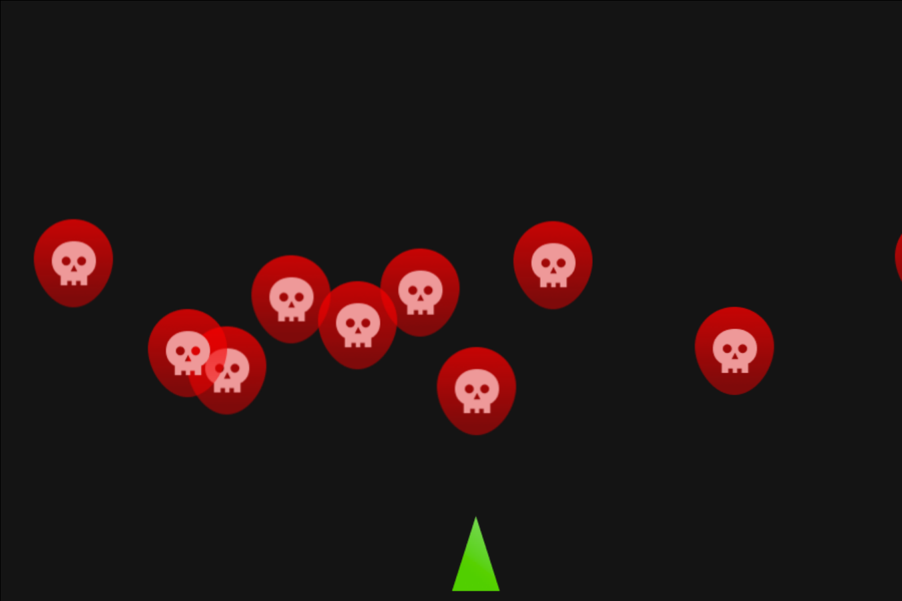

## Partie 3 - Une infinité de GameObjects !
Nous avons presque fini de mettre en place les bases de notre jeu.

### Chapitre 7 - Ajouter les aliens
Nous avons un joueur qui se déplace, il nous manque maintenant une horde d'Aliens qui foncent sur lui.

Pour faire apparaître ces aliens, il va falloir :
- Coder un alien via la classe `Alien`. Elle hérite de `GameObject`.
- Faire apparaître un `Alien` qui fonce vers le bas du canvas.
- Définir le nombre d'aliens via un attribut privé de la classe `Game`.
- Créer un tableau de `GameObject` et ajouter le joueur et les aliens dedans.
- Parcourir le tableau de `GameObject` à chaque frame : mettre à jour et redessiner tous les `GameObject` (player et aliens compris) : utilisez `Game.draw()` et `GameObject.callUpdate()`

#### Coder un Alien
Pour commencer, il faut coder un Alien qui descend vers le bas du canvas à chaque frame.

> N'oubliez pas d'ajouter l'asset `Alien.png` dans `index.html` et donc un nouveau getter dans la classe `Assets`.

##### Exercice 10 - Position aléatoire et mouvement de l'Alien

```ts
import { Assets } from "../Assets.js"
import { GameObject } from "./GameObject.js"

export class Alien extends GameObject{
    private speed : number = 1;

    protected start(): void {
        // Définissez l'image de l'alien
        // Codez ici ...


        // Faites-le apparaître à une position aléatoire dans le canvas
        // Codez ici ...


    }

    protected update(): void {
        // Faites avancer l'alien vers le bas du Canvas
        // Codez ici ...   
        
        
    }
}
```

##### Solution Exercice 10
https://github.com/CHAOUCHI/EarthDefender_Exercice10

#### Faire apparaître un alien dans le jeu
Pour faire apparaître un `GameObject` dans le jeu, il faut :
- L'instancier dans `Game.start()` en créant un nouvel attribut privé.
- Le dessiner dans `Game.loop()` avec `Game.draw()` pour qu'il reste affiché à l'écran.
- Le mettre à jour dans `Game.loop()` avec `GameObject.callUpdate()` pour le faire se déplacer.

Ajoutez un attribut privé dans la classe Game pour l'alien.
```ts
private alien : Alien;
```
Instanciez et dessinez l'Alien dans `Game.start()`
```ts
    // Public methods
    public start() : void{
        // Clear context
        this.context.clearRect(0,0,this.CANVAS_WIDTH,this.CANVAS_HEIGHT);
        this.context.fillStyle = "#141414";
        this.context.fillRect(0,0,this.CANVAS_WIDTH,this.CANVAS_HEIGHT);

        this.player = new Player(this);
        this.draw(this.player);

        // Instanciation de l'alien
        this.alien = new Alien(this);
        this.draw(this.alien);

        // Listen to input
        Input.listen();
        // Start game loop
        this.loop();
    }
```

Mettez à jour l'alien en appelant sa méthode `callUpdate()` dans `Game.loop()` et redessinez-le avec la méthode `Game.draw()`.

```ts
    private loop(){
        setInterval(()=>{
            console.log("Frame!");
            // Clear context
            this.context.clearRect(0,0,this.CANVAS_WIDTH,this.CANVAS_HEIGHT);
            this.context.fillStyle = "#141414";
            this.context.fillRect(0,0,this.CANVAS_WIDTH,this.CANVAS_HEIGHT);

            this.player.callUpdate();
            this.draw(this.player);
            
            this.alien.callUpdate();
            this.draw(this.alien);

        },10); 
    }
```

La classe `Game` finale :
```ts
import { Alien } from "./GameObjects/Alien.js";
import { GameObject } from "./GameObjects/GameObject.js";
import { Player } from "./GameObjects/Player.js";
import { Input } from "./Input.js";

export class Game{
    // Public attributs
    public readonly CANVAS_WIDTH : number = 900;
    public readonly CANVAS_HEIGHT : number = 600;
    
    // Private attributs
    private context : CanvasRenderingContext2D;
    private player : Player;
    private alien : Alien;
    
    constructor(){
        // Init Game canvas
        const canvas : HTMLCanvasElement = document.querySelector("canvas");
        canvas.height = this.CANVAS_HEIGHT;
        canvas.width = this.CANVAS_WIDTH;
        this.context = canvas.getContext("2d");
    }

    public start() : void{
        // Clear context
        this.context.clearRect(0,0,this.CANVAS_WIDTH,this.CANVAS_HEIGHT);
        this.context.fillStyle = "#141414";
        this.context.fillRect(0,0,this.CANVAS_WIDTH,this.CANVAS_HEIGHT);

        this.player = new Player(this);
        this.draw(this.player);

        this.alien = new Alien(this);
        this.draw(this.alien);

        // Listen to input
        Input.listen();
        // Start game loop
        this.loop();
    }
    
    private draw(gameObject : GameObject){
        this.context.drawImage(
            gameObject.getImage(),
            gameObject.getPosition().x,
            gameObject.getPosition().y,
            gameObject.getImage().width,
            gameObject.getImage().height
        );
    }

    private loop(){
        setInterval(()=>{
            console.log("Frame!");
            // Clear context
            this.context.clearRect(0,0,this.CANVAS_WIDTH,this.CANVAS_HEIGHT);
            this.context.fillStyle = "#141414";
            this.context.fillRect(0,0,this.CANVAS_WIDTH,this.CANVAS_HEIGHT);

            this.player.callUpdate();
            this.draw(this.player);
            
            this.alien.callUpdate();
            this.draw(this.alien);

        },10); 
    }
}
```

#### Faire apparaître plusieurs Aliens
Nous commençons à être à l'aise avec la création de `GameObject`.

Il est temps d'en faire apparaître plusieurs.

Au lieu de créer un attribut privé pour chaque `GameObject`, nous allons créer un tableau de `GameObject` dans la classe `Game`.

```ts
export class Game{
    // Public attributs
    
    // Private attributs
    private context : CanvasRenderingContext2D;
    public readonly CANVAS_WIDTH : number = 900;
    public readonly CANVAS_HEIGHT : number = 600;

    private player : Player;
    // Ajoutez un tableau vide de GameObject
    private gameObjects : GameObject[] = [];

    // ...
}
```

Pour rajouter un `GameObject` dans le tableau des `GameObjects`, il suffit de faire un `gameObjects.push()`.

Nous allons créer une méthode pour ça : la méthode `Game.instanciate()`

Dans la classe `Game`, ajoutez :
```ts
public instanciate(gameObject : GameObject) : void{
    this.gameObjects.push(gameObject);
}
```

Pour redessiner tous les `GameObjects` à chaque *frame*, il faut parcourir le tableau dans la boucle d'événement.

Il faut également appeler la méthode `GameObject.callUpdate()` pour mettre à jour les `GameObjects`.

##### Exercice 11 - Parcourir les `GameObjects`
```ts
private loop(){
        setInterval(()=>{
            console.log("Frame!");
            // Clear context
            this.context.clearRect(0,0,this.CANVAS_WIDTH,this.CANVAS_HEIGHT);
            this.context.fillStyle = "#141414";
            this.context.fillRect(0,0,this.CANVAS_WIDTH,this.CANVAS_HEIGHT);
            
            // Pour chaque gameObject
            // Mettez-les à jour et redessinez-les
            // Codez ici ..

        },10); 
    }
```

##### Solution Exercice 11
https://github.com/CHAOUCHI/EarthDefender_Exercice11

Tous les `GameObject` doivent être contenus dans le tableau de `GameObjects` pour être détectés par la boucle d'événement, il nous faut donc mettre à jour le code de la fonction `Game.start()` pour rajouter notre `player` dans ce tableau.

```ts
    // Public methods
    public start() : void{
        // Clear context
        this.context.clearRect(0,0,this.CANVAS_WIDTH,this.CANVAS_HEIGHT);
        this.context.fillStyle = "#141414";
        this.context.fillRect(0,0,this.CANVAS_WIDTH,this.CANVAS_HEIGHT);

        this.player = new Player(this);
        // J'ajoute le player au tableau de GameObject
        this.instanciate(this.player);

        // Listen to input
        Input.listen();
        // Start game loop
        this.loop();
    }
```

Je définis le nombre d'aliens en tant qu'attribut privé de Game.
```ts
private nbAliens : number = 10;
```
Enfin, nous pouvons instancier plusieurs `Aliens` via une boucle *for*.

##### Exercice 12 - Instancier les 10 aliens 
Instanciez 10 aliens dans le tableau de gameObjects à l'aide de la méthode `Game.instanciate()`.
```ts
public start() : void{
    // Clear context
    this.context.clearRect(0,0,this.CANVAS_WIDTH,this.CANVAS_HEIGHT);
    this.context.fillStyle = "#141414";
    this.context.fillRect(0,0,this.CANVAS_WIDTH,this.CANVAS_HEIGHT);

    this.player = new Player(this);
    this.instanciate(this.player)

    // Instancier 10 aliens 
    // Codez ici ...

    // Listen to input
    Input.listen();
    // Start game loop
    this.loop();
}
```
##### Solution Exercice 12
https://github.com/CHAOUCHI/EarthDefender_Exercice12

*Résultat : une vague aléatoire d'aliens*



*Classe `Game` finale :*
```ts
import { Alien } from "./GameObjects/Alien.js";
import { GameObject } from "./GameObjects/GameObject.js";
import { Player } from "./GameObjects/Player.js";
import { Input } from "./Input.js";

export class Game{
    // Public attributs
    public readonly CANVAS_WIDTH : number = 900;
    public readonly CANVAS_HEIGHT : number = 600;
    
    // Private attributs
    private context : CanvasRenderingContext2D;
    private nbAliens : number = 10;
    private player : Player;
    private gameObjects : GameObject[] = [];
    
    constructor(){
        // Init Game canvas
        const canvas : HTMLCanvasElement = document.querySelector("canvas");
        canvas.height = this.CANVAS_HEIGHT;
        canvas.width = this.CANVAS_WIDTH;
        this.context = canvas.getContext("2d");
    }

    public start() : void{
        // Clear context
        this.context.clearRect(0,0,this.CANVAS_WIDTH,this.CANVAS_HEIGHT);
        this.context.fillStyle = "#141414";
        this.context.fillRect(0,0,this.CANVAS_WIDTH,this.CANVAS_HEIGHT);
    
        this.player = new Player(this);
        this.instanciate(this.player)
    
        for (let i = 0; i < this.nbAliens; i++) {
            this.instanciate(new Alien(this));
        }
    
        // Listen to input
        Input.listen();
        // Start game loop
        this.loop();
    }
    public instanciate(gameObject : GameObject) : void{
        this.gameObjects.push(gameObject);
    }   
    
    private draw(gameObject : GameObject){
        this.context.drawImage(
            gameObject.getImage(),
            gameObject.getPosition().x,
            gameObject.getPosition().y,
            gameObject.getImage().width,
            gameObject.getImage().height
        );
    }

    private loop(){
        setInterval(()=>{
            console.log("Frame!");
            // Clear context
            this.context.clearRect(0,0,this.CANVAS_WIDTH,this.CANVAS_HEIGHT);
            this.context.fillStyle = "#141414";
            this.context.fillRect(0,0,this.CANVAS_WIDTH,this.CANVAS_HEIGHT);
            
            this.gameObjects.forEach(go=>{
                go.callUpdate();
                this.draw(go);
            });

        },10); 
    }
}
```

### Chapitre 8 - Ajouter les étoiles
Il faut maintenant ajouter des étoiles dans le fond pour la déco.

Pour ce faire, suivez la même procédure que pour faire apparaître plusieurs `Aliens`.

1 - Faire apparaître des étoiles statiques en fond de façon aléatoire.
2 - Faire descendre les étoiles vers le bas et les repositionner en haut du canvas quand elles dépassent de l'écran. Ainsi, nous aurons l'impression qu'elles défilent sous le joueur.

##### Exercice 13 - Instancier des étoiles
Pour cet exercice, vous devez être plus autonome. Il vous faudra créer la classe `Star` par vous-même de A à Z.

***Créez une classe `Star` qui hérite de `GameObject` et instanciez 100 étoiles dans le jeu.***

- Une `Star` a une position aléatoire dans le canvas.
- Une `Star` défile lentement vers le bas du canvas.
- Quand une `Star` dépasse le bord inférieur du canvas, elle revient en haut du canvas (position Y).
- La classe `Star` se trouve dans le fichier : */src/Classes/GameObjects/Star.ts*

*Prenez bien le temps de faire cet exercice, il est plus dur et très important pour votre apprentissage de la POO.*


##### Solution Exercice 13
https://github.com/CHAOUCHI/EarthDefender_Exercice13

Je peut maintenant instancier 100 étoiles dans le jeu !

*/src/Game.ts*
```ts
import { Alien } from "./GameObjects/Alien.js";
import { GameObject } from "./GameObjects/GameObject.js";
import { Player } from "./GameObjects/Player.js";
import { Star } from "./GameObjects/Star.js";
import { Input } from "./Input.js";

export class Game{
    // Public attributs
    public readonly CANVAS_WIDTH : number = 900;
    public readonly CANVAS_HEIGHT : number = 600;
    
    // Private attributs
    private context : CanvasRenderingContext2D;
    private nbAliens : number = 10;


    private player : Player;
    private gameObjects : GameObject[] = [];
    
    constructor(){
        // Init Game canvas
        const canvas : HTMLCanvasElement = document.querySelector("canvas");
        canvas.height = this.CANVAS_HEIGHT;
        canvas.width = this.CANVAS_WIDTH;
        this.context = canvas.getContext("2d");
    }

    public start() : void{
        // Clear context
        this.context.clearRect(0,0,this.CANVAS_WIDTH,this.CANVAS_HEIGHT);
        this.context.fillStyle = "#141414";
        this.context.fillRect(0,0,this.CANVAS_WIDTH,this.CANVAS_HEIGHT);
    
        this.player = new Player(this);
        this.instanciate(this.player)
    
        for (let i = 0; i < this.nbAliens; i++) {
            this.instanciate(new Alien(this));
        }


        /**
         * Instanciation des Stars
         */
        for (let i = 0; i < 100; i++) {
            this.instanciate(new Star(this));
        }


        
        // Listen to input
        Input.listen();
        // Start game loop
        this.loop();
    }
    public instanciate(gameObject : GameObject) : void{
        this.gameObjects.push(gameObject);
    }   
    
    private draw(gameObject : GameObject){
        this.context.drawImage(
            gameObject.getImage(),
            gameObject.getPosition().x,
            gameObject.getPosition().y,
            gameObject.getImage().width,
            gameObject.getImage().height
        );
    }

    private loop(){
        setInterval(()=>{
            console.log("Frame!");
            // Clear context
            this.context.clearRect(0,0,this.CANVAS_WIDTH,this.CANVAS_HEIGHT);
            this.context.fillStyle = "#141414";
            this.context.fillRect(0,0,this.CANVAS_WIDTH,this.CANVAS_HEIGHT);
            
            this.gameObjects.forEach(go=>{
                go.callUpdate();
                this.draw(go);
            });

        },10); 
    }
}
```

