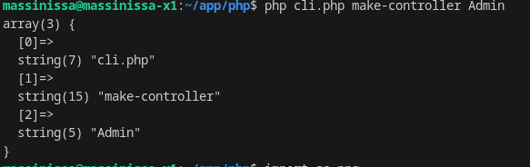
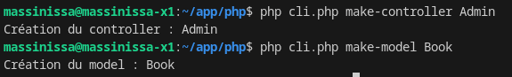
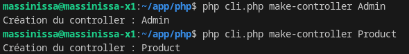

# CLI du framework
Un framework fournit également souvent un programme en ligne de commande appelé CLI. Ce programme permet, via des lignes de commandes dans la console, de créer à votre place le code *boilerplate*.

Par exemple, avec le Framework PHP Symfony, l'ajout d'un `Controller` se fait comme ceci :
```bash
symfony console make:controller ProductController
```

Dans notre framework maison, nous allons créer un CLI très simple qui nous permettra de créer des `Controller` et des `Model` rapidement.

## Rappel Architecture de notre MVC
*Arborescence d'un projet MVC*

- **/first_mvc** : la racine de notre projet
    - **/app** : contient tout notre code source.
        - **/controllers** : contient les fichiers sources de nos classes `Controller`
        - **/core** : contient la classe App qui est le point de départ de notre projet et tout ce qui est utile à travers toute l'appli, comme les constantes par exemple.
        - **/models** : contient les fichiers sources de nos classes `Model`.
        - **/views** : contient les fichiers sources de nos pages HTML
    - **/public** : contient notre index.php et tout ce qui doit être accessible publiquement.
        - **/css** : contient tous nos fichiers CSS
        - **/js** : contient tous nos scripts JavaScript
        - **/images** : contient toutes les images

- Les nouveaux fichiers Controller doivent donc être créés dans le dossier `app/controllers`
- et les fichiers Model dans le dossier `app/models`.

## Controller réutilisable

Voici un template de `Controller` réutilisable :
```php
<?php
// Remplacez Name par le nom du controller
class NameController{
    public function view(string $method, array $params = []){
        try {
            call_user_func([$this, $method], $params);
        } catch (Error $e) {
            require_once(__DIR__."/../views/404.php");
            // ou bien la méthode par défaut...
        }
    }

    // Remplacez methodName par le nom d'une méthode
    public function methodName($params = []){
        // Remplacez vue-name par le nom de la vue
        require_once(__DIR__."/../views/vue-name.php");
    }
}
```

## Création du CLI
Nous allons créer un fichier `cli.php` à la racine de notre projet. Ce fichier sera appelé dans le terminal pour exécuter des commandes.

1. Créez un dossier `cli` à la racine du projet.
2. Créez un fichier `cli.php` dans le dossier `cli`.

> **CODE SOURCE DU TEMPLATE CLI ICI** : https://github.com/CHAOUCHI/mvc-cli-template

Ce CLI n'est qu'un switch qui va exécuter des fonctions en fonction des arguments passés dans la console.

Si l'utilisateur tape la commande suivante, un controller nommé AdminController sera créé :

```bash
php cli/cli.php make-controller Admin
```

On peut facilement utiliser un switch case pour créer un nouveau fichier si l'utilisateur a tapé la bonne commande.

Les informations tapées dans le terminal sont disponibles dans la superglobale `$argv`, qui est un tableau contenant les arguments passés en ligne de commande.
- `$argv[0]` contient le nom du fichier appelé, ici `cli.php`
- `$argv[1]` contient la première valeur passée en argument, ici `make-controller`
- `$argv[2]` contient la deuxième valeur passée en argument, ici `Admin`

3. Créez le programme suivant pour voir les arguments passés en ligne de commande.

*cli.php*
```php
<?php
var_dump($argv);
```


4. Écrivez le code suivant dans cli.php.

*cli.php*
```php
<?php 

$commandName = $argv[1] ?? null;    // make-controller ou make-model
$controllerName = $argv[2] ?? null; // Le nom du controller à créer, par exemple Admin ou Home

if($commandName == null){
    echo "Vous devez préciser une commande\n";
    exit;
}

switch ($commandName) {
    case 'make-controller':
        echo "Création du controller : $controllerName\n";
        createController($controllerName);
        break;

    case 'make-model':
        echo "Création du model : $controllerName\n";
        createModel($controllerName);
        break;

    default:
        echo "Commande inconnue\n";
        break;
}

function createController(string $controllerName){
    // TODO : Créer le fichier controller dans app/controllers
}

function createModel(string $modelName){
    // TODO : Créer le fichier model dans app/models
}
```

5. Testez le code dans le terminal en lançant quelques commandes pour obtenir les messages suivants dans la console et vérifiez que tout fonctionne :



## Création des fichiers

1. Créez un fichier nommé `TemplateController` qui contient le texte suivant :
```
<?php
// Remplacez Name par le nom du controller
class [CONTROLLER_NAME]Controller{
    public function view(string $method, array $params = []){
        try {
            call_user_func([$this, $method], $params);
        } catch (Error $e) {
            require_once(__DIR__.'/../views/404.php');
            // ou bien la méthode par défaut...
        }
    }

    // Remplacez methodName par le nom d'une méthode
    //public function methodName($params = []){
        // Remplacez vue-name par le nom de la vue
    //    require_once(__DIR__.'/../views/vue-name.php');
    //}
}
```

2. Mettez à jour la fonction createController pour qu'elle crée dynamiquement un fichier dans le dossier `app/controllers` avec le code du template de controller réutilisable :

*cli.php*
```php
<?php 

$commandName = $argv[1] ?? null;    // make-controller ou make-model
$controllerName = $argv[2] ?? null; // Le nom du controller à créer, par exemple Admin ou Home

if($commandName == null){
    echo "Vous devez préciser une commande\n";
    exit;
}

switch ($commandName) {
    case 'make-controller':
        echo "Création du controller : $controllerName\n";
        createController($controllerName);
        break;

    case 'make-model':
        echo "Création du model : $controllerName\n";
        createModel($controllerName);
        break;

    default:
        echo "Commande inconnue\n";
        break;
}

function createController(string $controllerName){
    // 1. Récupérer le code source du template
    $template = file_get_contents(__DIR__.'/TemplateController');
    // 2. Remplacer le texte [CONTROLLER_NAME] par le nom du controller
    $template = str_replace('[CONTROLLER_NAME]', $controllerName, $template);
    // 3. Créer le fichier controller dans app/controllers
    file_put_contents(__DIR__."/../app/controllers/$controllerName"."Controller.php", $template);
}
```



## Exercices Controller

1. Créez un controller AdminController avec le CLI nouvellement créé et ajoutez les routes suivantes à l'application :
- /admin/dashboard -> AdminController::dashboard
- /admin/users -> AdminController::users

2. Ajoutez un controller UserController avec les routes suivantes :
- /user/profile -> UserController::profile
- /user/settings -> UserController::settings

## Exercice BONUS make-model:
1. Modifiez le cli.php pour qu'il puisse également créer des `Model` dans le dossier `app/models` avec le template suivant :

*TemplateModel*
```php
<?php
/**
 * 1. Complétez les requêtes SQL (...TODO...) selon votre table.
 * 2. Les méthodes add et edit doivent être adaptées pour gérer les colonnes spécifiques à votre modèle.
 */

class [MODEL_NAME]Model{
    private PDO $bdd;
    private PDOStatement $add[MODEL_NAME];
    private PDOStatement $del[MODEL_NAME];
    private PDOStatement $get[MODEL_NAME];
    private PDOStatement $get[MODEL_NAME]s;
    private PDOStatement $edit[MODEL_NAME];

    function __construct()
    {
        $this->bdd = new PDO("mysql:host=lamp-mysql;dbname=boutique", "root", "root");

        // Adaptez cette requête à votre table [MODEL_NAME]
        $this->add[MODEL_NAME] = $this->bdd->prepare("INSERT INTO ...TODO... ");

        $this->del[MODEL_NAME] = $this->bdd->prepare("DELETE FROM `[MODEL_NAME]` WHERE `id` = :id;");

        $this->get[MODEL_NAME] = $this->bdd->prepare("SELECT * FROM `[MODEL_NAME]` WHERE `id` = :id;");

        // Adaptez cette requête à votre table [MODEL_NAME]
        $this->edit[MODEL_NAME] = $this->bdd->prepare("UPDATE `[MODEL_NAME]` SET ...TODO... WHERE `id` = :id");

        $this->get[MODEL_NAME]s = $this->bdd->prepare("SELECT * FROM `[MODEL_NAME]` LIMIT :limit");
    }
    // Éditez les paramètres de la méthode add en fonction de votre table [MODEL_NAME]
    public function add(...) : void
    {
        // $this->add[MODEL_NAME]->bindValue("...", $columnValue);
        $this->add[MODEL_NAME]->execute();
    }

    public function del(int $id) : void
    {
        $this->del[MODEL_NAME]->bindValue("id", $id);
        $this->del[MODEL_NAME]->execute();
    }
    public function get($id): [MODEL_NAME]Entity | NULL
    {
        $this->get[MODEL_NAME]->bindValue("id", $id, PDO::PARAM_INT);
        $this->get[MODEL_NAME]->execute();
        $raw[MODEL_NAME] = $this->get[MODEL_NAME]->fetch();

        // Si le produit n'existe pas, je renvoie NULL
        if(!$raw[MODEL_NAME]){
            return NULL;
        }
        return new [MODEL_NAME]Entity(
            // $raw[MODEL_NAME]["columnName"],
        );
    }

    public function getAll(int $limit = 50) : array
    {
        $this->get[MODEL_NAME]s->bindValue("limit", $limit, PDO::PARAM_INT);
        $this->get[MODEL_NAME]s->execute();
        $raw[MODEL_NAME]s = $this->get[MODEL_NAME]s->fetchAll();

        $[MODEL_NAME]sEntity = [];
        foreach($raw[MODEL_NAME]s as $raw[MODEL_NAME]){
            $[MODEL_NAME]sEntity[] = new [MODEL_NAME]Entity(
                $raw[MODEL_NAME]["name"],
                $raw[MODEL_NAME]["price"],
                $raw[MODEL_NAME]["image"],
                $raw[MODEL_NAME]["id"]
            );
        }

        return $[MODEL_NAME]sEntity;
    }

    // À part l'id, les paramètres de la méthode edit sont optionnels.
    // Nous ne voulons pas forcer le développeur à modifier tous les champs
    public function edit(int $id, ...) : [MODEL_NAME]Entity | NULL
    {
        $original[MODEL_NAME]Entity = $this->get($id);

        // Si le produit n'existe pas, je renvoie NULL
        if(!$original[MODEL_NAME]Entity){
            return NULL;
        }

        // On utilise un opérateur ternaire ? : ;
        // Il permet en une ligne de renvoyer le nom original du 
        // produit si le paramètre est NULL.
        // En effet, si le paramètre est NULL, cela veut dire que 
        // l'utilisateur ne souhaite pas le modifier.
        // Le même résultat est possible avec des if else
        // Je précise PDO::PARAM_INT car id est un INT
        $this->edit[MODEL_NAME]->bindValue("id", $id, PDO::PARAM_INT);

        // $this->edit[MODEL_NAME]->bindValue($columnName,
        //  $columnName ? $columnName : $original[MODEL_NAME]Entity->getColumnName() );

        $this->edit[MODEL_NAME]->execute();

        // Une fois modifié, je renvoie le [MODEL_NAME] en utilisant ma
        // propre méthode public [MODEL_NAME]Model::get().
        return $this->get($id);
    }
}

class [MODEL_NAME]Entity{
    private $id;
    // private $columnName;
    function __construct($columnName, ..., int $id = NULL)
    {
        // $this->setColumnName($columnName);
        $this->id = $id;
    }

    // public function setColumnName($columnValue){
    //     $this->columnName = $columnValue;
    // }

    // public function getColumnName(){
    //     return $this->columnName;
    // }
    
    public function getId() : int{
        return $this->id;
    }
}
```
