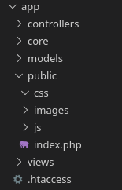
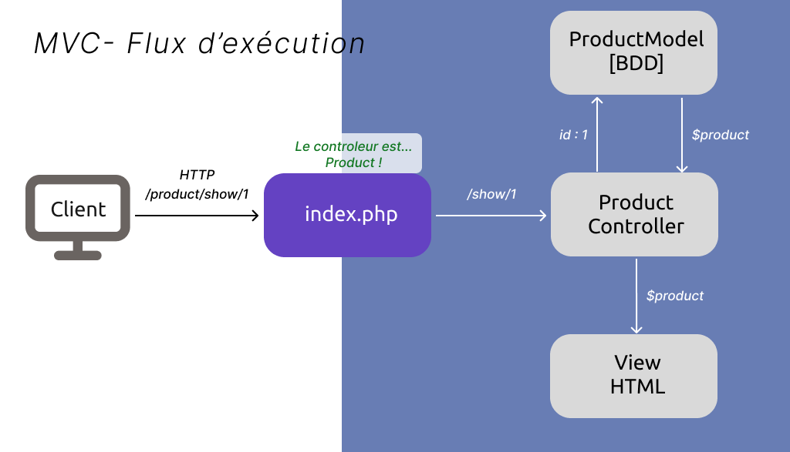
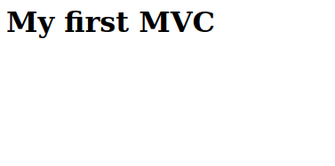
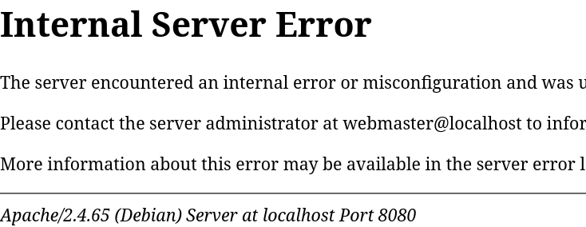
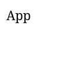
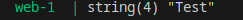

## I - Structure du projet
### Arboresence du projet
> La racine de notre projet est le dossier `app` il a été entièrement copié dans le dossier `/var/www/html/` du serveur apache grâce à la configuration de notre docker compose.yaml.

> Notre projet sera une petite boutique en ligne de produit.

Un projet MVC est structuré en plusieurs dossiers :

*Arborescence d'un projet MVC*

- **/first_mvc**: la racine de notre projet
    - **/app** : contient tout notre codes source.
        - **/controllers** : contient les fichiers sources de nos classes `Controller`
        - **/core**: contient la class App qui est le point de départ denotre projet et tout ce qui est utile à travers toutes l'appli comme les constantes par exemple.
        - **/models** : contient les fichiers sources de nos classes `Model`.
        - **/views** : contient les fichiers sources de nos page HTML
        - **/public** : contient notre index.php et tout ce qui doit être accessible publiquement.
            - **/css** : contient TOUT nos fichiers CSS
            - **/js** : contient TOUT nos scripts JavaScript
            - **/images** : contient TOUTES les images

### **Pratique :**
1. Créer l'arborescence de dossier si dessus.
3. **Créer un fichier nommé `.htaccess` dans le dossier `app`.**
2. Créer un fichier `index.php` à la racine du dossier `/public` et placer le code : `<h1>My first MVC</h1>` à l'intérieur.

Le projet devrait maintenant ressembler à ceci :



> N'oubliez pas le `.` devant le nom du fichier `.htaccess`. C'est un fichier de configuration apache et sont ortographe doit être exact. Attention au fautes de frappe ;).

### Redirection des requêtes vers index.php et réécriture d'URL.
#### Explications
Pour rappel un MVC n'utilise pas le format habituel des requêtes HTTP.
```
localhost:8080/show-product.php?id=3
```
L'URI d'un lien MVC respecte le format `/controller_name/method/param` :
```
localhost:8080/controller_name/method/param
```
**Exemples :**
La méthode `ProductController::show()` sera appelée lorsque cette route sera reçue: 
```
localhost:8080/product/show/3
```

La méthode `CategoryController::delete()` sera appelée lorsque cette route sera reçue :
```
localhost:8080/category/delete/3
```

Le format classique des requetes HTTP qui accède directement à un fichier `.php` n'est pas compatible avec le pattern MVC.

Comme expliqué dans l'intro TOUTES les requêtes HTTP doivent être redirigées vers un seul et unique point d'entrée : `index.php`.



Il faut donc effectuer une réécriture d'url en modifiant la configuration du serveur web apache. La modification d'apache se fait dans le fichier `.htaccess` à la racine du projet.

> Ce fichier était présent lors de votre stage, n'hesitez pas à y rejeter un coup d'oeil.

#### Pratique (réécriture d'URL .htaccess)
1. Dans le fichier `.htaccess` écrivez ceci : 
```htaccess
RewriteEngine On
RewriteRule ^(?!public/)(.*) public/index.php
```

Rendez-vous sur localhost:8080 et vous devriez voir votre `h1` :


- `RewriteEngine On` : active le moteur de réécriture d'url de apache2 c'est obligatoire pour que les rêgles de réécriture fonctionnent.
- `RewriteRule` rajoute un rêgle de réécriture en faisant corresepondre une regex à un fichier php. Cette rêgle renvoi au fichier `public/index.php`. 

- `^(?!public/)(.*)` est une regex qui match toute url qui ne commence pas par `public/` vers le fichier `public/index.php`.

Ainsi si j'écris dans mon navigateur `/product/show/3` la rêgle de réécriture va rediriger cette requête vers `public/index.php`.

Mais si j'écris dans mon navigateur :
- `/public/css/style.css` 
- ou `public/images/logo.png`

La requête ne sera pas redirigée et les fichiers CSS ou images seront servis normalement.

> Voir Negative Lookahead pour comprendre le `?!` : https://fr.javascript.info/regexp-lookahead-lookbehind#lookahead-negatif


>**Internal Error ?** 
>**Si le serveur vous renvoi une "Internal Error**", une faute de frappe dans le .htaccess
> 

> **Forbidden Error ?**
> Si le serveur vous renvoi une "Forbidden Error" cela signifie probablement que vous avez oublié de crée le fichier `.htaccess`.

<!-- ou le module rewrite de apache, qui permet la réecriture d'url, n'est pas activé.
> Pour activé le module **tapez la commande suivante** dans votre container docker, puis relancez votre container.
>```bash
> docker exec lamp-php a2enmod rewrite
>```
> lamp-php est le nom de mon container docker qui contient php et apache, il est basé sur l'image `php:8.2-apache`
-->


**Dans quelle situation la requête est redirigée vers index.php ?**

`product/show/1` sera renvoyer vers index.php mais `public/css/style.css` renvera comme d'habitude le fichier CSS.

`Regex` est un langage qui permet de chercher des occurences de texte dans un texte, pour se faire il utilise une suite de caratères spéciaux. 

> Les regexs ne sont pas le sujet de ce cours.
> Plus d'info sur les regex ici : https://regexlearn.com/
 
> Si la requête HTTP précise `public/` cela signifie qu'il souhaite accéder aux images, aux css ou aux scripts JS et dans ce cas il ne faut pas le renvoyer à index.php mais bien lui donner la ressource qu'il demande.

### La classe App
La classe `App` est le point de départ de notre application rien ne se trouve en dehors de cette classe. Elle contient une méthode `static` nommée `start`.

Pour l'instant la méthode `start` affichera simplement un *"Hello World"* mais c'est ici que, plus tard, les urls seront lu et que les `Controller` seront appelés.

#### Pratique (fonction App::start):
1. Dans le dossier `app/core/` créez un fichier appelé `App.php`.
2. A l'intérieur de ce fichier créer une classe nommée App et ajoutez lui une méthode public static qui echo `"App"`.
3. Appelez la méthode `App::start()` dans `index.php` après avoir inclus le fichier `App.php` avec un `require_once`.

*app/core/App.php*
```php
<?php
class App{
    public static function start(){
        echo "App";
    }
}
```
*public/index.php*
```php
<?php
require_once(__DIR__."/../core/App.php");
App::start();
```

Rendez-vous sur `localhost:8080`, vous deveriez voir le texte *App* apparaître. 



C'est la preuve que notre point d'entrée fonctionne correctement et que la méthode `App::start()` est bien appelée à chaque requête HTTP.

Attention aux fautes de frappes dans le chemin du `require_once`!

> `../` signifie retour en arrière

> `__DIR__` en php est une constante qui contient le chemin vers le dossier actuel du fichier appelant. C'est très pratique pour ne pas se tromper dans le chemin du fichier et VSCode aide à l'autocompletion.

Maintenant que le point d'entrée du projet est mis en place (`App::start`) nous allons pouvoir rajouter les briques au fur et a mesure.

### Ecrire dans la console

Pour débugger notre application il est très utile de pouvoir écrire dans la console du serveur. Habituellement vous utilisez `var_dump()` et son résultat sera affiché à l'écran. Nous allons redigier le résultat de `var_dump` dans la console du serveur pour simplifier le débuggage.

Dans votre fichier index.php ajoutez la fonction suivante :
```php
require_once(__DIR__."/../core/App.php");

function console(mixed $data) : void{
    ob_start(); # démarre la capture du flux de sortie
    var_dump($data);
    $debug_str = ob_get_clean(); # capture le flux de sortie et l'efface
    file_put_contents("php://stdout", $debug_str);   
}

App::start();
```
> `ob_start()` mets en cache tout ce qui est envoyé à l'écran (echo et var_dump compris)
> ob_get_clean() récupère le contenu du cache sous la forme d'une string. La string qui aurait normalent du apparaitre à l'écran est maintenant dans la variable `$debug_str`.
> https://www.php.net/manual/fr/intro.outcontrol.php

A présent vous pouvez utiliser la fonction `console()` pour écrire dans la console du serveur.

Dans App::start() du fichier App.php ajoutez la ligne suivante :
```php
<?php
class App{
    public static function start(){
        console("App");
    }
}
```

Vous devriez voir une message apparaitre dans la console.



### Conclusion 
Vous avez :
1. mis en place un environnement LAMP avec Docker
2. créé la structure de votre projet MVC
3. mis en place la réécriture d'URL avec le fichier `.htaccess` 
4. et créé le point d'entrée de votre application avec la classe `App`.

- Vous avez également mis en place une fonction `console()` pour écrire dans la console du serveur, ce qui facilitera le débogage de votre application.