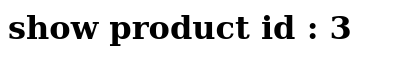
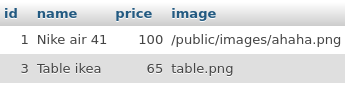
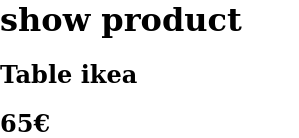

## III - Contrôleur et vue
Un contrôleur permet d'afficher un vue en fonction de la méthode demandée dans l'URI.
Un Controller est composée à minima de 
- une méthode `view()` qui execute la bonne méthode en fonction d'un chaine de caratère passée en paramètre.
- une méthode `show()` qui sera notre permière méthode reliée à la route `/product/show/3` et qui prend en paramètre l'id d'un produit.

### Création du Controller
1. Dans le dossier `app/controllers/` créez le fichier `ProductController.php`.
2. Dans ce fichier créer une classe `ProductController`.

*app/controllers/ProductController.php*
```php
<?php
class ProductController{
    
}
```

3. Ajouter la méthode public `show()`.

*app/controllers/ProductController.php*
```php
<?php
class ProductController{
    public function show($params){

    }
}
```
### Création de la View

4. Créez la vue `single-product.php` dans le dossier `app/views/`. Ce fichier contient du HTML.

*app/views/single-product.php*
```html
<h1>show product id : <?= $id ?></h1>
```
### Affichage de la View
5. Affichez la vue dans la méthode show grâce à la fonction `require_once`.

*app/controllers/ProductController.php*
```php
class ProductController{
    public function show(array $params = []){
        // Préparation de la variable $id à afficher dans la vue
        $id = $params[0];

        // Affichage de la vue
        require_once(__DIR__."/../views/single-product.php");
    }
}
```
> la méthode show prends un table de paramètre en paramètre. Typiquement les paramètres de show sont les valeurs fournit dans l'url.
> `localhost/product/show/1/3/4`
> Ici params est égal à `[1,3,4]`.
> Même si la méthode n'a besoin que du premier paramètre, une méthode publique d'un `Controller` prends toujours un tableau de paramètre en paramètre (dans notre framework).
6. Testez dans `App` si le `Controller` fonctionne.

*app/core/App.php*
```php
<?php
require_once(__DIR__."/../controllers/ProductController.php");

class App{
    public static function start(){
        $controller = new ProductController();
        $controller->show([3]);
    }
}
```
**Résultat :**

### Lier le `Model` au `Controller`

J'ai dans ma table sql plusieurs produits.


Maintenant que l'on sait que notre `Controller` fonctionne nous allons rajouter de la logique métier et récupérer un produit en fonction de l'id et le rendre disponible à la vue.

*app/controllers/ProductController.php*
```php
<?php
require_once(__DIR__."/../models/ProductModel.php");

class ProductController{
    public function show(array $params = []){
        // Préparation de la variable $id à afficher dans la vue
        $id = $params[0];

        // Récupération d'un produit
        $productModel = new ProductModel();
        $product = $productModel->get($id);

        // Affichage de la vue
        require_once(__DIR__."/../views/single-product.php");
    }
}
```

*app/views/single-product.php*
```php
<h1> show product </h1>
<h2> <?= $product->getName(); ?> </h2>
<p> <?= $product->getPrice(); ?> € </p>
```

**Résultat :**
Vous devriez maintenant voir un produit s'afficher dans votre navigateur.


<!-- Pour l'afficher je fournis à la méthode show l'id 3 dans son tableau de paramètres.
*app/core/App.php*
```php
<?php
require_once(__DIR__."/../controllers/ProductController.php");

class App{
    public static function start(){
        $controller = new ProductController();
        $controller->show([3]);
    }
}
``` -->
Mon produit s'affiche dans le navigateur :).


