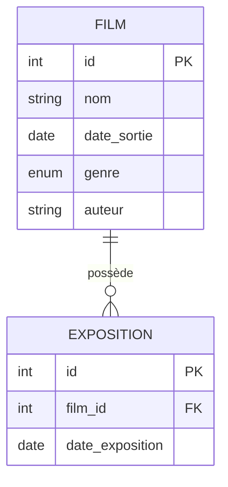

# Synopsis

Cette application permet de rechercher, consulter et gérer des films et leurs expositions. Chaque film possède des informations détaillées et peut être associé à plusieurs expositions.

# Diagramme Entity Relation



# Cahier des charges

| Taches                         | Description                                                                 | Cas critique                                      |
|------------------------------- |-----------------------------------------------------------------------------|---------------------------------------------------|
| Liste des films                | Afficher tous les films enregistrés                                         | Aucun film existant                               |
| Recherche de film              | Rechercher un film par nom, genre, auteur, date de sortie                   | Aucun résultat, recherche trop large/étroite      |
| Détail d’un film               | Afficher les détails d’un film et ses expositions associées                 | Film inexistant, expositions manquantes           |
| Création d’un film             | Ajouter un nouveau film                                                     | Données invalides, doublon                        |
| Modification d’un film         | Modifier les informations d’un film                                         | Film inexistant, données invalides                |
| Suppression d’un film          | Supprimer un film et ses expositions associées                              | Film inexistant, suppression en cascade           |
| Liste des expositions          | Afficher toutes les expositions d’un film                                   | Film inexistant, aucune exposition                |
| Création d’une exposition      | Ajouter une exposition à un film                                            | Film inexistant, date invalide                    |
| Modification d’une exposition  | Modifier la date d’une exposition                                           | Exposition inexistante, date invalide             |
| Suppression d’une exposition   | Supprimer une exposition                                                    | Exposition inexistante                            |

# Entity
Exemple d'entités PHP pour les tables `Film` et `Exposition` :
```php
class FilmEntity {
    private int $id;
    private string $nom;
    private DateTime $date_sortie;
    private string $genre;
    private string $auteur;

    // Getters et Setters...
}
```

```php
class ExpositionEntity {
    private int $id;
    private int $film_id;
    private DateTime $date_exposition;
    // Getters et Setters...
}
```

> ***Astuce DateTime en PHP***
>```php
>$date = new DateTime();
>var_dump($date->format('H:i:s'));
>// string(8) "18:16:16"
>```

# Repo du MVC de base

***TODO***
```bash
git clone https://github.com/username/projet-allocine.git
cd projet-allocine
```