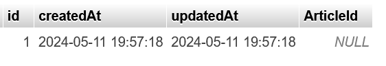
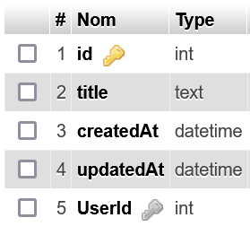
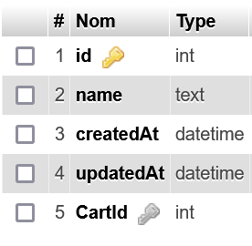
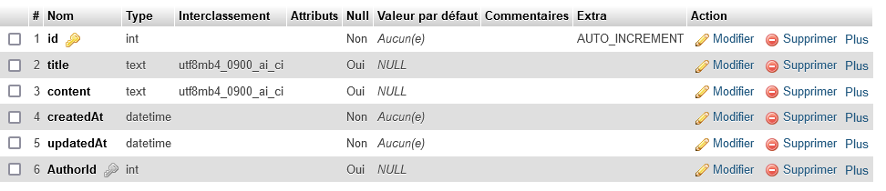
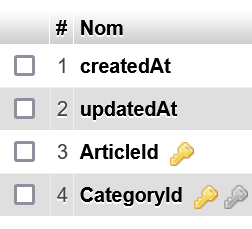
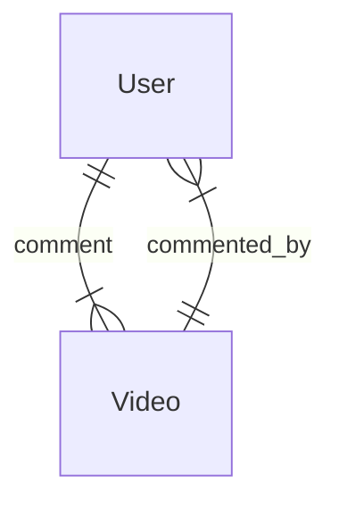
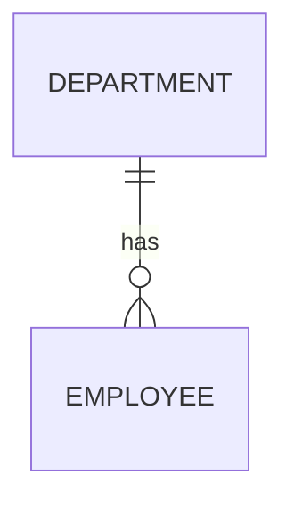
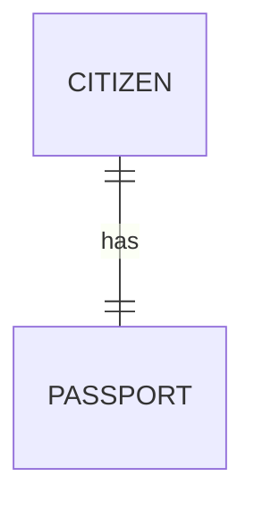
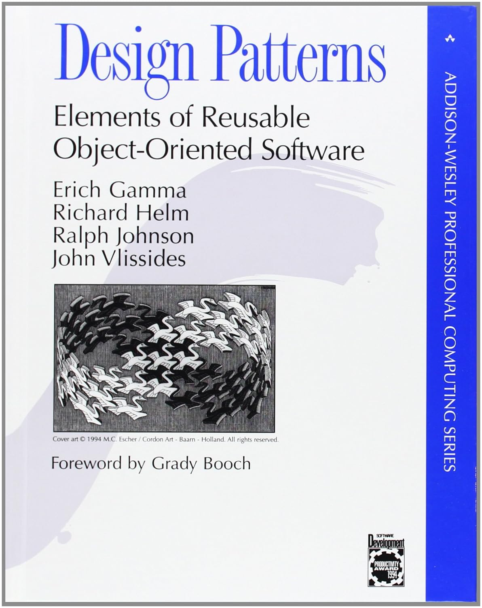
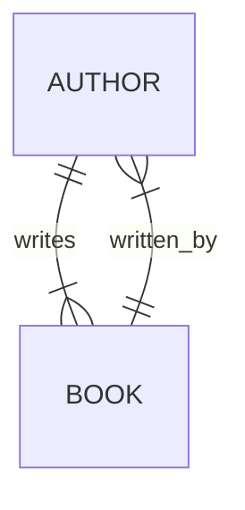

# Relation Sequelize
L'intérêt d'une base de données relationnelle se trouve dans l'utilisation de relations entre les tables.
Sequelize permet de simplifier la mise en place et l'utilisation de relations inter-tables en vous évitant d'écrire le moindre code SQL.

## Rappel sur les relations SQL
Il existe trois types de relations :
- One to Many
- One to One
- Many to Many

Les relations sont mises en place à l'aide de clés étrangères. Une clé étrangère est une colonne d'une table qui contient la clé primaire d'une autre table.

### One to Many
La relation One to Many signifie qu'une ligne d'une table A peut être référencée dans plusieurs lignes d'une table B.

**Par exemple** : un *article* de la table *Articles* peut être référencé dans plusieurs *commentaires* de la table *Commentary*.
La primary key de l'article sera alors référencée en tant que clé étrangère d'un ou plusieurs commentaires.
> Ainsi, un article peut être lié à plusieurs commentaires. 
> 
> *One article has many commentary.*

### Many to Many
La relation Many to Many signifie qu'une ligne d'une table A peut être référencée dans plusieurs lignes d'une table B **ET** qu'une ligne de la table B peut aussi être référencée dans plusieurs lignes de la table A.

> C'est en quelque sorte une double relation One to Many.

#### Exemple Article et Catégorie
Un article de la table Article peut avoir plusieurs Catégories associées **ET** une catégorie peut évidemment avoir plusieurs articles.
> *One article has many categories*
>
> *One category has many articles*
> 
> *Many to Many*

#### Exemple Utilisateur et Produit pour une Wishlist
Un utilisateur peut avoir plusieurs produits dans sa wishlist (One to Many donc) MAIS un produit peut être dans la wishlist de plusieurs utilisateurs (One to Many dans l'autre sens). Les tables Produit et Utilisateur ont toutes les deux une liaison One to Many dans les deux sens, c'est donc une relation Many to Many.

> Avec MySQL, la relation Many to Many génère une table de jointure.

### One to One
La relation One to One est plutôt rare et définit une relation parfaitement exclusive entre deux tables.

Une ligne de la table A ne peut être référencée que par une seule et unique ligne de la table B MAIS la ligne de la table B doit référencer la même ligne de la table A.

#### Exemple carte d'identité et citoyen
Par exemple, une carte d'identité de la table IdCards ne peut être référencée que par un seul citoyen de la table Citizens et vice-versa.

#### Exemple utilisateur et panier
Autre exemple, un panier ne peut avoir qu'un utilisateur et un utilisateur ne peut avoir qu'un seul et unique panier. *One to One*.

## Les relations de tables avec Sequelize
Avec Sequelize, les tables sont appelées Models et définies grâce à la fonction `sequelize.define()`.

Une fois deux modèles définis, il est possible de définir leurs relations grâce à un jeu de méthodes de la classe Model :
```ts
Model.hasOne(otherModel : Model) 
Model.belongsTo(otherModel : Model)
Model.hasMany(otherModel : Model)
Model.belongsToMany(otherModel : Model, {through : "JoinTableName"})
```
Ces fonctions permettent de créer des relations et donc de placer une clé étrangère sur l'un des deux models.
La table qui reçoit la clé étrangère s'appelle la `Target` (cible), celle qui envoie sa clé primaire s'appelle la `Source`.

`A.hasOne(B)` crée une relation **One to One** entre A et B et place la clé étrangère dans B. B est donc la target.
`A.belongsTo(B)` crée une relation **One to One** entre A et B et place la clé étrangère dans A. A est donc la target.

> Vous remarquerez que hasOne et belongsTo font la même chose mais inversent simplement la position de la target.

`A.hasMany(B)` crée une relation **One to Many** entre A et B et place la clé étrangère dans B. B est donc la target.

`A.belongsToMany(B, {through : "C"})` crée une relation **Many to Many** entre A et B via la table de jointure C. Les clés étrangères seront placées dans la table C sous les noms aId et bId. La table C sera créée si nécessaire.

> Attention, seul `belongsToMany` est capable de gérer une table de jointure. On ne peut donc pas utiliser `hasMany` pour une relation Many to Many.

## Requêtes SQL sur les associations, les méthodes dynamiques (mixins) de Sequelize

Soient les deux modèles suivants :
```js
const Article = sequelize.define("Article",{});
const Category = sequelize.define("Category",{});
```
Les méthodes précédentes permettent de créer des relations entre les tables, d'ajouter les clés étrangères et même de créer automatiquement une table de jointure.

Qu'en est-il du requêtage ?

Lors de l'utilisation d'une méthode *has/belongs* sur un Model, le Model se voit attribuer de nouvelles méthodes en fonction de la méthode utilisée.

### setModelName
Par exemple, l'appel de `belongsTo` :
```js
Article.belongsTo(Category); // Clé étrangère de category sur Article
```
Permet au modèle `Article` d'accéder à la méthode `setCategory()`. Elle permet de définir la catégorie de l'article sans s'embêter avec la clé étrangère.

Je crée un article et une catégorie.
```js
const category = await Category.create({});
const article = await Article.create({});
```
Je définis la catégorie de l'article
```js
await article.setCategory(category);  
// Le champ article.CategoryId est défini
```

```js
console.log(article.dataValues);
```

```bash
{
    id: 1,
    updatedAt: 2024-05-11T13:46:52.585Z,
    createdAt: 2024-05-11T13:46:52.580Z,
    CategoryId: 1
}
```

**Les fonctions has/belongs permettent à un Model d'accéder à la table associée**

### getModelName

La méthode `setCategory` permet de définir la clé étrangère du model target et réciproquement la méthode `getCategory()` permet de récupérer la catégorie.

```js
const category = await article.getCategory();
```

### Lexique des méthodes mixins disponibles

#### Pour hasOne() et belongsTo()
hasOne et belongsTo permettent de créer une relation One to One. Ces méthodes mixins permettent donc de définir ou récupérer une instance de modèle. Il est aussi possible de créer une instance et de la définir en une seule fonction.

- setBar()
- getBar()
- createBar()

> Remplacez Bar par le nom du Model associé.

> Lire la documentation de Sequelize sur le fonctionnement de chaque fonction : https://sequelize.org/docs/v6/core-concepts/assocs/#foohasonebar

#### Pour hasMany() et belongsToMany()
`hasMany()` et `belongsToMany()` permettent de créer respectivement des relations One to Many et Many to Many.

Leurs fonctions permettent donc de gérer plusieurs instances de model. La plupart des méthodes sont au pluriel et demandent ou renvoient donc un tableau.
##### Getter
- getBars()
- countBars()
> Au même titre que `Model.findAll()` on peut fournir au getter un `where` pour conditionner la recherche du `SELECT`.
##### Tester la présence d'une instance
- hasBar()
- hasBars()
##### Setter
- setBars()
- addBar()
- addBars()
- removeBar()
- removeBars()
- createBar()

> Remplacez `Bar` par le nom du Model associé.

> Lire la documentation de Sequelize sur le fonctionnement de chaque fonction : https://sequelize.org/docs/v6/core-concepts/assocs/#foohasmanybar

###### Ne confondez pas setBars et addBars.
`setBars()` définit plusieurs éléments d'un coup et supprime toutes les anciennes associations.

`addBars()` ajoute plusieurs éléments aux associations précédentes.

Cela signifie que cette ligne retire tous les éléments d'une `categorie` : 
```js
const categorie = await Category.findByPk(2);
await categorie.setArticles([]);
```

### Nécessité de doubler les relations

Soit :
```js

const Article = sequelize.define("Article",{});
const Category = sequelize.define("Category",{});

Article.belongsTo(Category);

(async ()=>{
        await sequelize.sync({force : true});
        
        const category = await Category.create({});
        const article = await Article.create({});

        // Codez ici ...
})();
```
Les méthodes `has/belongs` nous donnent accès aux méthodes getter et setter sur le Model appelant.

```js
// Article est le modèle appelant belongsTo
Article.belongsTo(Category);
// Il possède donc les méthodes getter et setter de Category.
```

```js
await article.setCategory(category);
const assocCategory = await article.getCategory();
```
Seul problème : l'autre modèle (Category) n'a pas accès aux getter et setter, car il n'appelle jamais de méthodes `has/belongs`. C'est très gênant.

```js
const assocArticle = await category.getArticle(); // ERROR 
```
*TypeError : La fonction getArticle n'existe pas !*
```bash
const assocArticle = await category.getArticle();
                                                                        ^
TypeError: category.getArticle is not a function
```

**Alors, comment faire pour récupérer l'article depuis une catégorie ?**

*Pour récupérer l'article depuis une catégorie il faut que le model Category ait accès aux méthodes getter et setter, **il faut donc que Category appelle une méthode has ou belongs.***

```js
Article.belongsTo(Category);
Category.hasOne(Article);
```

```js
await article.setCategory(category);
const assocCategory = await article.getCategory();
const assocArticle = await category.getArticle(); // OK
```

Ici j'ai utilisé la liaison hasOne qui va chercher la clé étrangère (article.CategoryId) qui correspond à sa clé primaire (id).

 #### **Pourquoi ne pas utiliser deux fois hasOne ou belongsTo ?**
Si belongsTo et hasOne font la même chose mais à l'envers, pourquoi ne pas simplement utiliser toujours la même fonction en inversant les Models comme ceci ?
 ```js
// Ajout du champ FK article.CategoryId 
Article.belongsTo(Category);  
// Ajout du champ FK category.ArticleId
Category.belongsTo(Article);
```
*Ce qui me permettrait théoriquement de faire ceci donc ?*
```js
await article.setCategory(category);
const assocCategory = await article.getCategory();
const assocArticle = await category.getArticle();  // ??
```
**FAUX** assocArticle est null.
```js
console.log(assocArticle);
```
```bash
null
```
La fonction category.getArticle() n'a pas trouvé d'article correspondant à notre catégorie ...
Pourtant nous avons bien défini le champ article.CategoryId avec la fonction `article.setCategory()`.

Oui, mais le problème c'est que **nous avons utilisé belongsTo** pour lier Category à Article.
```js
// Ajout du champ FK category.ArticleId
Category.belongsTo(Article);
```
Ce qui a eu pour conséquence de créer une foreign key dans la table Category.
Ainsi la fonction category.getArticle() ne cherche plus une catégorie dans les foreign keys de la table Article mais un article en fonction de la FK category.ArticleId.

Regardons donc quelle est la valeur de la FK ArticleId dans *phpMyAdmin*.

*SELECT * FROM Category*


Le champ `ArticleId` de la category est `NULL`. C'est logique car nous n'avons pas défini ce champ avec la méthode category.setArticle() comme ceci :
```js
await category.setArticle(article);
```

*Une fois la FK définie tout fonctionne.*

*app.js - code complet*
```js
const {Sequelize, DataTypes} = require("sequelize");

const sequelize = new Sequelize("blog","blog","blog",{
        dialect:"mysql",
        logging : false
});

sequelize.authenticate().then(()=>console.log("logged in"));

const Article = sequelize.define("Article");
const Category = sequelize.define("Category",{});

Article.belongsTo(Category);
Category.belongsTo(Article);  // J'utilise deux fois belongsTo

(async ()=>{
        await sequelize.sync({force : true});
        
        const category = await Category.create({});
        const article = await Article.create({});

        // Donc je dois définir deux fois les foreign keys
        await article.setCategory(category); // pour article.CategoryId
        await category.setArticle(article);  // et category.ArticleId
        
        const assocCategory = await article.getCategory();
        const assocProduct = await category.getArticle();
        
        console.log(assocCategory.dataValues); //OK
        console.log(assocProduct.dataValues); // OK
})();
```
En conclusion, il est inutile et même gênant d'utiliser deux fois belongsTo car ceci vous demandera de définir deux fois les clés étrangères lors de l'ajout d'un élément. 
C'est inutile car en SQL il suffit que l'une des deux tables possède la clé étrangère de l'autre pour former une relation One to One (à condition de mettre une contrainte UNIQUE sur la clé étrangère).

### Relation One to One
```js
const User = sequelize.define("User",{
        name : DataTypes.TEXT
});
const Cart = sequelize.define("Cart",{
        title : DataTypes.TEXT,
});
// Cart reçoit une foreign key de User
Cart.belongsTo(User,{
        foreignKey : {
                unique : true
        }
});
User.hasOne(Cart);     
sequelize.sync({force: true});
```
> J'ai ajouté une contrainte `unique` sur le champ foreign key, je pourrais également ajouter `allowNull : false` pour rendre ma liaison One to One encore plus stricte.

*Cart*


*User*


### Relation One to Many
Avec Sequelize, la relation One to Many se crée avec les fonctions `Model.belongsTo()` et `Model.hasMany()`.

```js
const Article = sequelize.define("Article",{
        title : DataTypes.TEXT,
        content : DataTypes.TEXT
});
const Author = sequelize.define("Author",{
        name : DataTypes.TEXT
});
Article.belongsTo(Author); //  one Article belongs To one Author
Author.hasMany(Article) // one Author has Many Articles

sequelize.sync({force: true});
```

> `belongsTo` place la clé étrangère sur la table Article. On l'appelle la `table source`.

#### Requête avec des relations
```js
//Create
const massinissa = Author.create({name : "Massinissa"});
// Associate
Article.create({
        title : "Comment faire du skate",
        content : "bla bla ollie",
        AuthorId : massinissa.id
});
// Fetch
const article = Article.findOne(1); // Comment faire du skate
const author = article.getAuthor(); // Massinissa
```
### Relation Many to Many
La relation Many to Many se crée avec la fonction belongsToMany.
```js
const Article = sequelize.define("Article",{
        title : DataTypes.TEXT,
        content : DataTypes.TEXT
});
const Category = sequelize.define("Category",{
        title : DataTypes.TEXT,
        description : DataTypes.TEXT
});
Article.belongsToMany(Category,{through : "ArticleCategory"});
Category.belongsToMany(Article,{through : "ArticleCategory"});
sequelize.sync({force: true});
```
*La table de jointure ArticleCategory*


Il est également possible de créer une table de jointure à l'avance et de la fournir dans through. Cela permet de définir des champs en plus dans la table de jointure en plus de ceux que Sequelize rajoute (les foreign keys, createdAt).


```js
const User = sequelize.define("User",{});
const Video = sequelize.define("Video",{});
const Comment = sequelize.define("Comment",{
        content : DataTypes.TEXT,
        liked : DataTypes.INTEGER // nombre de likes
});
User.belongsToMany(Video,{through : Comment});
Video.belongsToMany(User,{through : Comment});
sequelize.sync({force: true});
```

### Ajouter des éléments pour Many to Many

L'ajout d'éléments pour une liaison Many to Many se fait via les méthodes mixins : addBars, setBars, createBar et addBar.

```js
// Je fais mes liaisons
Category.belongsToMany(Product,{through : "CategoryProduct"});
Product.belongsToMany(Category,{through : "CategoryProduct"});

sequelize.sync({force : true}).then(async ()=>{
        // Je crée une catégorie
        const cat = await Category.create({title : "Voiture"});
        // Je crée un produit
        const product = await Product.create({
                name : "206"
        });
        // J'ajoute un produit dans la catégorie
        cat.addProduct(product);
        // addProduct s'appelle ainsi car le model s'appelle Product
        // Grâce aux liaisons belongsToMany faites plus haut,
        // Sequelize va automatiquement rajouter un élément
        // dans la table de jointure
})
```
> Voir les méthodes mixins plus haut ou la doc de Sequelize : https://sequelize.org/docs/v6/core-concepts/assocs/#foobelongstomanybar--through-baz-

# Exercices
- Mettez en place les relations suivantes avec Sequelize
- Pour chaque diagramme, ajoutez et récupérez des éléments avec les méthodes mixins pour prouver que les associations ont bien fonctionné.

### One to Many
1. Créez 10 employés avec Model.create()
2. Ajoutez-en 5 à un département nommé "Comptable"
3. Ajoutez-en 4 à un autre nommé "Dev"
4. Ajoutez-en 1 dans le département "Direction"
5. Récupérez tous les employés
6. Récupérez tous les Dev
7. Récupérez le nombre de comptables.

1. Créez 15 classes avec Model.create()
2. Ajoutez-en 5 à une school nommée "Collège"
3. Ajoutez-en 5 à une autre nommée "Lycée"
4. Ajoutez-en 5 dans la school "Primaire"
5. Récupérez toutes les classes
6. Récupérez tous les collégiens
7. Récupérez le nombre de primaires.
8. Récupérez tous les collégiens ET lycéens
```mermaid
erDiagram
        SCHOOL ||--o{ CLASS : has

```

### One to One
1. Créez 2 citoyens avec Model.create()
2. Leur fournir à chacun un passeport
3. Grâce à la contrainte UNIQUE, empêcher un citoyen d'avoir plusieurs passeports dans la BDD.


### Many to Many
> N'oubliez pas de nommer votre table de jointure par le nom des deux tables.
1. Créez les auteurs du livre "DESIGN PATTERNS" dans le model Author
https://www.amazon.fr/Design-Patterns-Elements-Reusable-Object-Oriented/dp/0201633612

2. Ajoutez les auteurs du livre "Parallel Programming"  
https://www.eyrolles.com/Informatique/Livre/parallel-programming-with-microsoft-visual-c--9780735651753/

3. Ajoutez les deux livres.
4. Associez les auteurs aux livres.
