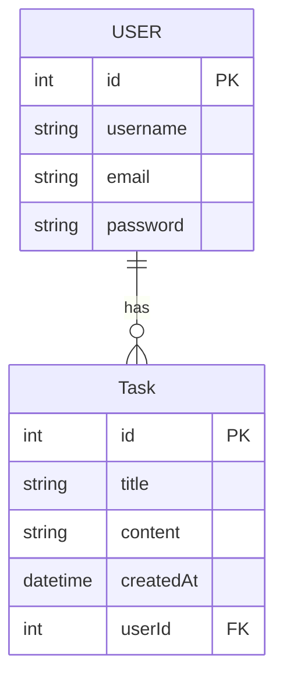

## Présentation de sujet du TP

Pour simplifier votre apprentissage nous allons mettre en place le back-end d'une application type todolist.

La `TaskListAPI` !

## Routes de l'api

Elle possédera les routes :

- POST /task
- GET /tasks
- GET /task/:id
- POST /login
- POST /register

## MCD

Voici son digramme MCD :

## Stack

Nous utiliserons la stack suivante :

- nodejs / npm
- express
- sequelize
- jwt