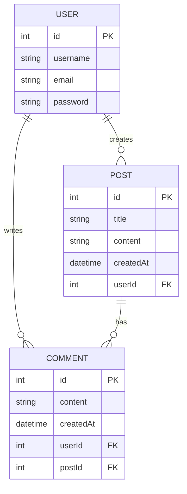

# Projet ThreadAPI
## Description
API REST pour une application de type réseau social (twitter) permettant aux utilisateurs de s'inscrire, se connecter, créer des posts, commenter.

## Technologies utilisées
- Node.js
- Express
- Sequelize
- JWT pour l'authentification
- Bcrypt pour le hachage des mots de passe
- MySQL pour la base de données

## Diagramme de la base de données

# Cahier des charges 
| Titre                | Description                                                                 | Cas critique                                                                                  |
|----------------------|-----------------------------------------------------------------------------|----------------------------------------------------------------------------------------------|
| Login                | Authentifier un utilisateur via JWT. Vérifie les identifiants et génère un JWT stocké dans les cookies. | Mauvais identifiants, JWT non généré, cookie non envoyé.                |
| Logout               | Déconnecter l'utilisateur en supprimant le JWT des cookies.                 | 
| Register             | Créer un nouvel utilisateur, générer un JWT et l'ajouter aux cookies.       | Utilisateur déjà existant, JWT non généré, cookie non envoyé, données invalides.             |
| POST post utilisateur| Permet à un utilisateur authentifié de créer un post.                       | Utilisateur non authentifié, données manquantes ou invalides           |
| POST commentaire     | Permet à un utilisateur authentifié de commenter un post.                   | Utilisateur non authentifié, post inexistant, données invalides  |
| GET allPosts         | Récupérer la liste de tous les posts avec leurs commentaires.               | Aucun post trouvé          |
| DELETE commentaire   | Supprimer un commentaire (par son auteur ou un admin).                      | Commentaire inexistant, utilisateur non autorisé                    |
| DELETE post          | Supprimer un post (par son auteur ou un admin).                             | Post inexistant, utilisateur non autorisé         |