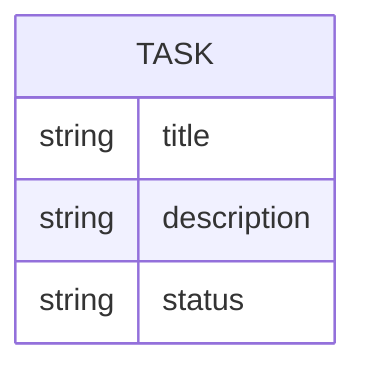

## Tableau de Tasks



```js
const tasks = [
  {  title: 'Task 1', description: 'Description 1', status: 'pending' },
  {  title: 'Task 2', description: 'Description 2', status: 'completed' },
];
```


## Routes CRUD (Create, Read, Update, Delete)

## Créer un serveur Express


1. Créer un serveur qui ecoute le port 3030
```js
const express = require('express');


const app = express();

app.listen(3030, () => {
  console.log('Server is running on port 3030');
});
```

2. Créer une route `/` qui affiche un message d'accueil
```js
const express = require('express');


const app = express();

app.get('/', (req, res) => {
  res.send('Welcome to the Task API');
});

app.listen(3030, () => {
  console.log('Server is running on port 3030');
});
```
## GET /tasks - Read

Partons du principe que nous avons un tableau de tâches en mémoire pour representer nos données( on utilisera une base de données SQL plus tard).

```js
const express = require('express');
// +++++++++++++++++++++++++++++++++
const tasks = [
  { id: 1, title: 'Task 1', description: 'Description 1', status: 'pending' },
  { id: 2, title: 'Task 2', description: 'Description 2', status: 'completed' },
];
// +++++++++++++++++++++++++++++++++


const app = express();

app.listen(3030, () => {
  console.log('Server is running on port 3030');
});
```

2. Créons une nouvelle route pour notre serveur qui va renvoyer la liste de taches au format JSON.

```js
const express = require('express');
// +++++++++++++++++++++++++++++++++
const tasks = [
  { id: 1, title: 'Task 1', description: 'Description 1', status: 'pending' },
  { id: 2, title: 'Task 2', description: 'Description 2', status: 'completed' },
];
// +++++++++++++++++++++++++++++++++


const app = express();

// +++++++++++++++++++++++++++++++++
app.get('/tasks', (req, res) => {
  res.json(tasks);
});
// +++++++++++++++++++++++++++++++++


app.listen(3030, () => {
  console.log('Server is running on port 3030');
});
```

3. Accedons à la route `/tasks` via le navigateur pour voir le résultat.

## GET /task/:id - Read One

Express permet de passer un id en paramètre dans l'URL.

```js
const express = require('express');

const app = express();


app.get('/hello/:name', (req, res) => {
  const name = req.params.name;
  res.send(`Hello, ${name}!`);
});

app.listen(3030, () => {
  console.log('Server is running on port 3030');
});
```

> Je récupère le paramètre `name` via l'objet `req.params`


1. Ajoutons une nouvelle route pour récupérer une tâche par son index.

```js
const express = require('express');
const tasks = [
  { title: 'Task 1', description: 'Description 1', status: 'pending' },
  { title: 'Task 2', description: 'Description 2', status: 'completed' },
];

const app = express();

app.get('/tasks', (req, res) => {
  res.json(tasks);
});

// +++++++++++++++++++++++++++++++++
app.get('/task/:id', (req, res) => {
  const taskId = parseInt(req.params.id);

  const task = tasks[taskId];

  if (task) {
    res.json(task);
  } else {
    res.status(404).json({ message: 'Task not found' });
  }
});
// +++++++++++++++++++++++++++++++++


app.listen(3030, () => {
  console.log('Server is running on port 3030');
});
```

## POST /task - Create

## Sequelize ORM - Ajouter du SQL pour Create et Delete

### Installation de Sequelize

### Initialisation de Sequelize

### Création du modèle Task

### Synchronisation de la base de données

#### CRUD Sequelize

- INSERT et SELECT


- Exercices

### Modification des routes

Mettre à jour les routes pour utiliser Sequelize

GET /task
GET /task/:id
POST /task

### Etat des lieux des routes

GET /task
GET /task/:id
POST /task

Exercies :

Créer les routes :

GET /task/:status


## 

- Créer une route GET
- Créer une route Avec des paramètres
- Créer une route POST
- Créer une route DELETE