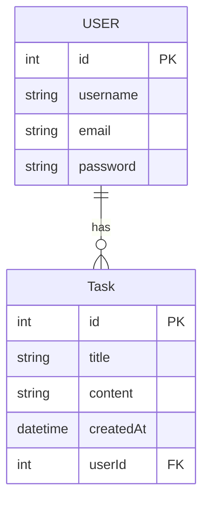

## Init Sequelize

0. Stoppé un potentiel serveur mysql tournant sur votre PC pour libérer le port 3306
```
systemctl stop mysql
systemctl disable mysql
```

1. Créez un nouveau dossier pour votre projet et ouvrez VSCode dedans

2. Initaliser un projet nodejs avec npm

```
npm init
```
> Laissez les réponses par défaut en appuyant sur Entrer plusieurs fois.

3. Installez les extensions npm neccessaires aux projet à savoir :

- express : pour le serveur http
- sequelize : pour faire le requetes SQL
- mysql2 : utilisé par sequelize pour se connecter à un serveur mysql

```bash
npm install sequelize mysql2 express
```

4. Lancez un serveur mysql avec docker

```bash
docker run --name bdd  -e MYSQL_ROOT_PASSWORD=root -e MYSQL_DATABASE=app-database mysql
```

> Pour relancer le serveur mysql au redémmarage de votre machine : 
>```bash
>docker start bdd
>```


5. Créer un fichier nommée main.mjs à la racine du projet contenant le code suivant :
```js
async function main(){
    console.log("Hello World");
}
main()
```

6. Installer nodemon pour ne pas avoir à relancer votre programme à chaque modification
```bash
sudo npm i -g nodemon
```

7. Lancez votre script `main.mjs` avec nodemon dans la console de VSCode

```bash
nodemon main.mjs
```

Vous devriez voir `Hello World` s'affichez dans la console de VSCode.

## Qu'est ce que Sequelize

`Sequelize` est un module npm qui permet d'accéder à une BDD SQL sans jamais écrire le moindre code SQL. Toutes les actions habituelles du SQL sont accessibles via des objets. Les programmes comme sequelize s'appelle des ORM ( object-relational mapping ) c'est une surcouche (un interface) du SQL qui permet un accès simple, rapide et orienté objet à la BDD.

A titre d'exemple une requête comme :
```sql
SELECT * FROM User WHERE User.id==1
```
S'écrit avec sequelize :
```js
const user = await User.findByPk(1);
```
Une relation One to Many se crée comme suit :
```js
Category.hasMany(Product);
Product.belongsTo(Category);
```

Plusieurs choses importantes à retenir :
- Avec Sequelize les tables SQL s'appelle maintenant des `Models`, il sont crée directement dans le code pas besoin de crée de schema SQL contenant vos CREATE TABLE.
- Sequelize utilise la syntaxe des Promises (async, await ou then) car les fonctions effectue des requetes SQL sur le réseau. Ce sont donc des opérations asyncrones.

## Initialiser la connexion avec la BDD

la connexion à une BDD avec Sequelize se fait en plusieurs étapes :
1. Importer la classe Sequelize
```js
import { Sequelize } from "sequelize";

``` 
2. Instancier un objet sequelize et fournir les logins de connexion au constructeur, l'ip du serveur et le SGDB utilisé (mysql,mariadb,sqlite ou postgresql).

```js
import { Sequelize } from "sequelize";

// Connexion à la BDD
const sequelize = new Sequelize("app-database","root","root", {
    host: '127.0.0.1',
    dialect: 'mysql'
});
``` 

3. Syncroniser la connexion 
```js
import { Sequelize } from "sequelize";

// Connexion à la BDD
const sequelize = new Sequelize("app-database","root","root", {
    host: '127.0.0.1',
    dialect: 'mysql'
});

sequelize.sync().then(()=>console.log("Connexion effectué"));
``` 

1. Ajouter donc le code complet suivant dans notre fonction main pour nous connectée à la BDD :

*main.mjs*
```js
import { Sequelize } from "sequelize";

async function main(){
    try {
        
        const login = {
            database: "app-database",
            username: "root",
            password: "root"
        };
        // Connexion à la BDD
        const sequelize = new Sequelize(login.database, login.username, login.password, {
            host: '127.0.0.1',
            dialect: 'mysql'
        });

        await sequelize.sync(); // j'attend la fin de la requete avec de continuer.
        console.log("Connexion à la BDD effecté")
        
    }catch(error){
        console.log(error);
    }
}
main()
```

Si le connexion à réussi vous devriez voir la requete SQL `1+1` effectué par sequelize affiché dans votre terminal :
```bash
Executing (default): SELECT 1+1 AS result
Connexion à la BDD effecté
```

> La connexion à la BDD est assez similaire à la connexion avec la classe `PDO` de php.

## Présentation de sujet du TP

Pour simplifier votre apprentissage nous allons mettre en place le back-end d'une application type todolist.

La `TaskListAPI` !

Elle possédera les routes :

- POST /task
- GET /tasks
- GET /task/:id
- POST /login
- POST /register

Voici son digramme MCD :




## Créer une table - un Model
Grâce aux ORM comme sequelize on peut créer nos tables SQL directement dans le code.

On appelle nos tables Model.

## Créer le UserModel
Pour commencez créeons une table User.

> Voir la doc de la méthode Model.define : https://sequelize.org/docs/v6/core-concepts/model-basics/#using-sequelizedefine

La création d'un model ce fait en plusieurs étapes:

1. Importer la classe DataTypes
```js
import { Sequelize,DataTypes } from "sequelize";
```

2. Utiliser la méthode define de l'instance `sequelize` et définir le nom et les champs de la nouvelle table.
```js
import { Sequelize,DataTypes } from "sequelize";

// ...
// After init sequelize object
// ...
sequelize.define("User", {
    username: DataTypes.STRING,
    email: DataTypes.STRING,
    password: DataTypes.STRING
});
```

3. Syncroniser sequelize au serveur mysql pour effectuer les CREATE TABLE

```js
import { Sequelize,DataTypes } from "sequelize";

// ...
// After init sequelize object
// ...
sequelize.define("User", {
    username: DataTypes.STRING,
    email: DataTypes.STRING,
    password: DataTypes.STRING
});


sequelize.sync({force:true}).then(()=>console.log("tables crées!"))
```

1. Modifier votre code pour crée la table `User` comme ceci :

*main.mjs*
```js
import { Sequelize,DataTypes } from "sequelize";

async function main(){
    try {
        
        const login = {
            database: "app-database",
            username: "root",
            password: "root"
        };
        // Connexion à la BDD
        const sequelize = new Sequelize(login.database, login.username, login.password, {
            host: '127.0.0.1',
            dialect: 'mysql'
        });


        // + Création des models (tables) -------------//
        sequelize.define("User", {
            username: DataTypes.STRING,
            email: DataTypes.STRING,
            password: DataTypes.STRING
        });
        // CREER LES TABLES AVANT LA FONCTION sync !
        // -----------------------------------------//

        await sequelize.sync({force:true});
        console.log("Connexion à la BDD effecté")
        
    }catch(error){
        console.log(error);
    }
}
main()
```

Vous devirez voir le `CREATE TABLE` apparaitre dans la console.
```
Executing (default): CREATE TABLE IF NOT EXISTS `Users` (`id` INTEGER NOT NULL auto_increment , `username` VARCHAR(255), `email` VARCHAR(255), `password` VARCHAR(255), `createdAt` DATETIME NOT NULL, `updatedAt` DATETIME NOT NULL, PRIMARY KEY (`id`)) ENGINE=InnoDB;
Connexion à la BDD effecté
``` 

> {force:true} permet de supprimer toutes les données précedentes des tables, très utile quand on le code est souvent modifié en dev.

## CRUD du UserModel
L'avantage principal d'un ORM c'est que le CRUD SQL des tables est déjà crée via un jeu de méthodes.

Voici les fonctions les plus importantes :

- Model.create()
- Model.findAll()
- Model.findByPk()
- Model.destroy()
- Model.update()

Pour effecuter une requete SQL sur un model il me faut ce model, il est contenu dans l'attributs models de l'objet sequelize :
```js
console.log(sequelize.models); // Voir tout les models défini
const User = sequelize.models.User; // récupérer le User model
``` 

1. Assurez que votre code corresponde au code suivant nous allons tester toutes les fonctions CRUD du Model.
```js
import { DataTypes, Sequelize } from "sequelize";


async function main() {
    try {

        const login = {
            database: "app-database",
            username: "root",
            password: "root"
        };
        // Connexion à la BDD
        const sequelize = new Sequelize(login.database, login.username, login.password, {
            host: '127.0.0.1',
            dialect: 'mysql'
        });

        // Création des models (tables) -------------//
        sequelize.define("User", {
            username: DataTypes.STRING,
            email: DataTypes.STRING,
            password: DataTypes.STRING
        });

        // -----------------------------------------//

        await sequelize.sync({ force: true }).then(()=>console.log("Tables crées"));

        console.log(sequelize.models);
        const User = sequelize.models.User;
        
       // --Vous coderez ici pour les exemples suivants-- //
       // ...


       ////-----------////

    } catch (error) {
        console.log(error);
    }
}
main();
```

### INSERT INTO
Pour effectué un INSERT INTO j'utilise la fonction Model.create(), elle prend en paramètre un objet contenant les mêmes champs que ce déclaré dans la fonctio sequelize.define.

```js
// INSERT INTO User
const newUser = await User.create({
    username: "massinissa",
    email: "massi@mail.com",
    password: "1234"
});

// Voir la nouvelle ligne insérée complet
console.log(newUser); 
// Accéder aux colonnes de la ligne inserée
console.log(newUser.email);
console.log(newUser.username);
```

> Notez l'utilisons de await avec le create, celà prouve que `create()` effectue une requete SQL.

### SELECT * FROM
### SELECT * FROM WHERE id=
### DELETE FROM
### UPDATE FROM

### Exemple complet

Voici un exemple complet des fonctions crud basique du model crée :
```js
import { DataTypes, Sequelize } from "sequelize";


async function main() {
    try {

        const login = {
            database: "app-database",
            username: "root",
            password: "root"
        };
        // Connexion à la BDD
        const sequelize = new Sequelize(login.database, login.username, login.password, {
            host: '127.0.0.1',
            dialect: 'mysql'
        });

        // Création des models (tables) -------------//
        sequelize.define("User", {
            username: DataTypes.STRING,
            email: DataTypes.STRING,
            password: DataTypes.STRING
        });

        // -----------------------------------------//

        await sequelize.sync({ force: true }).then(()=>console.log("Tables crées"));

        console.log(sequelize.models);
        const User = sequelize.models.User;
        
        // INSERT INTO User
        const newUser = await User.create({
            username: "massinissa",
            email: "massi@mail.com",
            password: "1234"
        });
         // INSERT INTO User
        const newUser2 = await User.create({
            username: "billy",
            email: "billy@mail.com",
            password: "1234"
        });

        console.log(newUser.username);
        console.log(newUser2.username);

        // SELECT * FROM User après ajout des deux users
        let allUsers = await User.findAll();
        allUsers.forEach(user=>{
            console.log(user.email)
        });
        
        // DELETE User
        await User.destroy({
            where : {
                username : "massinissa"
            }
        })
        
        // SELECT * FROM User après suppression de massinissa
        allUsers = await User.findAll();
        allUsers.forEach(user=>{
            console.log(user.email)
        });

        // UPDATE User
        await User.update({email:"newmailbilly@mail.com"},{
            where : {
                username : "billy"
            }
        })

        // SELECT * FROM User après UPDATE de billy
        allUsers = await User.findAll();
        allUsers.forEach(user=>{
            console.log(user.email)
        });


    } catch (error) {
        console.log(error);
    }
}
main();
```

## Exercice UserModel

<!-- Ecrire plein d'exo pour le UserModel -->

## TaskModel
1. Create TaskModel
2. Association OneToMany TaskModel et UserModel
3. CRUD TaskModel
4. Exercice TaskModel

```js

import { DataTypes, Sequelize } from "sequelize";

async function main() {
    try {

        const login = {
            database: "app-database",
            username: "root",
            password: "root"
        };
        // Connexion à la BDD
        const sequelize = new Sequelize(login.database, login.username, login.password, {
            host: '127.0.0.1',
            dialect: 'mysql'
        });

        // Création des models (tables) -------------//
        sequelize.define("User", {
            username: DataTypes.STRING,
            email: DataTypes.STRING,
            password: DataTypes.STRING
        });

        // -----------------------------------------//

        await sequelize.sync({ force: true }).then(()=>console.log("Tables crées"));

        console.log(sequelize.models);
        const User = sequelize.models.User;
        
        // INSERT INTO User
        const newUser = await User.create({
            username: "massinissa",
            email: "massi@mail.com",
            password: "1234"
        });
         // INSERT INTO User
        const newUser2 = await User.create({
            username: "billy",
            email: "billy@mail.com",
            password: "1234"
        });

        console.log(newUser.username);
        console.log(newUser2.username);

        // SELECT * FROM User après ajout des deux users
        let allUsers = await User.findAll();
        allUsers.forEach(user=>{
            console.log(user.email)
        });
        
        // DELETE User
        await User.destroy({
            where : {
                username : "massinissa"
            }
        })
        
        // SELECT * FROM User après suppression de massinissa
        allUsers = await User.findAll();
        allUsers.forEach(user=>{
            console.log(user.email)
        });

        // UPDATE User
        await User.update({email:"newmailbilly@mail.com"},{
            where : {
                username : "billy"
            }
        })

        // SELECT * FROM User après UPDATE de billy
        allUsers = await User.findAll();
        allUsers.forEach(user=>{
            console.log(user.email)
        });


    } catch (error) {
        console.log(error);
    }
}
main();
```

