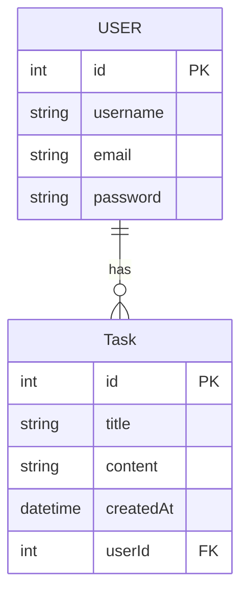
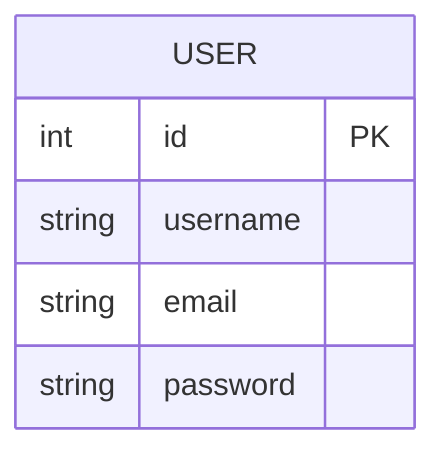

## Sequelize ORM - Faire du SQL sans écrire de SQL

## Pré-requis

0. Stoppez un éventuel serveur MySQL tournant sur votre PC pour libérer le port 3306 :
```bash
systemctl stop mysql
systemctl disable mysql
```

1. Créez un nouveau dossier pour votre projet et ouvrez VSCode dedans.

2. Initialisez un projet Node.js avec npm :

```bash
npm init
```
> Laissez les réponses par défaut en appuyant sur Entrée plusieurs fois.

3. Installez les dépendances npm nécessaires au projet, à savoir :

- express : pour le serveur HTTP
- sequelize : pour faire les requêtes SQL
- mysql2 : utilisé par sequelize pour se connecter à un serveur MySQL

```bash
npm install sequelize mysql2 express
```

4. Lancez un serveur MySQL avec Docker :

```bash
docker run --name bdd -e MYSQL_ROOT_PASSWORD=root -e MYSQL_DATABASE=app-database -p 3306:3306 mysql
```

> Pour relancer le serveur MySQL au redémarrage de votre machine : 
>```bash
>docker start bdd
>```

5. Créez un fichier nommé `main.mjs` à la racine du projet contenant le code suivant :
```js
async function main(){
    console.log("Hello World");
}
main()
```

6. Installez nodemon pour ne pas avoir à relancer votre programme à chaque modification :
```bash
sudo npm i -g nodemon
```

7. Lancez votre script `main.mjs` avec nodemon dans la console de VSCode :

```bash
nodemon main.mjs
```

Vous devriez voir `Hello World` s'afficher dans la console de VSCode.

## Qu'est-ce que Sequelize ?

`Sequelize` est un module npm qui permet d'accéder à une BDD SQL sans jamais écrire le moindre code SQL. Toutes les actions habituelles du SQL sont accessibles via des objets. Les programmes comme sequelize s'appellent des ORM (Object-Relational Mapping) : c'est une surcouche (une interface) du SQL qui permet un accès simple, rapide et orienté objet à la BDD.

À titre d'exemple, une requête comme :
```sql
SELECT * FROM User WHERE User.id=1
```
s'écrit avec sequelize :
```js
const user = await User.findByPk(1);
```
Une relation One to Many se crée comme suit :
```js
Category.hasMany(Product);
Product.belongsTo(Category);
```
Sequelize s'occupera donc de la rédaction de CREATE TABLE et du placement des clés étrangères.

Quelques points importants à retenir :
- Avec Sequelize, les tables SQL s'appellent maintenant des `Models`, ils sont créés directement dans le code, pas besoin de créer de schéma SQL contenant vos CREATE TABLE.
- Sequelize utilise la syntaxe des Promises (async, await ou then) car les fonctions effectuent des requêtes SQL sur le réseau. Ce sont donc des opérations asynchrones.

## Initialiser la connexion avec la BDD

La connexion à une BDD avec Sequelize se fait en plusieurs étapes :
1. Importer la classe Sequelize
```js
import { Sequelize } from "sequelize";
``` 
2. Instancier un objet sequelize et fournir les identifiants de connexion au constructeur, l'IP du serveur et le SGBD utilisé (mysql, mariadb, sqlite ou postgresql).

```js
import { Sequelize } from "sequelize";

// Connexion à la BDD
const sequelize = new Sequelize("app-database", "root", "root", {
    host: '127.0.0.1',
    dialect: 'mysql'
});
``` 

3. Synchroniser la connexion 
```js
import { Sequelize } from "sequelize";

// Connexion à la BDD
const sequelize = new Sequelize("app-database", "root", "root", {
    host: '127.0.0.1',
    dialect: 'mysql'
});

sequelize.sync().then(()=>console.log("Connexion effectuée"));
``` 

4. Ajoutez donc le code complet suivant dans notre fonction main pour nous connecter à la BDD :

*main.mjs*
```js
import { Sequelize } from "sequelize";

async function main(){
    try {
        
        const login = {
            database: "app-database",
            username: "root",
            password: "root"
        };
        // Connexion à la BDD
        const sequelize = new Sequelize(login.database, login.username, login.password, {
            host: '127.0.0.1',
            dialect: 'mysql'
        });

        await sequelize.sync(); // j'attends la fin de la requête avant de continuer.
        console.log("Connexion à la BDD effectuée")
        
    }catch(error){
        console.log(error);
    }
}
main()
```

Si la connexion a réussi, vous devriez voir la requête SQL `1+1` effectuée par sequelize affichée dans votre terminal :
```bash
Executing (default): SELECT 1+1 AS result
Connexion à la BDD effectuée
```

> La connexion à la BDD est assez similaire à la connexion avec la classe `PDO` de PHP.

## Présentation du sujet du TP

Pour simplifier votre apprentissage, nous allons mettre en place le back-end d'une application type *todolist*.

La `TaskListAPI` !

Elle possédera les routes :

- POST /task
- GET /tasks
- GET /task/:id
- POST /login
- POST /register

Voici son diagramme MCD :



>Avec cette API nous pourrons concevoir une application front-end séparée du back-end à la manière du projet Pokedex.

## Créer une table - un Model
Grâce aux ORMs comme sequelize, on peut créer nos tables SQL directement dans le code.

On appelle nos tables des Models.

## Créer le UserModel
Pour commencer, créons une table User.



> Voir la doc de la méthode Model.define : https://sequelize.org/docs/v6/core-concepts/model-basics/#using-sequelizedefine

La création d'un model se fait en plusieurs étapes :

1. Importer la classe DataTypes
```js
import { Sequelize, DataTypes } from "sequelize";
```

2. Utiliser la méthode `sequelize.define` de l'instance `sequelize` et définir le nom et les champs de la nouvelle table.
```js
import { Sequelize, DataTypes } from "sequelize";

// ...
// Après l'initialisation de l'objet sequelize
// ...
sequelize.define("User", {
    username: DataTypes.STRING,
    email: DataTypes.STRING,
    password: DataTypes.STRING
});
```
> Sequelize ajoute lui-même la *primary key id*.

3. Synchroniser sequelize au serveur MySQL pour effectuer les `CREATE TABLE` grâce à la fonction `sequelize.sync()`.

```js
import { Sequelize, DataTypes } from "sequelize";

// ...
// Après l'initialisation de l'objet sequelize
// ...
sequelize.define("User", {
    username: DataTypes.STRING,
    email: DataTypes.STRING,
    password: DataTypes.STRING
});

sequelize.sync({force:true}).then(()=>console.log("Tables créées !"))
```

> force : true vide les données précédentes.

4. Modifiez votre code pour créer la table `User` comme ceci :

*main.mjs*
```js
import { Sequelize, DataTypes } from "sequelize";

async function main(){
    try {
        
        const login = {
            database: "app-database",
            username: "root",
            password: "root"
        };
        // Connexion à la BDD
        const sequelize = new Sequelize(login.database, login.username, login.password, {
            host: '127.0.0.1',
            dialect: 'mysql'
        });

        // Création des models (tables) -------------//
        sequelize.define("User", {
            username: DataTypes.STRING,
            email: DataTypes.STRING,
            password: DataTypes.STRING
        });
        // -----------------------------------------//

        await sequelize.sync({force:true});
        console.log("Connexion à la BDD effectuée")
        
    }catch(error){
        console.log(error);
    }
}
main()
```

Vous devriez voir le `CREATE TABLE` apparaître dans la console.
```
Executing (default): CREATE TABLE IF NOT EXISTS `Users` (`id` INTEGER NOT NULL auto_increment , `username` VARCHAR(255), `email` VARCHAR(255), `password` VARCHAR(255), `createdAt` DATETIME NOT NULL, `updatedAt` DATETIME NOT NULL, PRIMARY KEY (`id`)) ENGINE=InnoDB;
Connexion à la BDD effectuée
``` 

> `{force:true}` permet de supprimer toutes les données précédentes des tables, très utile quand le code est souvent modifié en dev.

## CRUD du UserModel
L'avantage principal d'un ORM, c'est que le CRUD SQL des tables est déjà créé via un jeu de méthodes.

Voici les fonctions les plus importantes :

- Model.create()
- Model.findAll()
- Model.findByPk()
- Model.destroy()
- Model.update()

Pour effectuer une requête SQL sur un model, il me faut ce model, il est contenu dans l'attribut `models` de l'objet sequelize :
```js
console.log(sequelize.models); // Voir tous les models définis
const User = sequelize.models.User; // récupérer le User model
``` 

1. Assurez-vous que votre code corresponde au code suivant, nous allons tester toutes les fonctions CRUD du Model.
<details>
<summary>Cliquez pour voir le code</summary>


```js
import { DataTypes, Sequelize } from "sequelize";

async function main() {
    try {

        const login = {
            database: "app-database",
            username: "root",
            password: "root"
        };
        // Connexion à la BDD
        const sequelize = new Sequelize(login.database, login.username, login.password, {
            host: '127.0.0.1',
            dialect: 'mysql'
        });

        // Création des models (tables) -------------//
        sequelize.define("User", {
            username: DataTypes.STRING,
            email: DataTypes.STRING,
            password: DataTypes.STRING
        });

        // -----------------------------------------//

        await sequelize.sync({ force: true }).then(()=>console.log("Tables créées"));

        console.log(sequelize.models);
        const User = sequelize.models.User;
        
       // CODEZ ICI !!!!!!!!!!!!!!!//
       // ...

       ////-----------////

    } catch (error) {
        console.log(error);
    }
}
main();
```
</details>

### INSERT INTO
Pour effectuer un INSERT INTO, j'utilise la fonction Model.create(), elle prend en paramètre un objet contenant les mêmes champs que ceux déclarés dans la fonction sequelize.define.

```js
const User = sequelize.models.User;
// INSERT INTO User
const newUser = await User.create({
    username: "massinissa",
    email: "massi@mail.com",
    password: "1234"
});

// Voir la nouvelle ligne insérée complète
console.log(newUser); 
// Accéder aux colonnes de la ligne insérée
console.log(newUser.email);
console.log(newUser.username);
```
> Notez l'utilisation de `await` avec le create, cela prouve que `Model.create()` effectue une requête SQL.

Vous pouvez voir dans la console que :
- Un INSERT INTO a été effectué
- Puis le console.log de l'objet `newUser` 
- Puis le champ email de l'utilisateur inséré
- Puis le champ username de l'utilisateur inséré

<details>
<summary>1. Résultat du code précédent dans la console</summary>


```
Connexion à la BDD effectuée

Executing (default): INSERT INTO `Users` (`id`,`username`,`email`,`password`,`createdAt`,`updatedAt`) VALUES (DEFAULT,?,?,?,?,?);

User {
  dataValues: {
    id: 1,
    username: 'massinissa',
    email: 'massi@mail.com',
    password: '1234',
    updatedAt: 2025-10-08T09:52:36.326Z,
    createdAt: 2025-10-08T09:52:36.326Z
  },
  _previousDataValues: {
    username: 'massinissa',
    email: 'massi@mail.com',
    password: '1234',
    id: 1,
    createdAt: 2025-10-08T09:52:36.326Z,
    updatedAt: 2025-10-08T09:52:36.326Z
  },
  uniqno: 1,
  _changed: Set(0) {},
  _options: {
    isNewRecord: true,
    _schema: null,
    _schemaDelimiter: '',
    attributes: undefined,
    include: undefined,
    raw: undefined,
    silent: undefined
  },
  isNewRecord: false
}

massi@mail.com
massinissa

```
</details>


Vous pouvez créer autant de lignes que vous voulez :

```js
const User = sequelize.models.User;
// INSERT INTO User
const newUser = await User.create({
    username: "massinissa",
    email: "massi@mail.com",
    password: "1234"
});
// INSERT INTO User
const newUser2 = await User.create({
    username: "billy",
    email: "billy@mail.com",
    password: "1234"
});
console.log(newUser.username);
console.log(newUser2.username);
``` 

1. Ajoutez deux utilisateurs et affichez leurs username comme dans le code précédent.
2. Ajoutez un troisième utilisateur et affichez ses champs `.email` et `.password`
3. Affichez son id SQL avec le champ `.id`

### SELECT * FROM
Si je souhaite obtenir tous les utilisateurs précédemment créés, j'utilise la fonction `model.findAll()` qui effectue un `SELECT * FROM` pour toutes les lignes de la table.

```js
// SELECT * FROM User après ajout des deux users
let allUsers = await User.findAll();

// J'affiche l'email de chaque utilisateur
allUsers.forEach(user=>{
    console.log(user.email)
});
```

```js
const User = sequelize.models.User;

// INSERT INTO User
const newUser = await User.create({
    username: "massinissa",
    email: "massi@mail.com",
    password: "1234"
});
// INSERT INTO User
const newUser2 = await User.create({
    username: "billy",
    email: "billy@mail.com",
    password: "1234"
});

// SELECT * FROM User après ajout des deux users
let allUsers = await User.findAll();

// J'affiche l'email de chaque utilisateur
allUsers.forEach(user => {
    console.log(user.email)
});
```

Vous pouvez voir dans la console les emails des deux utilisateurs résultant du `findAll()`.

```
Executing (default): INSERT INTO `Users` (`id`,`username`,`email`,`password`,`createdAt`,`updatedAt`) VALUES (DEFAULT,?,?,?,?,?);

Executing (default): INSERT INTO `Users` (`id`,`username`,`email`,`password`,`createdAt`,`updatedAt`) VALUES (DEFAULT,?,?,?,?,?);

Executing (default): SELECT `id`, `username`, `email`, `password`, `createdAt`, `updatedAt` FROM `Users` AS `User`;

massi@mail.com
billy@mail.com
```

### DELETE FROM

Détruire une ligne d'une table se fait via la fonction `model.destroy()`

- La fonction destroy prend en paramètre un objet qui lui-même possède un champ `where`.
- Ce champ `where` est lui-même un objet qui prend en attribut les conditions.

La commande
```sql
DELETE FROM User WHERE username='massinissa'
```
s'écrit donc :
```js
// DELETE User
await User.destroy({
    where : {
        username : "massinissa"
    }
})
```

> https://sequelize.org/docs/v6/core-concepts/model-querying-basics/#simple-delete-queries

Si vous affichez tous les utilisateurs après le destroy, vous ne verrez plus que l'email de billy, preuve que massinissa a été supprimé !

```js
const User = sequelize.models.User;

// INSERT INTO User
const newUser = await User.create({
    username: "massinissa",
    email: "massi@mail.com",
    password: "1234"
});
// INSERT INTO User
const newUser2 = await User.create({
    username: "billy",
    email: "billy@mail.com",
    password: "1234"
});

// DELETE User
await User.destroy({
    where : {
        username : "massinissa"
    }
})

// SELECT * FROM User après ajout des deux users
let allUsers = await User.findAll();

// J'affiche l'email de chaque utilisateur
allUsers.forEach(user => {
    console.log(user.email)
});
```

> Lien du cours officiel sur la doc de sequelize : https://sequelize.org/docs/v6/core-concepts/model-querying-basics/#simple-select-queries

```
Executing (default): SELECT `id`, `username`, `email`, `password`, `createdAt`, `updatedAt` FROM `Users` AS `User`;

billy@mail.com
```

1. Vérifiez bien dans la console que seul l'email de billy est affiché après la destruction de l'utilisateur massinissa.
2. Effectuez un autre `User.destroy()` qui cette fois supprime billy **EN FONCTION de son email**

### SELECT * FROM WHERE id=
Il est parfois utile de faire un SELECT * FROM en fonction de l'id :

On pourrait utiliser findAll avec un where comme pour destroy mais il existe une fonction toute prête pour ça :

```js
const userById = await User.findByPk(2); // 2 est l'id de Billy
console.log(userById);
```
> Lien du cours officiel sur la doc de sequelize :
> findByPk : https://sequelize.org/docs/v6/core-concepts/model-querying-finders/#findbypk
> Il existe de nombreuses fonctions `finders`, regardez les autres fonctions dans la doc.
> where : https://sequelize.org/docs/v6/core-concepts/model-querying-basics/#applying-where-clauses
<details>
<summary>1. Voir le résultat de la console</summary>

```bash
Executing (default): SELECT `id`, `username`, `email`, `password`, `createdAt`, `updatedAt` FROM `Users` AS `User` WHERE `User`.`id` = 2;

User {
  dataValues: {
    id: 2,
    username: 'billy',
    email: 'billy@mail.com',
    password: '1234',
    createdAt: 2025-10-08T10:23:19.000Z,
    updatedAt: 2025-10-08T10:23:19.000Z
  },
  _previousDataValues: {
    id: 2,
    username: 'billy',
    email: 'billy@mail.com',
    password: '1234',
    createdAt: 2025-10-08T10:23:19.000Z,
    updatedAt: 2025-10-08T10:23:19.000Z
  },
  uniqno: 1,
  _changed: Set(0) {},
  _options: {
    isNewRecord: false,
    _schema: null,
    _schemaDelimiter: '',
    raw: true,
    attributes: [ 'id', 'username', 'email', 'password', 'createdAt', 'updatedAt' ]
  },
  isNewRecord: false
}
```
</details>


### UPDATE FROM

Pour modifier le champ d'une table, par exemple le mot de passe d'un utilisateur, je peux utiliser la fonction Model.update(), elle fonctionne d'une façon très similaire au findAll.

```js
const updatedValues_obj = { email:"newmailbilly@mail.com" };
await User.update(updatedValues_obj,{
    where : {
        username : "billy"
    }
})
```

En résumé la fonction update prend deux paramètres :
1. Un objet qui contient les valeurs à mettre à jour en tant qu'attributs.
2. Un autre objet qui contient un champ `where` avec les conditions de recherche de la ligne à modifier.

> Lien du cours officiel sur la doc de sequelize : https://sequelize.org/docs/v6/core-concepts/model-querying-basics/#simple-update-queries

### Exemple complet des accès CRUD d'un Model avec sequelize


<details>
<summary>Voici un exemple complet des fonctions CRUD basiques du model créé</summary>


```js
import { DataTypes, Sequelize } from "sequelize";

async function main() {
    try {
        
        const login = {
            database: "app-database",
            username: "root",
            password: "root"
        };
        // Connexion à la BDD
        const sequelize = new Sequelize(login.database, login.username, login.password, {
            host: '127.0.0.1',
            dialect: 'mysql'
        });

        // Création des models (tables) -------------//
        sequelize.define("User", {
            username: DataTypes.STRING,
            email: DataTypes.STRING,
            password: DataTypes.STRING
        });

        // -----------------------------------------//

        await sequelize.sync({ force: true }).then(()=>console.log("Tables créées"));

        console.log(sequelize.models);
        const User = sequelize.models.User;
        
        // INSERT INTO User
        const newUser = await User.create({
            username: "massinissa",
            email: "massi@mail.com",
            password: "1234"
        });
         // INSERT INTO User
        const newUser2 = await User.create({
            username: "billy",
            email: "billy@mail.com",
            password: "1234"
        });

        console.log(newUser.username);
        console.log(newUser2.username);

        // SELECT * FROM User après ajout des deux users
        let allUsers = await User.findAll();
        allUsers.forEach(user=>{
            console.log(user.email)
        });
        
        // DELETE User
        await User.destroy({
            where : {
                username : "massinissa"
            }
        })
        
        // SELECT * FROM User après suppression de massinissa
        let massiUser = await User.findByPk(1);
        console.log(massiUser) // null car massi a été supprimé.

        // UPDATE User
        await User.update({email:"newmailbilly@mail.com"},{
            where : {
                username : "billy"
            }
        })

        // SELECT * FROM User après UPDATE de billy
        allUsers = await User.findAll();
        allUsers.forEach(user=>{
            console.log(user.email)
        });

    } catch (error) {
        console.log(error);
    }
}
main();
```
</details>

## Exercice UserModel

<!-- Écrire plein d'exercices pour le UserModel -->

## TaskModel et la relation OneToMany
Dans cette seconde partie nous allons compléter notre BDD d'un second modèle et effectuer une relation OneToMany.

Vous verrez comment sequelize simplifie la gestion des clés étrangères et des INNER JOIN.

### 1. Créer TaskModel

Pour rappel les tables ressemblent à ceci :

Je définis donc le TaskModel de cette façon :

```js

// Init sequelize ...

//Création du TaskModel
sequelize.define("Task",{
    title : DataTypes.TEXT,
    content : DataTypes.TEXT
});

```

Et là vous vous dites sûrement :

**"Mais, tu as oublié les champs `id`,`createdAt` et `userId` dans le modèle !"**

"*Non* je ne les ai pas oubliés."

Par défaut sequelize crée automatiquement les champs :
- id pour la clé primaire
- createdAt et updatedAt

**D'accord mais qu'en est-il de la clé étrangère userId ?!**

### 2. Association OneToMany TaskModel et UserModel

L'utilisateur peut créer une tâche qui doit lui être associée. Il nous faut donc la clé étrangère du UserModel dans une colonne du TaskModel.

Cette opération est très simple avec sequelize : il suffit d'utiliser les fonctions `User.hasMany` et `Task.belongsTo` de la classe Model.


```js
// Init sequelize ...

// 1. Création du UserModel
sequelize.define("User", {
    username: DataTypes.STRING,
    email: DataTypes.STRING,
    password: DataTypes.STRING
});
// 2. Création du TaskModel
sequelize.define("Task",{
    title : DataTypes.TEXT,
    content : DataTypes.TEXT
});

// 3. Mise en place de la relation OneToMany

const User = sequelize.models.User;
const Task = sequelize.models.Task;

User.hasMany(Task);   // liaison User has Many Task
Task.belongsTo(User); // liaison Task belong to One User
// Ensemble ces deux liaisons forment donc une relation OneToMany

await sequelize.sync();
```

Grâce aux fonctions hasMany et belongsTo sequelize va se charger de placer la clé étrangère userId dans la table de Tâche.

> ***Astuce*** : c'est toujours le `Model` situé à gauche de la fonction belongs qui reçoit la clé étrangère.

Nous obtenons donc les deux tables suivantes :


- Une table User avec ses champs : `id,username,email,password`
- Une table `Task` avec ses champs y compris le champ `userId` créé par les fonctions `hasMany` et `belongsTo`

### 3. CRUD TaskModel
Dans un *OneToMany* je souhaite accéder aux données d'un *Model* à partir d'un autre :
- *CREATE* : Une tâche et l'associer à un utilisateur
- *READ* : Toutes les tâches d'un utilisateur à partir du modèle `User`
- *READ* : L'utilisateur associé à une Task à partir du modèle `Task`

#### Créer une tâche

Il existe plusieurs façons de créer une tâche :

##### Définir le userId, la méthode traditionnelle

Comme en SQL je peux créer une tâche et préciser le champ UserId.
> Attention à la **majuscule** sur la colonne **UserId**
```js
const user = User.findByPk(2);
const newTask = await Task.create({
    title : "Faire les courses",
    content : "Du savon, des frites et une Xbox 360",
    UserId : user.id
});
```

##### Créer une tâche à partir d'un user
Sequelize nous permet de créer une tâche à partir d'un objet user résultant d'un findByPk ou d'un findAll.

Sequelize a créé dynamiquement une nouvelle fonction disponible dans une entité User.

`user.createTask()`

> Le nom de la fonction dépend du nom du modèle fourni lors du sequelize.define

```js
const user = await User.findByPk(2);
const newtask = await user.createTask({
    title : "Faire les courses",
    content : "Du savon, des frites et une Xbox 360"
});
```

**Je vous recommande grandement d'utiliser cette méthode !** D'autant plus qu'une fois l'authentification mise en place, n'importe quelle route de notre serveur aura à sa disposition une variable user.


> Cette fonctionnalité avancée de sequelize est nommée méthodes mixins, il en existe plusieurs, consultez la documentation ici pour être informé des méthodes existantes et coder plus vite vos applications : https://sequelize.org/docs/v6/core-concepts/assocs/#special-methodsmixins-added-to-instances

<!-- 
delete all tasks of a user
 -->


### 4. Exemple complet

Voici le code complet des fonctionnalités basiques de sequelize à savoir :

0. Connexion au serveur mysql
1. Création de tables via les models
2. Insertion de lignes
3. Sélection de lignes (SELECT)
4. Les méthodes mixins pour créer et accéder aux données lors d'une relation `OneToMany`.

```js
import { Sequelize, DataTypes } from "sequelize";

async function main() {
    try {

        const login = {
            database: "app-database",
            username: "root",
            password: "root"
        };
        // ----  0. Connexion au serveur mysql ---- 
        // Connexion à la BDD
        const sequelize = new Sequelize(login.database, login.username, login.password, {
            host: '127.0.0.1',
            dialect: 'mysql'
        });


        // ----  1. Création de tables via les models ---- 
        // Création des models (tables) -------------//
        const User = sequelize.define("User", {
            username: DataTypes.STRING,
            email: DataTypes.STRING,
            password: DataTypes.STRING
        });
        const Task = sequelize.define("Task", {
            title: DataTypes.TEXT,
            content: DataTypes.TEXT
        });

        User.hasMany(Task);
        Task.belongsTo(User);


        // CREER LES TABLES AVANT LA FONCTION sync !
        // -----------------------------------------//
        await sequelize.sync({ force: true });
        console.log("Connexion à la BDD effectuée")


        // ----  2. Insertion de lignes ---- 
        // INSERT INTO User
        const newUser = await User.create({
            username: "massinissa",
            email: "massi@mail.com",
            password: "1234"
        });
        // INSERT INTO User
        const newUser2 = await User.create({
            username: "billy",
            email: "billy@mail.com",
            password: "1234"
        });

        // DELETE User
        await User.destroy({
            where: {
                username: "massinissa"
            }
        })


        // ---- 3. Sélection de lignes (SELECT) ---- 
        // SELECT * FROM User après ajout des deux users 
        let allUsers = await User.findAll();

        // J'affiche l'email de chaque utilisateur
        allUsers.forEach(user => {
            console.log(user.email)
        });

        // Je récupère un utilisateur en fonction de son id
        const userById = await User.findByPk(2);
        console.log(userById);

        // Création d'une tâche de façon traditionnelle
        const otherTask = await Task.create({
            title: "Faire les courses",
            content: "Du savon, des frites et une Xbox 360",
            UserId : userById.id
        });


        // ---- 4. Les méthodes mixins pour créer et accéder aux données lors d'une relation `OneToMany`.-----------//
        // Création de plusieurs tâches à partir d'un utilisateur
        await userById.createTask({ title: "Chien", content: "Sortir le chien" });
        await userById.createTask({ title: "le chat", content: "nourrir le chat" });


        // SELECT toutes les tâches d'un utilisateur
        const allUserTasks = await userById.getTasks();

        console.log(allUserTasks.map(task=>task.content))
        // SELECT toutes les tâches
        console.log((await Task.findAll()).map(task=>task.content));


    } catch (error) {
        console.log(error);
    }
}
main()
```

