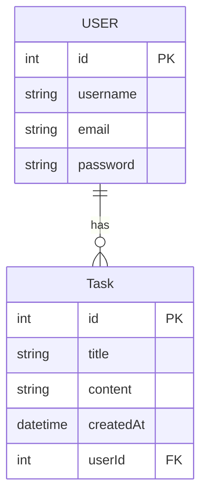
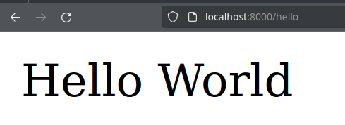
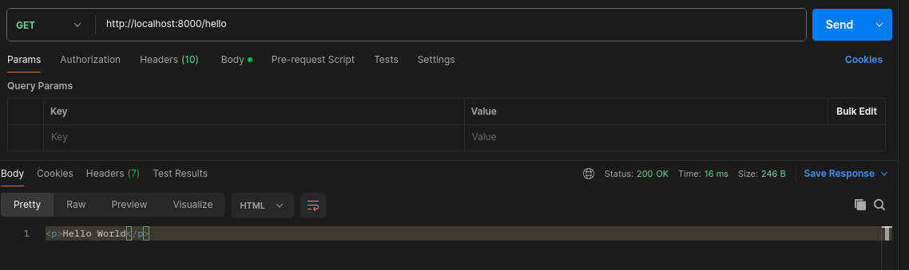
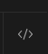
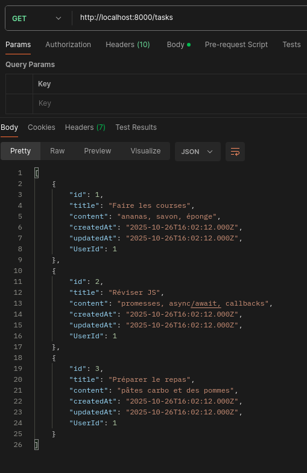
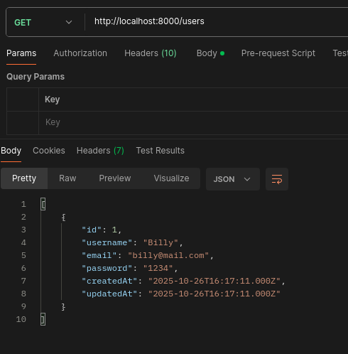
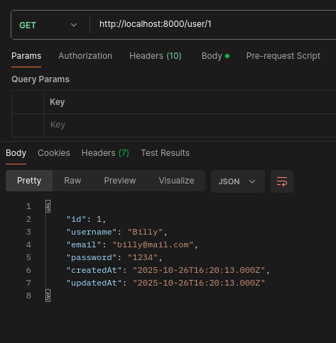
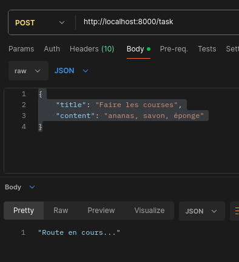
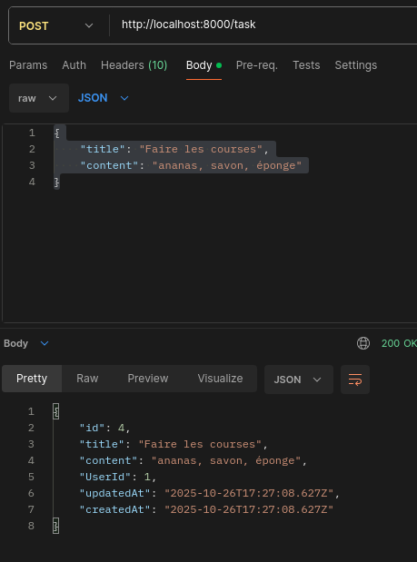
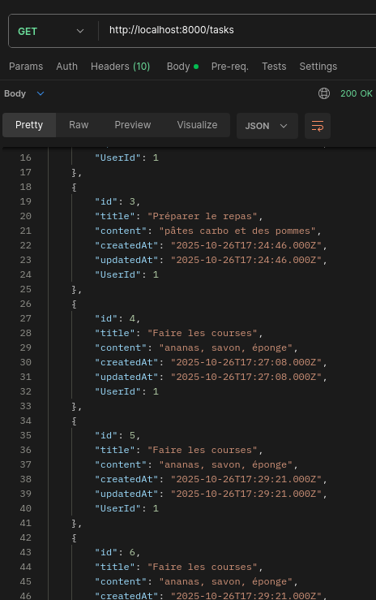

# Express- Créer une API REST avec Nodejs
## Pré-requis
Partons du principe que nous avons deux modèles User et Task avec une relation OneToMany pour associer une Task à un User.

*Diagramme des modèles Task et User*


### Lancer la base de données MySQL locale

1. Stopper le serveur MySQL local (si besoin)
```bash
systemctl stop mysql
systemctl disable mysql
```

> Il est néccessaire de stopper le serveur mysql local pour libérer le port 3306 de la machine linux.

1. Lancer la base de données MySQL via Docker
    a. **Si ce n'est pas déjà fait ! Créez le container bdd mysql**
    ```bash
    docker run --name bdd -e MYSQL_ROOT_PASSWORD=root -e MYSQL_DATABASE=app-database -p 3306:3306 mysql
    ```
    > Ce serveur mysql écoute le port 3306

    b. Ou sinon **lancer le container bdd**
    ```bash
    docker start bdd
    ```
2. Tester la connexion à la bdd
```bash
mysql -h127.0.0.1 -uroot -proot
```
3. Vous devriez arriver sur le shell mysql, faite la commande suivante pour vérifier que la base de données app-database a bien été créée.
```sql
mysql> SHOW DATABASES;
+--------------------+
| Database           |
+--------------------+
| app-database       |
| information_schema |
| mysql              |
| performance_schema |
| sys                |
+--------------------+
5 rows in set (0.00 sec)
```

### Initialisation Sequelize et définition des modèles

*Diagramme des modèles Task et User*


1. Créez un fichier `database.mjs` qui contient le code suivant pour initialiser la connexion à la base de données et définir les modèles Task et User. :

*database.mjs*
<details>
  <summary>Cliquez pour voir le fichier database.mjs </summary>


```js
import { Sequelize, DataTypes } from "sequelize";

/**
 * Initialise la connexion à la base de données et définit les modèles User et Task.
 * @return {Promise<Sequelize>} L'instance Sequelize connectée à la base de données.
 */
export async function loadSequelize() {
    try {

        const login = {
            database: "app-database",
            username: "root",
            password: "root"
        };
        // ----  0. Connexion au serveur mysql ---- 
        // Connexion à la BDD
        const sequelize = new Sequelize(login.database, login.username, login.password, {
            host: '127.0.0.1',
            dialect: 'mysql'
        });


        // ----  1. Création de tables via les models ---- 
        // Création des models (tables) -------------//
        const User = sequelize.define("User", {
            username: DataTypes.STRING,
            email: DataTypes.STRING,
            password: DataTypes.STRING
        });
        const Task = sequelize.define("Task", {
            title: DataTypes.TEXT,
            content: DataTypes.TEXT
        });

        User.hasMany(Task);
        Task.belongsTo(User);


        // CREER LES TABLES AVANT LA FONCTION sync !
        // -----------------------------------------//
        await sequelize.sync({ force: true });
        console.log("Connexion à la BDD effectuée")

        // Init fixtures data
        const userTest = await User.create({
            username : "Billy",
            email : "billy@mail.com",
            password : "1234"
        });

        await userTest.createTask({title:"Faire les courses",content : "ananas, savon, éponge"});
        await userTest.createTask({title:"Réviser JS",content : "promesses, async/await, callbacks"});
        await userTest.createTask({title:"Préparer le repas",content : "pâtes carbo et des pommes"});


        return sequelize;
 } catch (error) {
        console.log(error);
    }
}
```
</details>


2. Créez un fichier `app.mjs`, il contiendra le code de notre serveur web.

*app.mjs*
<details>
  <summary>Cliquez pour voir le fichier app.mjs</summary>

*app.mjs*
```js
// Déclarez vos imports ici
import {loadSequelize} from './database.mjs';


// Fonction principale pour initialiser la base de données et démarrer le serveur
async function main(){
    const sequelize = await loadSequelize();
    const User = sequelize.models.User;
    const Task = sequelize.models.Task;
    
    // Codez TOUTE la suite ici...


    

}
main();
```
</details>

<br>

> Il est obligatoire de coder toutes votre application dans la fonction `main()` APRES l'appel de la fonction `loadSequelize()` car cette fonction est asynchrone et :
> - nous devons attendre la connexion à la base de données avant de continuer.
> - nous devons attendre la création des modèles avant de les utiliser dans nos routes.


Concrètement la suite de notre application que consitera quand la création de routes (url) sur notre serveur web en utilisant les modèles Sequelize User et Task pour interagir avec la base de données :
- Création d'utilisateur : `User.create(...)`
- Récupération des tâches : `Task.findAll(...)`
- Récupération des taches d'un utilisateur : `User.findByPk()` et  `user.getTasks()`

### Installer les dépendances

```bash
npm install sequelize mysql2 express jsonwebtoken cors
```

## Qu'est ce qu'un API REST ?
Une API REST (Representational State Transfer) est une architecture de communication entre un client et un serveur qui utilise les méthodes HTTP pour effectuer des opérations sur des ressources. Les ressources sont généralement représentées au format JSON.

Correctement : 
- une API REST est un serveur web qui reçoit et fournit des données au format JSON.
- une API REST utilise les méthodes HTTP (GET, POST, PUT, DELETE) pour effectuer des opérations sur les ressources (Mysql, Fichiers, etc.)
- Comme tout serveur web une API REST est composée de routes (url) auquelles le client accède via un client HTTP (le plus souvent via l'API `fetch` en JavaScript).

## Qu'est ce que express ?

Express est un framework web pour Node.js qui facilite la création d'applications web et d'API REST. Il fournit un ensemble de fonctionnalités pour gérer les requêtes HTTP, les routes, et les réponses.

Les actions d'un serveur Express sont analogue au méthodes du protocole HTTP.

- GET : Récupérer une donnée
- POST : Envoyer une donnée au serveur
- DELETE : Supprimer une donnée du serveur
- PUT : Modifier une donnée du serveur

## Init Serveur

1. Importer express avec :
```js
import express from 'express';
```

*app.mjs*
```js
// Déclarez vos imports ici
import {loadSequelize} from('./database.mjs');
// ++++
import express from 'express';


// Fonction principale pour initialiser la base de données et démarrer le serveur
async function main(){
    const sequelize = await loadSequelize();
    const User = sequelize.models.User;
    const Task = sequelize.models.Task;
    
    // Codez TOUTE la suite ici...
    

}
main();
```

2. Créez un serveur HTTP express avec la fonction `express()` :

*app.mjs*
```js
async function main(){
    const sequelize = await loadSequelize();
    const User = sequelize.models.User;
    const Task = sequelize.models.Task;
    
    // Codez TOUTE la suite ici...
    // +
    const app = express();
    

}
```

3. Lancez le programme avec nodemon :
```bash
nodemon app.mjs
```

## Créer une route HTTP

Une api REST est composé de différentes routes (url) que l'utilisateur peut appeler via des requêtes HTTP.

Créons notre première route HTTP.

3. Ajoutez une route `GET /hello` avec la fonction `app.get()`.
*app.mjs*
```js
// Dans la fonction main() ...
const app = express();

app.get("/hello",(request,response)=>{
    response.send("<p>Hello World</p>");
});
// ...
```

La méthode get pendant deux arguments  en paramètre :
- Le chemin de la route : `/hello` (string)
- Une fonction executé lorsqu'un utilisateur fait une requête HTTP GET sur cette route. Cette fonction prend deux paramètres :
    - request : l'objet requête HTTP (contient les informations de la requête)
    - response : l'objet réponse HTTP (permet d'envoyer une réponse au client)

Un serveur HTTP est accesible via une adresse IP (localhost pour une machine locale) et un port (8000 par exemple).

> ***Definition fonction callback*** : Une fonction passée en paramètre est appelée une *fonction callback* ou fonction de rappel. 
> Elle est rappelée par le framework express a chaque fois que l'utilisateur fait une requête HTTP sur la route.

4. Lancez le serveur en localhost sur le port 8000 avec la fonction `app.listen()`.

*app.mjs*
```js
// Dans la fonction main() ...
const app = express();

app.get("/hello",(request,response)=>{
    // J'envoie une string HTML au client via la méthode Response.send()
    response.send("<p>Hello World</p>");
});

// ++++
app.listen(8000,()=>{
    console.log("Serveur prêt : rendez-vous sur http://localhost:8000/hello");
});
// ...
```

> La fonction callback passée en second paramètre est appelée une fois que le serveur est bien lancé sur le port 8000.

Allez on regarde dans un navigateur !

5. Dans un navigateur tapez dans la barre de recherche : `localhost:8000/hello` pour lancer une requête HTTP GET sur la route /hello.



Voilà, vous avez crée votre première route HTTP avec express !

Cette route renvoi en body du texte html, la réponse HTTP brut ressemble à celle-ci.

*La réponse du serveur express*
```http
HTTP/1.1 200 OK

<p>Hello World</p>
```

*La requête du navigateur client*
```http
GET /hello HTTP/1.1
Host : localhost
```


### Exercices - Créer plusieurs routes

On peut créer autant de routes que l'on veut dans un serveur express, il suffit d'appeler la méthode `app.get()` autant de fois que nécessaire avant l'appel de `app.listen()`.

```js
app.get("/hello",(request,response)=>{
    // J'envoie une string HTML au client via la méthode Response.send()
    response.send("<p>Hello World</p>");
});

app.get("/route1",(request,response)=>{
    response.send("<p>Route 1</p>");
});
app.get("/route2",(request,response)=>{
    response.send("<p>Route 2</p>");
});
// ...
```


Pour vous entrainer ajouter les routes suivantes qui affiches du HTML :
- GET /goodbye : affiche `<p>Goodbye World</p>`
- GET /status : affiche `<p>Server is running</p>`
- GET /date : affiche la date et l'heure actuelle au format ISO (utilisez `new Date().toISOString()`)
- GET /random : affiche un nombre aléatoire entre 0 et 1 (utilisez `Math.random()`)
- GET /random : affiche un nombre aléatoire entre 0 et 10 (utilisez `Math.random()`)

## Tester ses routes avec Postman
Postman est un client HTTP qui permet de faire des requêtes HTTP (GET, POST, PUT, DELETE) sur des serveurs web (API REST par exemple).

Il permet de tester facilement les routes de votre serveur sans avoir à coder le front-end avant.

Vous pouvez l'installer avec snap en ligne de commande :

1. Installer snap
```bash
sudo apt install snapd
```

2. Installer postman
```bash
sudo snap install postman
```

3. Lancez postman
```bash
snap run postman
```
> Cette commande lance snap et monopolise le terminal pour les logs, vous pouvez ouvrir un autre terminal dans vscode pour continuer à coder.

> Il existe également une extension vscode Postman et une version web de Postman.

Postman est un client http il permet de faire des requêtes HTTP sur un serveur web.

Pour effecter une requete HTTP GET sur la route /hello il faut :
1. Ouvrir Postman
2. Sélectionner la méthode GET dans le menu déroulant
3. Taper l'url `http://localhost:8000/hello` dans la barre d'url
4. Cliquer sur le bouton "Send" pour envoyer la requête



5. Vous devriez voir la réponse du serveur dans l'onglet "Body" de Postman.

> Vous pouvez également voir les headers de la réponse dans l'onglet "Headers".

> Plus tard nous utiliserons postman pour tester nos routes POST, PUT et DELETE mais également pour ajouter un header d'authentification JWT à nos requetes.

> Si vous cliquez sur l'onglet "Code" en haut à droite de Postman, vous pouvez voir le code JavaScript (fetch) généré par Postman pour faire la même requête HTTP.
> 


### Exercices
1. Testez TOUTES les routes que vous avez créées dans l'exercice précédent avec Postman.

## Créer des routes

### GET /tasks

La premier route à mettre en place est la route GET /tasks qui, comme son nom et sa méthode l'indique, permet de récupérer (GET) toutes les tâches (tasks) de la base de données.

1. Ajoutez la route GET /tasks dans le fichier *app.mjs*:

*app.mjs*
```js
// ++
app.get("/tasks",async (request,response)=>{
    const tasks = await Task.findAll();
    response.json(tasks);
});
```

- Notez l'utilisation du mot clé `await` avant l'appel de la méthode `findAll()`. Cette méthode est asynchrone car elle effectue une requête à la base de données qui peut prendre du temps. 
*Il est donc obligatoire d'utiliser `await` pour attendre la fin de la requête avant de continuer l'exécution du code.*

- Notez également l'utilisation de la méthode `response.json()` pour envoyer la réponse au format JSON au client. Cette méthode convertit automatiquement l'objet JavaScript en JSON (via la méthode `JSON.stringify()`) et ajoute le header `Content-Type: application/json` à la réponse HTTP.


<details>
  <summary>Cliquez ici pour voir le code complet app.mjs</summary>

*code complet app.mjs*
```js
// Dans la fonction main() ...
const app = express();

app.get("/hello",(request,response)=>{
    response.send("<p>Hello World</p>");
});

// ++++
app.get("/tasks",async (request,response)=>{
    // 1. Récupérer toutes les tâches de la table Task
    const tasks = await Task.findAll();
    // 2. Envoyer les tâches au format JSON au client
    response.json(tasks);
});
app.listen(8000,()=>{
    console.log("Serveur prêt : rendez-vous sur http://localhost:8000/hello");
});
// ...
```
</details>

2. Testez la route GET /tasks dans Postman.

Vous devriez voir le tableau JSON des tâches dans l'onglet Body de Postman.



> Souvenez-vous qu'en lors du developpement du front-end JS nous accederions à cette route via l'API fetch :
>```js
>const response = await fetch("http://localhost:8000/tasks");
>const tasks = await response.json();
>console.log(tasks);
>```

#### Exercice:

1. Pour vous exercer, créez une route GET `/users` qui renvoi tous les utilisateurs de la table User au format JSON. *Puis testez la dans PostMan*
- Vous devriez obtenir ce résultat :



### GET /user/:id
La route GET /user/:id permet de récupérer un utilisateur par son id.

Par exemple, pour récupérer l'utilisateur avec l'id 1, il faut faire une requête GET sur l'url `/user/1`.

Les paramètre d'url (query parameters) sont définis dans l'url avec un `:` avant le nom du paramètre.

Ils sont accessibles via l'objet `request.params`.
1. Ajoutez la route GET /user/:id dans le fichier *app.mjs*:
*app.mjs*
```js
// ++
app.get("/user/:id",async (request,response)=>{
    console.log(request.params);
    const userId = request.params.id;
    const user = await User.findByPk(userId);
    response.json(user);
});
```

*Résultat de la route /user/1 dans Postman*



### POST /task (pour l'utilisateur 1 par défaut)

En developpement web front-end il est d'usage d'envoyer des données complexes via la body d'une requete HTTP.

Par exemple ici j'envoie une requete POST au back-end pour ajouter une tache à l'utilisateur 1 (Billy).
```js
const headers = new Headers();
headers.append("Content-Type", "application/json");
fetch("http://localhost:8000/task",{
    method : "POST",
    headers : headers,
    body : JSON.stringify({title : "Faire ses devoirs",content : "tout de suite",userId : 1})
})
```

Retenez ceci : 
- Il est impossible d'utiliser la méthode GET pour envoyer des données au back-end.
- Le contenu JSON se trouve dans le body de la requete HTTP du client
- Il est obligatoire de préciser le header Content-Type: application/json pour que le back-end fonctionne

Il nous faut donc :
1. Decoder le body JSON lors de la reception de la requete
2. Lire le body 
3. L'ajouter au la table Task

#### 1. Décoder le body JSON
Pour décoder le body entrant pas besoin d'utiliser JSON.parse() comme souvent express possède une fonction pour ça :

```js
app.use(express.json())
```
- app.use() est une méthode qui permet de définir une fonction qui s'executer pour toutes .les méthode HTTP (GET,POST, DELETE, etc).
- express.json() modifie l'objet request pour nous fournir le body dans l'attribut request.body
- express.json est un middleware ! C'est à dire une fonction qui n'execute avant toutes les autres. Donc une fois la fonction executé express va enchainer et tester toutes nos autres routes.

1. Il faut donc placer l'appel de app.use() avant les routes express :
```js
const app = express();
// + je place le middleware express.json AVANT la définition des routes de mon serveur
app.use(express.json());


app.get("/tasks",async (request,response)=>{
    const tasks = await Task.findAll();
    response.json(tasks);
});

// Les autres routes...
```

#### 2. Lire le body JSON de la requête HTTP

Pour lire le body rien de plus simple : il suffit de lire la variable request.body dans une route POST.

1. Ajoutez une route POST /task

```js
app.post("/task",async (request,response)=>{
    console.log(request.body); // le body devrais apparaitre dans la console nodemon
    const newTask = request.body; // J'affecte l'objet body à la variable newTask
    
    request.json("Route en cours...");
});
```

> Attention !  SI vous voyez que le body est undefined c'est que vous avez oublié le middleware `express.json()`.

1. Testez la route POST /task sur Postman en ajoutant le body JSON suivant dans l'onglet Body de la requete : 
```json
{
    "title": "Faire les courses",
    "content": "ananas, savon, éponge"
}
```

> N'oubliez pas de selectionner *raw>JSON* comment type de body dans Postman

2. Vérifiez que le body est bien console.log après execution de la route via postman
```bash
Serveur prêt : rendez-vous sur http://localhost:8000/hello
{ title: 'Faire les courses', content: 'ananas, savon, éponge' }
```

#### 3. Ajouter une route POST /task
Il nous siffit maintenant d'appeler la méthode Task.create() pour ajouter un tache à un utilisateur. Par défaut nous utiliserons l'utilisateur 1 le temps de mettre en place l'autentification sur notre API REST.

```js
app.post("/task",async (request,response)=>{
    console.log(request.body);
    const newTaskData = request.body;
    try {
        // +
        const newTask = await Task.create({
            title : newTaskData.title,
            content : newTaskData.content,
            UserId : 1
        });
        response.json(newTask);
    } catch (error) {
        response.status(500).json({error: "Erreur lors de la création de la tâche"});
    }
});
```
1. Testez la route POST /task sur Postman en ajoutant le body JSON pour ajouter des taches à l'utilisateur 1.
> N'oubliez pas de selectionner *raw>JSON* comment type de body dans Postman


3. Ajoutez 4 nouvelle taches avec la route POST /task et utiliser la route GET /tasks pour vérifier si elles ont bien été ajoutée.




- Ajouter une nouvelle tâche dans la table Task
- Envoyer la tâche créée au format JSON au client 

### Annexe : Gestion d'erreurs dans les routes

En HTTP il est important de gérer les erreurs pour informer le client (navigateur, postman, etc.) lorsque quelque chose ne va pas.

Les codes de status HTTP sont divisés en 5 groupes :
- 1xx : Informationnel
- 2xx : Succès
- 3xx : Redirection
- 4xx : Erreur client
- 5xx : Erreur serveur

Par défaut express renvoi le code 200 (OK) pour toutes les routes.

Si une erreur du serveur survient (ex : erreur de connexion à la base de données ou SQL) vous devez gérer cette erreur dans un try/catch et renvoyer un code 500 (Internal Server Error) au client.

*app.mjs*
```js
app.get("/tasks",async (request,response)=>{
    try{
        // 1. Récupérer toutes les tâches de la table Task
        const tasks = await Task.findAll();
        // 2. Envoyer les tâches au format JSON au client
        response.json(tasks);
    }catch(error){
        console.log(error);
        response.status(500).json("Erreur serveur");
    }
});
```